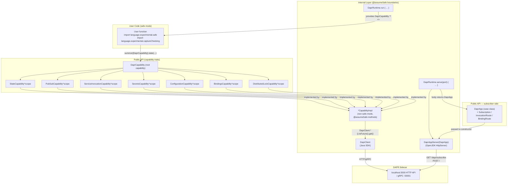
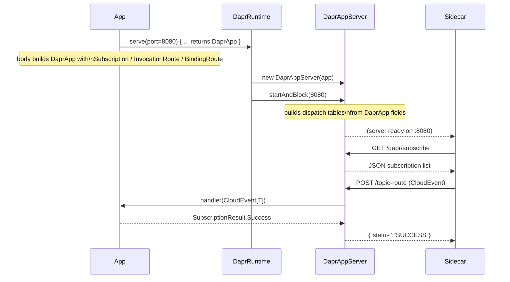
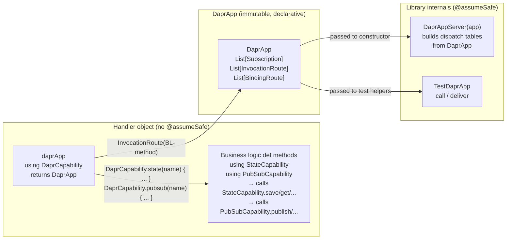
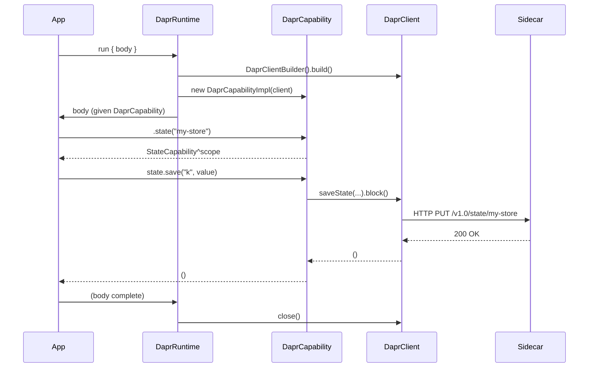
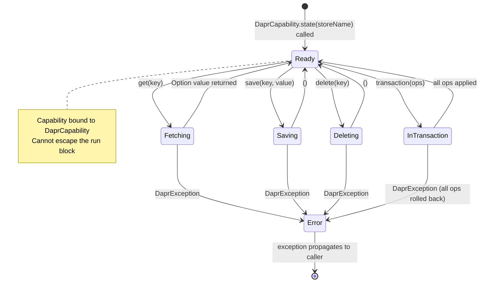

# scala-safe-dapr — Design

## Goal

A Scala 3 library that exposes every DAPR building block as a **tracked capability**. User code compiles under `import language.experimental.safe` and `import language.experimental.captureChecking`. The DAPR Java SDK is completely hidden — users see only Scala types.

**Requires**: Scala `3.9.0-RC1-bin-20260501-0c8c581-NIGHTLY` (or later nightly). The `import language.experimental.safe` and `import language.experimental.captureChecking` features are fully supported in nightly builds — no `-Ycc` flag is needed.

Each DAPR effect (state access, pub/sub, service calls, secrets, configuration, bindings) is tracked as a captured capability via `^` annotations. The Scala 3 compiler statically verifies:

- Which DAPR effects a computation may perform.
- That DAPR resources cannot escape their managed scope.
- That agent-generated code cannot introduce new unsafe capabilities.

---

## Two-Layer Architecture



### Layer 1 — Public API (safe-mode-compatible)

Capability traits, opaque domain types, and the `DaprRuntime.run` entry point. These compile cleanly under both safe mode and capture checking. No Java types are visible.

### Layer 2 — Internal implementations (`@assumeSafe`)

Non-safe-mode Scala that wraps `DaprClient` Java SDK calls. Each class/object is marked `@scala.caps.assumeSafe` (from the `scala.caps` package) so safe-mode user code may call them through the capability trait interfaces. Library authors are responsible for the safety contract; user code cannot add new `@scala.caps.assumeSafe` annotations (the annotation is itself restricted to non-safe-mode code).

Note: safe mode is enabled **per-file** via `import language.experimental.safe` (not globally via a compiler flag). This is intentional: files in `internal/` and `DaprRuntime.scala`/`JsonCodec.scala` must use `@scala.caps.assumeSafe` and therefore cannot have the safe-mode import.

---

## Capability Hierarchy

```mermaid
classDiagram
    class DaprCapability {
        <<trait>>
        +state(storeName: StoreName) StateCapability^this
        +pubsub(pubsubName: PubSubName) PubSubCapability^this
        +invoker ServiceInvocationCapability^this
        +secrets(storeName: SecretStoreName) SecretsCapability^this
        +config(storeName: ConfigStoreName) ConfigurationCapability^this
        +binding(name: BindingName) BindingsCapability^this
        +lock(storeName: StoreName) DistributedLockCapability^this
        +actor(actorType, actorId) ActorCapability^this
        +workflow WorkflowCapability^this
    }
    note for DaprCapability "Root capability. Companion object provides transformer API:\nDaprCapability.state(name) { ... } introduces StateCapability into body scope"
    class StateCapability {
        <<trait>>
        +get[T](key: StateKey) Option[T]
        +getWithETag[T](key: StateKey) StateEntry[T]
        +getBulk[T](keys: Seq[StateKey]) Map[StateKey,StateEntry[T]]
        +save[T](key: StateKey, value: T) Unit
        +saveBulk[T](entries: Seq[(StateKey,T)]) Unit
        +saveWithETag[T](key: StateKey, value: T, etag: ETag) Option[ETagMismatchException]
        +delete(key: StateKey) Unit
        +deleteWithETag(key: StateKey, etag: ETag) Option[ETagMismatchException]
        +transaction(ops: Seq[StateOp]) Unit
        +queryState[T](query: StateQuery) List[StateEntry[T]]
    }
    note for StateCapability "getBulk and saveBulk use DAPR batch APIs (getBulkState / saveBulkState) — single sidecar call each"
    class PubSubCapability {
        <<trait>>
        +publish[T](topic: Topic, data: T) Unit
        +publishWithMetadata[T](topic, data, meta) Unit
        +bulkPublish[T](topic, entries: Seq[BulkPublishEntry[T]]) BulkPublishResult
    }
    class ServiceInvocationCapability {
        <<trait>>
        +invoke[Req,Resp](appId: AppId, method: MethodName, data: Req) Resp
        +invokeGet[Resp](appId: AppId, method: MethodName) Resp
    }
    class SecretsCapability {
        <<trait>>
        +get(key: SecretKey) String
        +getBulk() Map[SecretKey,String]
    }
    class ConfigurationCapability {
        <<trait>>
        +get(keys: Seq[ConfigKey]) Map[ConfigKey,ConfigItem]
        +subscribe(keys: Seq[ConfigKey])(onChange) AutoCloseable
    }
    class DaprApp {
        <<case class>>
        +subscriptions: List[Subscription]
        +invocations: List[InvocationRoute]
        +bindings: List[BindingRoute]
        +workflows: List[DaprWorkflow]
        +activities: List[DaprActivity]
        +\+\+(other: DaprApp) DaprApp
    }
    class BindingsCapability {
        <<trait>>
        +invoke[Req,Resp](operation: BindingOperation, data: Req) Option[Resp]
        +invokeOneWay[Req](operation: BindingOperation, data: Req) Unit
    }
    class DistributedLockCapability {
        <<trait>>
        +tryLock(resourceId: LockResourceId, lockOwner: LockOwner, expirySeconds: Int) Boolean
        +unlock(resourceId: LockResourceId, lockOwner: LockOwner) UnlockStatus
    }

    DaprCapability --> StateCapability : .state()
    DaprCapability --> PubSubCapability : .pubsub()
    DaprCapability --> ServiceInvocationCapability : .invoker
    DaprCapability --> SecretsCapability : .secrets()
    DaprCapability --> ConfigurationCapability : .config()
    DaprCapability --> BindingsCapability : .binding()
    DaprCapability --> DistributedLockCapability : .lock()
```



---

## Subscriber Server (`DaprRuntime.serve`)

Apps that need to receive Dapr events (pub/sub messages, input binding triggers, service invocations) use `DaprRuntime.serve` instead of `run`.  The body returns a declarative [[DaprApp]] value describing all inbound routes; the runtime passes it to `DaprAppServer` which starts an HTTP server and blocks until interrupted.



The server runs each request on its own virtual thread (via `Executors.newVirtualThreadPerTaskExecutor()`).  Handler lambdas may capture capabilities from the `serve` body to make outbound calls (e.g., saving received messages to state).  Two `DaprApp` values may be combined with `++` to compose service modules.

### CloudEvent envelope parsing

The Dapr sidecar wraps pub/sub messages in CloudEvents.  `DaprAppServer` extracts the `data` field and decodes it with the registered `JsonCodec[T]`.  If decoding fails, the result is `SubscriptionResult.Drop` (silently discards — avoids poison-pill retry loops).  If the handler itself throws, the result is `SubscriptionResult.Retry`.

### Route collision

Pub/sub routes (default `/<topic>`), input binding paths (`/<bindingName>`), and service invocation paths (`/<methodName>`) all use the same flat namespace.  Users should choose distinct names.  Registration is first-writer-wins.

> Note: `scala.caps.Capability` is **sealed** in nightly Scala 3 and cannot be extended in user code. In the new CC model, any class/trait can serve as a capability through `^` capture annotations. `DaprCapability` and `DaprCapability` do not extend `scala.caps.Capability` — they are tracked via `^{scope}` return type annotations on `DaprCapability`'s factory methods.

---

## Handler Implementation Pattern (Capability-as-Effect-System)

Handler objects follow a two-layer structure that maximises capability tracking while containing the CC escape hatches in a single place.

### Layer 1 — Business logic methods

Pure handler methods declared with **anonymous** `using` capability parameters.  Business logic calls **companion-object methods** on the capability types (`StateCapability.save(...)`, `PubSubCapability.publish(...)`) rather than naming the capability value — the compiler resolves the implicit from the anonymous `using` context:

```scala
def placeOrder(req: OrderRequest)(using StateCapability, PubSubCapability): OrderResponse =
  val orderId = java.util.UUID.randomUUID().toString
  StateCapability.save(StateKey(orderId), req)
  PubSubCapability.publish(OrdersTopic, OrderEvent(orderId, req.item, req.quantity))
  OrderResponse(orderId, "accepted")
```

Each capability trait has a companion object that mirrors every instance method as a static forwarder taking `using cap: CapabilityType`.  This makes the call-site type act as both a static effect declaration (which capabilities are required) and as a namespace for the API:

```scala
// src/Capabilities.scala
object StateCapability:
  def save[T: JsonCodec](key: StateKey, value: T)(using cap: StateCapability): Unit =
    cap.save(key, value)
  def get[T: JsonCodec](key: StateKey)(using cap: StateCapability): Option[T] =
    cap.get(key)
  // ... all other methods
```

These methods carry no `@assumeSafe`; they are pure capability-tracked code that the compiler can reason about.

### Layer 2 — `daprApp` method: declarative route description

The `daprApp` method uses the **`DaprCapability` transformer API** to nest sub-capabilities into scope, then returns an immutable `DaprApp`.  Each `DaprCapability.xxx(...)` call acquires a sub-capability and makes it available as an implicit inside its body block.  Handler methods are passed as direct function references — no wrapping lambda is needed because no library method carries a `throws T` annotation:

```scala
def daprApp(using DaprCapability): DaprApp =
  DaprCapability.state(StateName) {
    DaprCapability.pubsub(PubSubComp) {
      DaprApp(
        invocations = List(
          InvocationRoute[OrderRequest, OrderResponse](MethodName("place-order"))(placeOrder),
          InvocationRoute[String, Option[OrderRequest]](MethodName("get-order"))(getOrder)
        )
      )
    }
  }
```

Transformer signature (in `src/DaprCapability.scala`):
```scala
object DaprCapability:
  def state(storeName: StoreName)[T](body: StateCapability ?=> T)(using cap: DaprCapability): T =
    body(using cap.state(storeName))
```

**Capability injection lifetime**: Capabilities are bound once per `daprApp` call and shared across all handler invocations for the lifetime of the `DaprCapability` scope.  The CC type system ensures they cannot outlive the scope (`ScopeContainment` invariant).

**`DaprApp` stores handlers as `AnyRef`**: Handler lambdas capture DAPR capabilities.  `Subscription`, `InvocationRoute`, and `BindingRoute` store them as `rawHandler: AnyRef` (CC-opaque) so the instances have an empty capture set and can live in a plain `List`.  Internal dispatch code (`DaprAppServer`, `TestDaprApp`) casts them back via path-dependent types under `@assumeSafe`.

### Diagram



### Testing with `TestDaprApp`

Integration tests use the `TestDaprApp` object (which is `@assumeSafe` internally) to invoke handlers directly against a `DaprApp` without an HTTP round-trip:

```scala
DaprRuntime.runWithEndpoints(http, grpc):
  val scope = summon[DaprCapability]
  val app   = OrderServiceHandlers.daprApp(using scope)
  val resp  = TestDaprApp.call[OrderRequest](app, "place-order", OrderRequest("widget", 2))[OrderResponse]
```

Two apps can be composed with `++`:
```scala
val combined = OrderServiceHandlers.daprApp ++ InventoryServiceHandlers.daprApp
```

---

## Opaque Domain Types

All domain identifiers are opaque to prevent accidental misuse (e.g., passing a `PubSubName` where a `StoreName` is expected).

| Type | Wraps | Non-empty? | Purpose |
|---|---|---|---|
| `StoreName` | `String` | yes | DAPR state store / lock store component name |
| `PubSubName` | `String` | yes | DAPR pub/sub component name |
| `Topic` | `String` | yes | Pub/sub topic |
| `AppId` | `String` | yes | Target application ID for service invocation |
| `SecretStoreName` | `String` | yes | DAPR secrets store component name |
| `ConfigStoreName` | `String` | yes | DAPR configuration store component name |
| `BindingName` | `String` | yes | DAPR output binding component name |
| `MethodName` | `String` | yes | Service-invocation / inbound handler method name |
| `Route` | `String` | yes | HTTP route for a pub/sub subscription |
| `BindingOperation` | `String` | yes | Operation name for an output binding |
| `LockResourceId` | `String` | yes | Resource identifier for a distributed lock |
| `LockOwner` | `String` | yes | Lock owner identifier |
| `ActorType` | `String` | yes | Dapr virtual actor type name |
| `WorkflowName` | `String` | yes | Dapr workflow class name |
| `ETag` | `String` | no | Optimistic-concurrency tag |
| `StateKey` | `String` | no | Key in a DAPR state store |
| `StateQuery` | `String` | no | State store query expression (JSON filter) |
| `SecretKey` | `String` | no | Key in a DAPR secrets store |
| `ConfigKey` | `String` | no | Key in a DAPR configuration store |
| `BulkEntryId` | `String` | no | Caller-assigned ID for bulk-publish correlation |
| `WorkflowInstanceId` | `String` | no | Dapr workflow instance ID |
| `ActorId` | `String` | no | Dapr virtual actor instance ID |
| `HttpMethod` | enum | — | HTTP verb used by an incoming service invocation |

Smart constructors live in companion objects and validate non-empty constraints at construction time (non-empty types). Extension methods provide `.value` unwrapping.

---

## Value Types

Structured data without identity, compared by value. Defined in `Models.scala`. These correspond to the `value` and `entity` declarations in the spec's Value Types and Entities sections.

| Type | Scala form | Purpose |
|---|---|---|
| `StateEntry[T]` | `case class` | Result of a state fetch; holds `value: Option[T]` and `etag: Option[ETag]` |
| `ConfigItem` | `case class` | Single configuration item: key, value, version, metadata |
| `ConfigUpdate` | `case class` | Config update notification from sidecar: `storeName: ConfigStoreName`, `items: Map[ConfigKey, ConfigItem]` |
| `BulkPublishEntry[T]` | `case class` | Entry in a bulk publish request: `entryId: BulkEntryId`, `event: T` |
| `BulkPublishResult` | `case class` | Result of a bulk publish: `failedEntries: List[BulkEntryId]` |
| `UnlockStatus` | `enum` | Result of a distributed lock unlock: `Success`, `LockNotFound`, `InternalError` |
| `SubscriptionResult` | `enum` | What a pub/sub handler returns to sidecar: `Success`, `Retry`, `Drop` |
| `CloudEvent[T]` | `case class` | Incoming CloudEvent from sidecar: envelope fields + `data: T` |
| `InvocationRequest[T]` | `case class` | Incoming service invocation: `methodName`, `httpMethod: HttpMethod`, `data: T` |
| `HttpMethod` | `enum` | HTTP verb: `Get`, `Post`, `Put`, `Patch`, `Delete`, `Head`, `Options` |
| `StateOp` | `sealed abstract class` | Base of the state transaction ADT (see below) |
| `WorkflowSnapshot` | `case class` | Snapshot of a workflow instance's current state |
| `WorkflowStatus` | `enum` | Workflow instance lifecycle status |

### StateOp — sealed ADT (entity + variants in spec)

The spec models `StateOp` as an `entity StateOp` (base) with two variants:
- `variant UpsertOp : StateOp` — carries `key`, optional `etag`, and `encoded_value` (pre-encoded JSON string)
- `variant DeleteOp : StateOp` — carries `key` and optional `etag`

In Scala this is represented as:

```scala
sealed abstract class StateOp          // entity StateOp
object StateOp:
  final case class UpsertOp(key: StateKey, encodedValue: String, etag: Option[ETag]) extends StateOp
  final case class DeleteOp(key: StateKey, etag: Option[ETag] = None)                extends StateOp
```

`UpsertOp.encodedValue` is structurally always present (non-nullable by construction). Use the companion `UpsertOp.apply[T]` smart constructor to encode a typed value immediately; this avoids type erasure issues when the operation is dispatched in `StateCapability.transaction`.

---

## JSON Serialization

User types must provide a `JsonCodec[T]` given instance. The library ships default instances for primitives and common collections. Users derive instances via upickle's `ReadWriter` derivation or supply custom ones.

```scala
trait JsonCodec[T]:
  def encode(value: T): String
  def decode(json: String | Null): Either[JsonDecodeException, T]

object JsonCodec:
  given JsonCodec[String] = ...
  given JsonCodec[Int]    = ...
  def decodeOrThrow[T: JsonCodec](json: String | Null): T   -- throws JsonDecodeException (unchecked)
  given [T: upickle.default.ReadWriter]: JsonCodec[T] = ...
```

---

## Resource Lifecycle (Scope Safety)

`DaprRuntime.run` acquires a `DaprClient`, creates a `DaprCapability` that captures the client reference, and releases both on exit. The return type of capabilities created inside `run` captures `DaprCapability`, so they cannot outlive the `run` block.



---

## State Machine: StateCapability



---

## Error Handling

Only two exception types are declared in `Exceptions.scala` — those where the caller has a genuine, distinct action to take:

| Exception | How surfaced | Why it is meaningful |
|---|---|---|
| `ETagMismatchException` | **Returned** as `Option[ETagMismatchException]` by `StateCapability.saveWithETag` and `deleteWithETag` | Caller must fetch the new ETag and retry; using a return value (not a thrown exception) makes handling explicit without try/catch |
| `JsonDecodeException` | **Thrown** by `JsonCodec.decodeOrThrow` | Data in the store/response does not match the expected type; a data-contract violation the caller may want to log or handle separately |

All other failures — sidecar unreachable, component not configured, gRPC errors — propagate as unchecked `io.dapr.exceptions.DaprException` (from the Java SDK, a `RuntimeException` subclass). These are unexpected infrastructure failures that callers cannot meaningfully handle at the call site; they bubble up to a top-level error boundary. There is no per-capability exception hierarchy: such a hierarchy would be a lie of precision, implying callers need to handle `DaprStateException` differently from `DaprPubSubException` when they do not.

`SecretsCapability.get` returns `Option[String]` rather than throwing for a missing key — absence is a normal case, not a failure.

Internal catch clauses use `scala.util.control.NonFatal` to ensure fatal JVM errors propagate immediately. `InterruptedException` is never silently swallowed (see `MonoOps.awaitResult`).

---

## Project Structure (Scala CLI)

```
scala-safe-dapr/
├── project.scala                     # Scala CLI directives (deps, compiler options; nightly Scala)
├── src/
│   ├── Models.scala                  # Opaque types, ETag, StateEntry, ConfigItem, StateOp,
│   │                                 # SubscriptionResult, CloudEvent, InvocationRequest [safe mode]
│   ├── JsonCodec.scala               # JsonCodec typeclass + default instances [@assumeSafe]
│   ├── Capabilities.scala            # All capability traits (DaprCapability subtypes) [safe mode]
│   ├── DaprApp.scala                 # DaprApp case class + Subscription/InvocationRoute/BindingRoute [@assumeSafe companions]
│   ├── DaprCapability.scala               # DaprCapability trait with ^{this} return types [safe mode]
│   ├── DaprRuntime.scala             # DaprRuntime.run + serve entry points [@assumeSafe]
│   └── internal/
│       ├── DaprCapabilityImpl.scala       # DaprCapability implementation
│       ├── MonoOps.scala             # Reactor Mono → blocking bridge (.toFuture().get())
│       ├── DaprAppServer.scala       # HTTP server (OpenJDK jdk.httpserver) for subscriber side
│       ├── StateCapabilityImpl.scala
│       ├── PubSubCapabilityImpl.scala
│       ├── InvokerCapabilityImpl.scala
│       ├── SecretsCapabilityImpl.scala
│       ├── ConfigCapabilityImpl.scala
│       ├── BindingsCapabilityImpl.scala
│       └── LockCapabilityImpl.scala
└── test/
    ├── unit/
    │   ├── ModelsTest.scala
    │   ├── JsonCodecTest.scala
    │   ├── CCTest.scala              # capture checking invariants (ScopeContainment, JsonCodec)
    │   ├── MockDaprCapability.scala       # in-memory mock for unit tests
    │   ├── StateCapabilityTest.scala # mock-based tests: state, pubsub, secrets, config, lock
    │   └── SubscriberTest.scala      # DaprAppServer dispatch logic (no Docker required)
    └── integration/
        ├── TestDaprApp.scala              # In-process DaprApp dispatch helper for tests (@assumeSafe)
        ├── DaprTestContainer.scala        # Testcontainers bridge
        ├── StateIntegrationTest.scala
        ├── PubSubIntegrationTest.scala
        ├── InvokerIntegrationTest.scala
        ├── OrderServiceIntegrationTest.scala
        ├── InventoryServiceIntegrationTest.scala
        ├── EndToEndIntegrationTest.scala
        └── SecretsIntegrationTest.scala
        └── apps/
            ├── Shared.scala               # Shared domain models (OrderRequest, OrderEvent, etc.)
            ├── OrderServiceHandlers.scala  # Business logic: no @assumeSafe, explicit using capabilities
            ├── InventoryServiceHandlers.scala
            ├── OrderServiceApp.scala       # Main entry point (serve)
            └── InventoryServiceApp.scala
```

---

## Key Design Decisions

| Decision | Choice | Rationale |
|---|---|---|
| Capability root | `DaprCapability` provides factory methods | Single entry point; child capabilities capture scope, preventing escape |
| JSON library | upickle | Pure Scala, Scala CLI friendly, automatic derivation |
| Async model | Blocking (`.toFuture().get()` on `Mono`) | Direct-style compatible; avoids bringing in effect library dependency; CAS-based VT-safe bridging |
| Error model | Exceptions (Java SDK `DaprException`) | Consistent with safe mode's exception-permitting stance; composable with `Try` |
| Java SDK visibility | Zero — all Java types in `internal/` | Users see only Scala types; easier to swap SDK in future |
| Scope safety | Capture checking: capabilities `^{scope}` | Compiler enforces no DAPR resource outlives its `DaprRuntime.run` block (via `import language.experimental.captureChecking`, no `-Ycc` needed) |

---

## Non-Goals (v1)

- Reactive/async API (Mono/Flux exposed to users) — use blocking for simplicity.
- Actor framework (DaprActor interface) — complex enough to warrant separate treatment.
- Workflow orchestration — complex; requires special determinism constraints.
