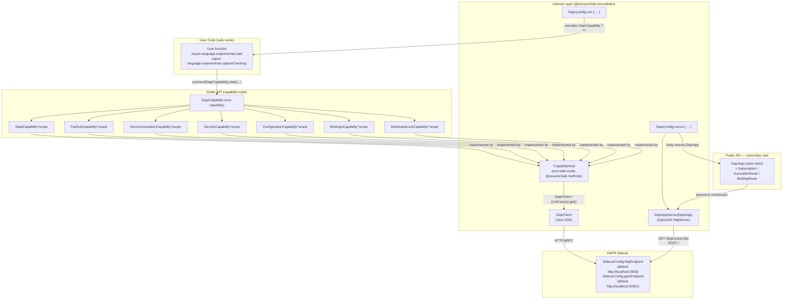
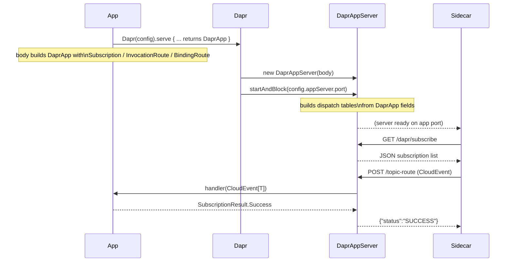
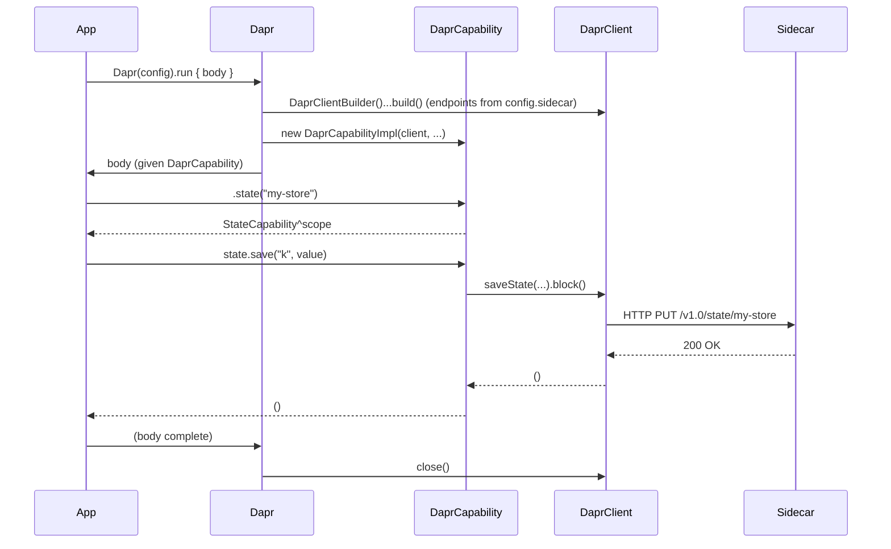
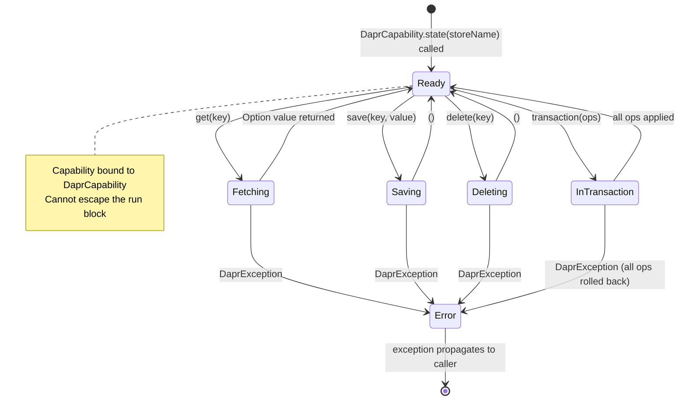

# dapr4s — Design

## Goal

A Scala 3 library that exposes every DAPR building block as a **tracked capability**. User code compiles under `import language.experimental.safe` and `import language.experimental.captureChecking`. The DAPR Java SDK is completely hidden — users see only Scala types.

**Requires**: Scala `3.9.0-RC1-bin-20260501-0c8c581-NIGHTLY` (or later nightly). The `import language.experimental.safe` and `import language.experimental.captureChecking` features are fully supported in nightly builds — no `-Ycc` flag is needed.

Each DAPR effect (state access, pub/sub, service calls, secrets, configuration, bindings) is tracked as a captured capability via `^` annotations. The Scala 3 compiler statically verifies:

- Which DAPR effects a computation may perform.
- That DAPR resources cannot escape their managed scope.
- That agent-generated code cannot introduce new unsafe capabilities.

---

## Two-Layer Architecture



### Layer 1 — Public API (safe-mode-compatible)

Capability traits, opaque domain types, and the `Dapr(config).run` / `.serve` entry points (on `class Dapr(config: DaprConfig)` in `src/Dapr.scala`). These compile cleanly under both safe mode and capture checking. No Java types are visible.

### Layer 2 — Internal implementations (`@assumeSafe`)

Non-safe-mode Scala that wraps `DaprClient` Java SDK calls. Each class/object is marked `@scala.caps.assumeSafe` (from the `scala.caps` package) so safe-mode user code may call them through the capability trait interfaces. Library authors are responsible for the safety contract; user code cannot add new `@scala.caps.assumeSafe` annotations (the annotation is itself restricted to non-safe-mode code).

Note: safe mode is enabled **per-file** via `import language.experimental.safe` (not globally via a compiler flag). This is intentional: files in `internal/` and `Dapr.scala`/`JsonCodec.scala` must use `@scala.caps.assumeSafe` and therefore cannot have the safe-mode import.

---

## Capability Hierarchy

```mermaid
classDiagram
    class DaprCapability {
        <<trait>>
        +state(storeName: StoreName) StateCapability^this
        +pubsub(pubsubName: PubSubName) PubSubCapability^this
        +invoker ServiceInvocationCapability^this
        +secrets(storeName: SecretStoreName) SecretsCapability^this
        +config(storeName: ConfigStoreName) ConfigurationCapability^this
        +binding(name: BindingName) BindingsCapability^this
        +lock(storeName: StoreName) DistributedLockCapability^this
        +actor(actorType, actorId) ActorCapability^this
        +workflow WorkflowCapability^this
        +crypto(componentName: CryptoComponentName) CryptoCapability^this
        +jobs JobsCapability^this
        +conversation(componentName: ConversationComponentName) ConversationCapability^this
    }
    note for DaprCapability "Root capability. Companion object provides transformer API:\nDaprCapability.state(name) { ... } introduces StateCapability into body scope"
    class StateCapability {
        <<trait>>
        +get[T](key: StateKey) Option[T]
        +getWithETag[T](key: StateKey) StateEntry[T]
        +getBulk[T](keys: Seq[StateKey]) Map[StateKey,StateEntry[T]]
        +save[T](key: StateKey, value: T) Unit
        +saveBulk[T](entries: Seq[(StateKey,T)]) Unit
        +saveWithETag[T](key: StateKey, value: T, etag: ETag) Option[ETagMismatchException]
        +delete(key: StateKey) Unit
        +deleteWithETag(key: StateKey, etag: ETag) Option[ETagMismatchException]
        +transaction(ops: Seq[StateOp]) Unit
        +queryState[T](query: StateQuery) List[StateEntry[T]]
    }
    note for StateCapability "getBulk and saveBulk use DAPR batch APIs (getBulkState / saveBulkState) — single sidecar call each"
    class PubSubCapability {
        <<trait>>
        +publish[T](topic: Topic, data: T) Unit
        +publishWithMetadata[T](topic, data, meta) Unit
        +bulkPublish[T](topic, entries: Seq[BulkPublishEntry[T]]) BulkPublishResult
    }
    class ServiceInvocationCapability {
        <<trait>>
        +invoke[Req,Resp](appId: AppId, method: MethodName, data: Req) Resp
        +invokeGet[Resp](appId: AppId, method: MethodName) Resp
    }
    class SecretsCapability {
        <<trait>>
        +get(key: SecretKey) String
        +getBulk() Map[SecretKey,String]
    }
    class ConfigurationCapability {
        <<trait>>
        +get(keys: Seq[ConfigKey]) Map[ConfigKey,ConfigItem]
        +subscribe(keys: Seq[ConfigKey])(onChange) AutoCloseable
    }
    class DaprApp {
        <<case class>>
        +subscriptions: List[Subscription]
        +invocations: List[InvocationRoute]
        +bindings: List[BindingRoute]
        +workflows: List[Workflow]
        +activities: List[WorkflowActivity[?,?]]
        +actors: List[ActorDefinition]
        +jobs: List[JobRoute]
        +\+\+(other: DaprApp) DaprApp
    }
    class BindingsCapability {
        <<trait>>
        +invoke[Req,Resp](operation: BindingOperation, data: Req) Option[Resp]
        +invokeOneWay[Req](operation: BindingOperation, data: Req) Unit
    }
    class DistributedLockCapability {
        <<trait>>
        +tryLock(resourceId: LockResourceId, lockOwner: LockOwner, expirySeconds: Int) Boolean
        +unlock(resourceId: LockResourceId, lockOwner: LockOwner) UnlockStatus
    }
    class CryptoCapability {
        <<trait>>
        +encrypt(keyName, plaintext: ArraySeq[Byte], algorithm) ArraySeq[Byte]
        +decrypt(ciphertext: ArraySeq[Byte]) ArraySeq[Byte]
        +encryptString(keyName, plaintext: String, algorithm) ArraySeq[Byte]
        +decryptString(ciphertext: ArraySeq[Byte]) String
    }
    class JobsCapability {
        <<trait>>
        +schedule[T](name: JobName, data: T, schedule: JobSchedule) Unit
        +scheduleOnce[T](name: JobName, data: T, dueTime: Instant) Unit
        +get(name: JobName) Option[JobDetails]
        +delete(name: JobName) Unit
    }
    class ConversationCapability {
        <<trait>>
        +converse(prompt: String) String
        +converseMany(prompts: Seq[String]) Seq[String]
        +chat(messages: Seq[ChatMessage], ...) ChatResponse
    }

    DaprCapability --> StateCapability : .state()
    DaprCapability --> PubSubCapability : .pubsub()
    DaprCapability --> ServiceInvocationCapability : .invoker
    DaprCapability --> SecretsCapability : .secrets()
    DaprCapability --> ConfigurationCapability : .config()
    DaprCapability --> BindingsCapability : .binding()
    DaprCapability --> DistributedLockCapability : .lock()
    DaprCapability --> CryptoCapability : .crypto()
    DaprCapability --> JobsCapability : .jobs
    DaprCapability --> ConversationCapability : .conversation()
```



---

## Subscriber Server (`Dapr(config).serve`)

Apps that need to receive Dapr events (pub/sub messages, input binding triggers, service invocations) use `Dapr(config).serve` instead of `run`.  The body returns a declarative [[DaprApp]] value describing all inbound routes; the runtime passes it to `DaprAppServer` which starts an HTTP server on `config.appServer.port` (default 8080) and blocks until interrupted.



The server runs each request on its own virtual thread (via `Executors.newVirtualThreadPerTaskExecutor()`).  Handler lambdas may capture capabilities from the `serve` body to make outbound calls (e.g., saving received messages to state).  Two `DaprApp` values may be combined with `++` to compose service modules.

### CloudEvent envelope parsing

The Dapr sidecar wraps pub/sub messages in CloudEvents.  `DaprAppServer` extracts the `data` field and decodes it with the registered `JsonCodec[T]`.  If decoding fails, the result is `SubscriptionResult.Drop` (silently discards — avoids poison-pill retry loops).  If the handler itself throws, the result is `SubscriptionResult.Retry`.

A `Subscription` may declare an optional `deadLetterTopic: Option[Topic]`; when set it is emitted as `deadLetterTopic` in the `/dapr/subscribe` response so the sidecar routes undeliverable messages to that topic instead of dropping them.

### Service-invocation routes

`InvocationRoute.apply` builds a route whose handler receives only the decoded request body (`Q => R`).  `InvocationRoute.withRequest` is an HTTP-method-aware overload whose handler receives the full `InvocationRequest[Q]` envelope (method name, `httpMethod: HttpMethod`, decoded body), letting one route branch on the incoming HTTP verb.

### Route collision

Pub/sub routes (default `/<topic>`), input binding paths (`/<bindingName>`), service invocation paths (`/<methodName>`), and job-trigger paths (`/job/<jobName>`) all use the same flat namespace.  Users should choose distinct names.  Registration is first-writer-wins.

### Job triggers

A scheduled job created via `JobsCapability.schedule`/`scheduleOnce` is delivered by the sidecar as a POST to `/job/<jobName>` on the app server. A `JobRoute[T](JobName(...)) { payload => ... }` registered on the `DaprApp` decodes the payload (the sidecar sends either the raw value or a `{"data": ...}` envelope — both are accepted) and invokes the handler. Unknown job names return 404; a handler exception returns 500.

> **`ExclusiveCapability` as a cornerstone**: Every capability in this library — `DaprCapability`, all twelve sub-capability traits, `ActorContext`, and `WorkflowContext` — extends `scala.caps.ExclusiveCapability`. This is intentional and load-bearing:
> - `ExclusiveCapability` tells the Scala 3 CC framework that these objects are exclusive (not shared), enabling separation checking that prevents concurrent or escaping use.
> - `scala.caps.Capability` is **sealed** in nightly Scala 3; only `SharedCapability` and `ExclusiveCapability` can be extended. `SharedCapability` would allow sharing across concurrent fibers, which violates the exclusive-per-invocation semantics we require.
> - Because each sub-capability extends `ExclusiveCapability`, CC infers `^{fresh}` for new instances returned from methods. The trait declares `^{this}` to bind the sub-capability lifetime to the parent — overrides must explicitly annotate return types as `StateCapability^{this}` etc. to satisfy the override check. See `DaprCapabilityImpl` and `MockDaprCapability` for the pattern.
> - `@scala.caps.assumeSafe` on implementation classes suppresses CC checks inside the method body, but override-level compatibility checks still fire — hence the explicit `^{this}` annotations are required in both `DaprCapabilityImpl` and `MockDaprCapability`.

---

## Handler Implementation Pattern (Capability-as-Effect-System)

Handler objects follow a two-layer structure that maximises capability tracking while containing the CC escape hatches in a single place.

### Layer 1 — Business logic methods

Pure handler methods declared with **anonymous** `using` capability parameters.  Business logic calls **companion-object methods** on the capability types (`StateCapability.save(...)`, `PubSubCapability.publish(...)`) rather than naming the capability value — the compiler resolves the implicit from the anonymous `using` context:

```scala
def placeOrder(req: OrderRequest)(using StateCapability, PubSubCapability): OrderResponse =
  val orderId = java.util.UUID.randomUUID().toString
  StateCapability.save(StateKey(orderId), req)
  PubSubCapability.publish(OrdersTopic, OrderEvent(orderId, req.item, req.quantity))
  OrderResponse(orderId, "accepted")
```

Each capability trait has a companion object that mirrors every instance method as a static forwarder taking `using cap: CapabilityType`.  This makes the call-site type act as both a static effect declaration (which capabilities are required) and as a namespace for the API:

```scala
// src/Capabilities.scala
object StateCapability:
  def save[T: JsonCodec](key: StateKey, value: T)(using cap: StateCapability): Unit =
    cap.save(key, value)
  def get[T: JsonCodec](key: StateKey)(using cap: StateCapability): Option[T] =
    cap.get(key)
  // ... all other methods
```

These methods carry no `@assumeSafe`; they are pure capability-tracked code that the compiler can reason about.

### Layer 2 — the `*App` object's `apply` method: declarative route description

The promoted idiom is a dedicated `*App` object whose `apply` method takes the capabilities it needs (`using DaprCapability`, codecs, …) and returns an immutable `DaprApp` — the in-library analogue of a `main`.  It uses the **`DaprCapability` transformer API** to nest sub-capabilities into scope.  Each `DaprCapability.xxx(...)` call acquires a sub-capability and makes it available as an implicit inside its body block.  Handler methods are passed as direct function references — no wrapping lambda is needed because no library method carries a `throws T` annotation:

```scala
object OrderServiceApp:
  def apply()(using DaprCapability): DaprApp =
    DaprCapability.state(StateName) {
      DaprCapability.pubsub(PubSubComp) {
        DaprApp(
          invocations = List(
            InvocationRoute[OrderRequest, OrderResponse](MethodName("place-order"))(placeOrder),
            InvocationRoute[String, Option[OrderRequest]](MethodName("get-order"))(getOrder)
          )
        )
      }
    }
```

Transformer signature (in `src/DaprCapability.scala`):
```scala
object DaprCapability:
  def state(storeName: StoreName)[T](body: StateCapability ?=> T)(using cap: DaprCapability): T =
    body(using cap.state(storeName))
```

**Capability injection lifetime**: Capabilities are bound once per `apply` call and shared across all handler invocations for the lifetime of the `DaprCapability` scope.  The CC type system ensures they cannot outlive the scope (`ScopeContainment` invariant).

**`DaprApp` stores handlers as `AnyRef`**: Handler lambdas capture DAPR capabilities.  `Subscription`, `InvocationRoute`, and `BindingRoute` store them as `rawHandler: AnyRef` (CC-opaque) so the instances have an empty capture set and can live in a plain `List`.  Internal dispatch code (`DaprAppServer`, `TestDaprApp`) casts them back via path-dependent types under `@assumeSafe`.

### Diagram


### Testing with `TestDaprApp`

Integration tests use the `TestDaprApp` object (which is `@assumeSafe` internally) to invoke handlers directly against a `DaprApp` without an HTTP round-trip.  Tests point `Dapr` at the Testcontainers sidecar by constructing a `DaprConfig` whose `SidecarConfig.httpEndpoint` / `grpcEndpoint` come from the container (a test-only `Dapr.runWithEndpoints(http, grpc)` extension wraps this — it is **not** part of the published library):

```scala
Dapr(DaprConfig(SidecarConfig(httpEndpoint = c.httpEndpoint, grpcEndpoint = c.grpcEndpoint))).run:
  val scope = summon[DaprCapability]
  val app   = OrderServiceApp()(using scope)
  val resp  = TestDaprApp.call[OrderRequest](app, "place-order", OrderRequest("widget", 2))[OrderResponse]
```

Two apps can be composed with `++`:
```scala
val combined = OrderServiceApp() ++ InventoryServiceApp()
```

---

## Opaque Domain Types

All domain identifiers are opaque to prevent accidental misuse (e.g., passing a `PubSubName` where a `StoreName` is expected).

| Type | Wraps | Non-empty? | Purpose |
|---|---|---|---|
| `StoreName` | `String` | yes | DAPR state store / lock store component name |
| `PubSubName` | `String` | yes | DAPR pub/sub component name |
| `Topic` | `String` | yes | Pub/sub topic |
| `AppId` | `String` | yes | Target application ID for service invocation |
| `SecretStoreName` | `String` | yes | DAPR secrets store component name |
| `ConfigStoreName` | `String` | yes | DAPR configuration store component name |
| `BindingName` | `String` | yes | DAPR output binding component name |
| `MethodName` | `String` | yes | Service-invocation / inbound handler method name |
| `Route` | `String` | yes | HTTP route for a pub/sub subscription |
| `BindingOperation` | `String` | yes | Operation name for an output binding |
| `LockResourceId` | `String` | yes | Resource identifier for a distributed lock |
| `LockOwner` | `String` | yes | Lock owner identifier |
| `ActorType` | `String` | yes | Dapr virtual actor type name |
| `ReminderName` | `String` | yes | Persistent actor reminder name |
| `TimerName` | `String` | yes | Non-persistent actor timer name |
| `WorkflowName` | `String` | yes | Dapr workflow class name |
| `EventName` | `String` | yes | External event name for `WorkflowContext.waitForExternalEvent` and `WorkflowCapability.raiseEvent` |
| `CryptoComponentName` | `String` | yes | DAPR cryptography component name |
| `CryptoKeyName` | `String` | yes | Key name within a crypto component |
| `KeyWrapAlgorithm` | `String` | yes | Key-wrap algorithm (e.g. `RSA`, `AES`); has `Rsa`/`Aes` constants |
| `JobName` | `String` | yes | DAPR job name (routed back to `/job/<name>`) |
| `ConversationComponentName` | `String` | yes | DAPR conversation (LLM) component name |
| `ETag` | `String` | no | Optimistic-concurrency tag |
| `StateKey` | `String` | no | Key in a DAPR state store |
| `StateQuery` | `String` | no | State store query expression (JSON filter) |
| `SecretKey` | `String` | no | Key in a DAPR secrets store |
| `ConfigKey` | `String` | no | Key in a DAPR configuration store |
| `BulkEntryId` | `String` | no | Caller-assigned ID for bulk-publish correlation |
| `WorkflowInstanceId` | `String` | no | Dapr workflow instance ID |
| `ActorId` | `String` | no | Dapr virtual actor instance ID |
| `HttpMethod` | enum | — | HTTP verb used by an incoming service invocation |

Each opaque type lives in its own file under `src/optypes/` (one type per file), not in `Models.scala` companions. Smart constructors validate non-empty constraints at construction time (non-empty types). Extension methods provide `.value` unwrapping.

---

## Value Types

Structured data without identity, compared by value. Defined in `Models.scala`. These correspond to the `value` and `entity` declarations in the spec's Value Types and Entities sections.

| Type | Scala form | Purpose |
|---|---|---|
| `StateEntry[T]` | `case class` | Result of a state fetch; holds `value: Option[T]` and `etag: Option[ETag]` |
| `ConfigItem` | `case class` | Single configuration item: key, value, version, metadata |
| `ConfigUpdate` | `case class` | Config update notification from sidecar: `storeName: ConfigStoreName`, `items: Map[ConfigKey, ConfigItem]` |
| `BulkPublishEntry[T]` | `case class` | Entry in a bulk publish request: `entryId: BulkEntryId`, `event: T` |
| `BulkPublishResult` | `case class` | Result of a bulk publish: `failedEntries: List[BulkEntryId]` |
| `UnlockStatus` | `enum` | Result of a distributed lock unlock: `Success`, `LockNotFound`, `InternalError` |
| `SubscriptionResult` | `enum` | What a pub/sub handler returns to sidecar: `Success`, `Retry`, `Drop` |
| `CloudEvent[T]` | `case class` | Incoming CloudEvent from sidecar: envelope fields + `data: T` |
| `InvocationRequest[T]` | `case class` | Incoming service invocation: `methodName`, `httpMethod: HttpMethod`, `data: T` |
| `HttpMethod` | `enum` | HTTP verb: `Get`, `Post`, `Put`, `Patch`, `Delete`, `Head`, `Options` |
| `StateOp` | `sealed abstract class` | Base of the state transaction ADT (see below) |
| `WorkflowSnapshot` | `case class` | Snapshot of a workflow instance's current state |
| `WorkflowStatus` | `enum` | Workflow instance lifecycle status |
| `JobSchedule` | `enum` | Job schedule: `Cron(expr)`, `Every(period)`, `Daily`/`Hourly`/`Weekly`/`Monthly`/`Yearly` |
| `JobDetails` | `case class` | Stored job definition returned by `JobsCapability.get` |
| `ChatMessage` | `case class` | A conversation (alpha2) message with `role: ChatRole` + content; smart constructors `user`/`system`/`assistant`/`developer`/`tool` |
| `ChatRole` | `enum` | Conversation message role: `System`, `User`, `Assistant`, `Tool`, `Developer` |
| `ChatTool` / `ChatToolCall` | `case class` | Tool (function) definition and an assistant's tool-call request |
| `ChatResponse` | `case class` | Result of `chat`: `results: Seq[ChatResult]` (choices + usage) |

### StateOp — sealed ADT (entity + variants in spec)

The spec models `StateOp` as an `entity StateOp` (base) with two variants:
- `variant UpsertOp : StateOp` — carries `key`, optional `etag`, and `encoded_value` (pre-encoded JSON string)
- `variant DeleteOp : StateOp` — carries `key` and optional `etag`

In Scala this is represented as:

```scala
sealed abstract class StateOp          // entity StateOp
object StateOp:
  final case class UpsertOp(key: StateKey, encodedValue: SerializedJson, etag: Option[ETag]) extends StateOp
  final case class DeleteOp(key: StateKey, etag: Option[ETag] = None)                        extends StateOp
```

`UpsertOp.encodedValue` is a `SerializedJson` opaque type (structurally always present, non-nullable by construction). Use the companion `UpsertOp.apply[T]` smart constructor to encode a typed value immediately; this avoids type erasure issues when the operation is dispatched in `StateCapability.transaction`.

---

## JSON Serialization

User types must provide a `JsonCodec[T]` given instance. The library ships default instances for primitives and common collections. Users derive instances via upickle's `ReadWriter` derivation or supply custom ones.

```scala
trait JsonCodec[T]:
  def encode(value: T): String
  def decode(json: String | Null): Either[JsonDecodeException, T]

object JsonCodec:
  given JsonCodec[String] = ...
  given JsonCodec[Int]    = ...
  def decodeOrThrow[T: JsonCodec](json: String | Null): T   -- throws JsonDecodeException (unchecked)
  given [T: upickle.default.ReadWriter]: JsonCodec[T] = ...
```

**Raw-bytes outbound payloads**: pub/sub publish and service invocation encode the value with the `JsonCodec[T]` and hand the result to the Java SDK as **raw bytes** (`byte[]`), not as a `String`. The SDK's serializer passes `byte[]` through untouched but would re-serialize a `String`, double-encoding the JSON into a JSON-string. Exchanging bytes in both directions keeps dapr4s the sole owner of the JSON encoding. See `PubSubCapabilityImpl` and `InvokerCapabilityImpl`.

---

## Resource Lifecycle (Scope Safety)

`Dapr(config).run` builds a `DaprClient` from `config.sidecar` (HTTP/gRPC endpoints, timeouts, TLS, retries), creates a `DaprCapability` that captures the client reference, and releases it on exit. The `ActorClient` and `DaprWorkflowClient` are created lazily on first use and all clients are closed in the `finally` block. The return type of capabilities created inside `run` captures `DaprCapability`, so they cannot outlive the `run` block.



---

## State Machine: StateCapability



---

## Error Handling

Only two exception types are declared in `Exceptions.scala` — those where the caller has a genuine, distinct action to take:

| Exception | How surfaced | Why it is meaningful |
|---|---|---|
| `ETagMismatchException` | **Returned** as `Option[ETagMismatchException]` by `StateCapability.saveWithETag` and `deleteWithETag` | Caller must fetch the new ETag and retry; using a return value (not a thrown exception) makes handling explicit without try/catch |
| `JsonDecodeException` | **Thrown** by `JsonCodec.decodeOrThrow` | Data in the store/response does not match the expected type; a data-contract violation the caller may want to log or handle separately |

All other failures — sidecar unreachable, component not configured, gRPC errors — propagate as unchecked `io.dapr.exceptions.DaprException` (from the Java SDK, a `RuntimeException` subclass). These are unexpected infrastructure failures that callers cannot meaningfully handle at the call site; they bubble up to a top-level error boundary. There is no per-capability exception hierarchy: such a hierarchy would be a lie of precision, implying callers need to handle `DaprStateException` differently from `DaprPubSubException` when they do not.

`SecretsCapability.get` returns `Option[String]` rather than throwing for a missing key — absence is a normal case, not a failure.

Internal catch clauses use `scala.util.control.NonFatal` to ensure fatal JVM errors propagate immediately. `InterruptedException` is never silently swallowed (see `MonoOps.awaitResult`).

---

## Project Structure (Scala CLI)

```
dapr4s/
├── project.scala                     # Scala CLI directives (deps, compiler options; nightly Scala)
├── src/
│   ├── Models.scala                  # Value types: StateEntry, ConfigItem, StateOp, SubscriptionResult,
│   │                                 # CloudEvent, InvocationRequest, WorkflowSnapshot/Status [safe mode]
│   ├── JsonCodec.scala               # JsonCodec typeclass + default instances [@assumeSafe]
│   ├── Capabilities.scala            # All capability traits (DaprCapability subtypes + WorkflowCapability) [safe mode]
│   ├── DaprApp.scala                 # DaprApp case class + Subscription/InvocationRoute/BindingRoute [@assumeSafe companions]
│   ├── DaprCapability.scala          # DaprCapability trait with ^{this} return types [safe mode]
│   ├── Dapr.scala                    # class Dapr(config) with .run + .serve entry points [@assumeSafe]
│   ├── DaprConfig.scala              # DaprConfig / SidecarConfig / AppServerConfig / ActorRuntimeConfig
│   ├── Actors.scala                  # ActorContext, ActorDefinition, ActorRoutes + route types
│   ├── Workflows.scala               # Workflow, WorkflowActivity, ActivityDef, Task, WorkflowContext
│   ├── Exceptions.scala              # ETagMismatchException, JsonDecodeException
│   ├── optypes/                      # One opaque domain type per file (StoreName, Topic, AppId,
│   │                                 # SerializedJson, ApiToken, DaprPort, DaprDuration, ... )
│   └── internal/
│       ├── DaprCapabilityImpl.scala  # DaprCapability implementation
│       ├── MonoOps.scala             # Reactor Mono → blocking bridge (.toFuture().get())
│       ├── NullOps.scala             # null-handling helpers
│       ├── DaprAppServer.scala       # HTTP server (OpenJDK jdk.httpserver); workflow/actor registration
│       ├── StateCapabilityImpl.scala
│       ├── PubSubCapabilityImpl.scala
│       ├── InvokerCapabilityImpl.scala
│       ├── SecretsCapabilityImpl.scala
│       ├── ConfigCapabilityImpl.scala
│       ├── BindingsCapabilityImpl.scala
│       ├── LockCapabilityImpl.scala
│       ├── ActorCapabilityImpl.scala
│       ├── HttpActorContext.scala
│       ├── WorkflowCapabilityImpl.scala
│       ├── WorkflowContextImpl.scala
│       └── WorkflowBridges.scala     # WorkflowBridge / WorkflowActivityBridge (Java SDK adapters)
└── test/
    ├── TestCodecs.scala               # shared test JsonCodec instances
    ├── TestDaprExtensions.scala       # test-only Dapr.runWithEndpoints(http, grpc) helper
    ├── TestOptionCodec.scala
    ├── unit/
    │   ├── ModelsTest.scala
    │   ├── JsonCodecTest.scala
    │   ├── CCTest.scala               # capture checking invariants (ScopeContainment, JsonCodec)
    │   ├── CapabilityHandlerTest.scala
    │   ├── DaprServerTestBase.scala   # in-memory DaprAppServer test harness base
    │   ├── StateCapabilityTest.scala  # mock-based tests: state, pubsub, secrets, config, lock
    │   ├── BindingDispatchTest.scala
    │   └── SubscriberTest.scala       # DaprAppServer dispatch logic (no Docker required)
    └── integration/
        ├── TestDaprApp.scala          # In-process DaprApp dispatch helper for tests (@assumeSafe)
        ├── DaprTestContainer.scala    # Testcontainers bridge
        ├── StateIntegrationTest.scala
        ├── PubSubIntegrationTest.scala
        ├── InvokerIntegrationTest.scala
        ├── OrderServiceIntegrationTest.scala
        ├── InventoryServiceIntegrationTest.scala
        ├── EndToEndIntegrationTest.scala
        ├── SecretsIntegrationTest.scala
        ├── StateCapabilityServerTest.scala       # *CapabilityServerTest: live-sidecar capability tests
        ├── PubSubCapabilityServerTest.scala
        ├── SecretsCapabilityServerTest.scala
        ├── LockCapabilityServerTest.scala
        ├── ActorCapabilityServerTest.scala
        ├── ServiceInvocationServerTest.scala
        ├── WorkflowCapabilityServerTest.scala
        └── apps/
            ├── Shared.scala           # Shared domain models (OrderRequest, OrderEvent, etc.)
            ├── OrderServiceApp.scala   # `object OrderServiceApp { def apply()(using …): DaprApp }` + handlers (no @assumeSafe)
            ├── InventoryServiceApp.scala
            ├── OrderServiceMain.scala   # @main entry point (serve OrderServiceApp())
            ├── InventoryServiceMain.scala
            ├── CounterActorApp.scala
            ├── CounterActorShared.scala
            ├── WorkflowApp.scala
            ├── TestDurations.scala
            └── TestUpickleCodec.scala
```

---

## Key Design Decisions

| Decision | Choice | Rationale |
|---|---|---|
| Capability root | `DaprCapability` provides factory methods | Single entry point; child capabilities capture scope, preventing escape |
| JSON library | upickle | Pure Scala, Scala CLI friendly, automatic derivation |
| Async model | Blocking (`.toFuture().get()` on `Mono`) | Direct-style compatible; avoids bringing in effect library dependency; CAS-based VT-safe bridging |
| Error model | Exceptions (Java SDK `DaprException`) | Consistent with safe mode's exception-permitting stance; composable with `Try` |
| Java SDK visibility | Zero — all Java types in `internal/` | Users see only Scala types; easier to swap SDK in future |
| Scope safety | Capture checking: capabilities `^{scope}` | Compiler enforces no DAPR resource outlives its `Dapr(config).run` block (via `import language.experimental.captureChecking`, no `-Ycc` needed) |
| Configuration | Typed `DaprConfig` (`SidecarConfig` / `AppServerConfig` / `ActorRuntimeConfig`) | All endpoints/timeouts/TLS explicit and typed — no env-var reads or system-property manipulation in production code; `grpcTlsInsecure` defaults to `false` |
| Capability base type | `scala.caps.ExclusiveCapability` | All capability traits extend `ExclusiveCapability` — the only sealed subtype of `Capability` that prevents sharing. Enables CC separation checking: no capability escapes its scope or is used concurrently. Sub-capabilities return as `^{this}` to bind lifetime to the parent; override methods must explicitly annotate return types to satisfy CC override checks. |

---

## Workflows and Activities

`Workflow` and `WorkflowActivity[I, O]` provide clean Scala abstractions over the Dapr workflow SDK, hiding all Java types.

### Workflow

Extend `Workflow` and implement `run()(using WorkflowContext): Unit`. `WorkflowContext` is injected as a `given` — user code never binds a `ctx` value. The `WorkflowContext` companion object provides forwarder methods (`WorkflowContext.getInput`, `callActivity`, `complete`, etc.) mirroring the `ActorContext` companion pattern:

```scala
class OrderWorkflow extends Workflow:
  def run(using WorkflowContext): Unit =
    val input = WorkflowContext.getInput[OrderRequest].getOrElse(throw RuntimeException("No input"))
    val paymentTask = WorkflowContext.callActivity[ProcessPaymentActivity](input)
    val result = paymentTask.await()
    WorkflowContext.complete(result)
```

`callActivity` is parameterised by the concrete activity **class** (`callActivity[ProcessPaymentActivity](input)`), not a `classOf[...]` argument. The `ActivityDef[A]` typeclass (auto-derived for every `WorkflowActivity[I, O]` subclass with a `ClassTag` and the relevant `JsonCodec`s in scope) links the class to its input/output types, so the input/output types are resolved by the compiler.

`Workflow` is a pure Scala abstract class — no Java type in the public API. Internally, `WorkflowBridge(workflow) extends io.dapr.workflows.Workflow` and is used only during sidecar registration via the named-instance overload `registerWorkflow(name, bridge, "", false)`. The bridge constructs `given WorkflowContext = new WorkflowContextImpl(javaCtx)` and calls `w.run`, so `WorkflowContext` never escapes the bridge's stack frame. The bridge is in `dapr4s.internal` and never visible to users.

**Registration naming**: workflows register under their **simple** class name (`w.getClass.getSimpleName`) — this is what users pass to `WorkflowCapability.start(WorkflowName(...))`. Activities register under their **canonical** class name (`a.getClass.getCanonicalName`, exposed via `ActivityDef.activityName`). See `DaprAppServer`'s registration loop and `Workflows.scala`.

Workflow operations honour the configured gRPC endpoint: `Dapr` derives a `workflowProperties: Properties` from `config.sidecar` and threads it through to the `DaprWorkflowClient` and `WorkflowRuntimeBuilder`, whose no-arg constructors would otherwise hardcode `localhost:50001`.

`WorkflowCapability.getStatus` (and `waitForCompletion`) return `Option[WorkflowSnapshot]`, yielding `None` for an unknown or purged instance.

### WorkflowActivity[I, O]

Extend `WorkflowActivity[I, O]` (which requires `JsonCodec[I]` and `JsonCodec[O]` in scope) and implement `execute(input: I)(using DaprCapability): O`. The `DaprCapability` is supplied fresh by the workflow runtime on **every call** — it is a per-call parameter, never captured in a field. Because nothing is captured, activity implementations stay capture-checked ("safe mode") with no `@scala.caps.assumeSafe` annotation:

```scala
class ProcessPaymentActivity extends WorkflowActivity[OrderRequest, PaymentResult]:
  def execute(input: OrderRequest)(using DaprCapability): PaymentResult =
    DaprCapability.invoker:
      ServiceInvocationCapability.invoke(PaymentService, MethodName("charge"), input)[PaymentResult]
```

`WorkflowActivity[I, O]` is a pure Scala abstract class. Internally, `WorkflowActivityBridge[I, O](activity) extends io.dapr.workflows.WorkflowActivity` wraps it for registration via `registerActivity(name, bridge)`. The bridge accesses `activity.inputCodec` / `activity.outputCodec` which are `private[dapr4s]` on the abstract class.

### Task[O]

`WorkflowContext.callActivity(...)`, `WorkflowContext.createTimer(...)`, and `WorkflowContext.waitForExternalEvent(...)` all return `Task[O]`. Call `.await()` to block and get the result, or `.map(f)` to transform it without scheduling new durable work. This is replay-safe inside the workflow runtime.

---

## Actors (Server-side Hosting)

Dapr virtual actors are hosted server-side via `ActorDefinition` without extending any Java class.

### ActorContext

`ActorContext` is a capability trait provided on every actor invocation. It bundles per-instance state access with reminder/timer scheduling:

```scala
@scala.caps.assumeSafe trait ActorContext extends scala.caps.ExclusiveCapability:
  // State
  def get[T: JsonCodec](key: StateKey): Option[T]
  def set[T: JsonCodec](key: StateKey, value: T): Unit
  def remove(key: StateKey): Unit
  // Reminders (persistent — survive actor deactivation)
  def registerReminder[T: JsonCodec](name: ReminderName, data: T, dueTime: Duration, period: Option[Duration] = None): Unit
  def unregisterReminder(name: ReminderName): Unit
  // Timers (non-persistent — lost on deactivation)
  def registerTimer[T: JsonCodec](name: TimerName, data: T, dueTime: Duration, period: Option[Duration] = None): Unit
  def unregisterTimer(name: TimerName): Unit
```

Implemented by `HttpActorContext` which calls the Dapr actor state and reminder/timer HTTP APIs. A companion `object ActorContext` provides static forwarding methods so handlers can call `ActorContext.set(...)` without naming the context parameter.

### ActorDefinition, ActorRoutes, and Route Types

```scala
ActorDefinition(ActorType("Counter")) { (id, ctx) =>
  given ActorContext = ctx
  val actor = new CounterActor   // plain Scala class, no special supertype
  ActorRoutes(
    methods = List(
      ActorMethodRoute[IncrReq, Int](MethodName("increment"))(actor.increment),
      ActorMethodRoute[Unit, Int](MethodName("get"))(actor.get),
    ),
    reminders = List(
      ActorReminderRoute[String](ReminderName("reset-reminder"))(actor.onReminder),
    ),
    timers = List(
      ActorTimerRoute[IncrReq](TimerName("auto-tick"))(actor.onTimer),
    ),
  )
}
```

`build` is called on every incoming invocation. It receives a fresh `ActorContext` scoped to that `(actorType, actorId)` pair and returns an `ActorRoutes` value grouping all three route types.

- `ActorMethodRoute[Req, Resp]` — handles `POST /actors/{type}/{id}/method/{name}`
- `ActorReminderRoute[Payload]` — handles `PUT /actors/{type}/{id}/method/remind/{name}`
- `ActorTimerRoute[Payload]` — handles `PUT /actors/{type}/{id}/method/timer/{name}`

### HTTP Routes (DaprAppServer)

`DaprAppServer` handles:
- `GET /dapr/config` → returns `{"entities": [...registered actor types...], ...}` 
- `POST /actors/{type}/{id}/method/{name}` → dispatches to the matching `ActorMethodRoute`
- `PUT /actors/{type}/{id}/method/remind/{name}` → dispatches to the matching `ActorReminderRoute`; body `{"data":"base64","dueTime":"..."}` — `data` is base64(JSON)
- `PUT /actors/{type}/{id}/method/timer/{name}` → dispatches to the matching `ActorTimerRoute`; same body format
- `DELETE /actors/{type}/{id}` → actor deactivation (returns 200, no local cleanup needed)

Actor state persists via `/v1.0/actors/{type}/{id}/state`. Reminders are registered at `/v1.0/actors/{type}/{id}/reminders/{name}` and timers at `/v1.0/actors/{type}/{id}/timers/{name}`. All sidecar callbacks target `config.sidecar.httpEndpoint` (default `http://localhost:3500`), passed into `HttpActorContext` — there is no `DAPR_HTTP_PORT` environment read. The actor runtime settings reported via `GET /dapr/config` come from `config.actors` (`ActorRuntimeConfig`).

---

## Non-Goals (v1)

- Reactive/async API (Mono/Flux exposed to users) — use blocking for simplicity.
