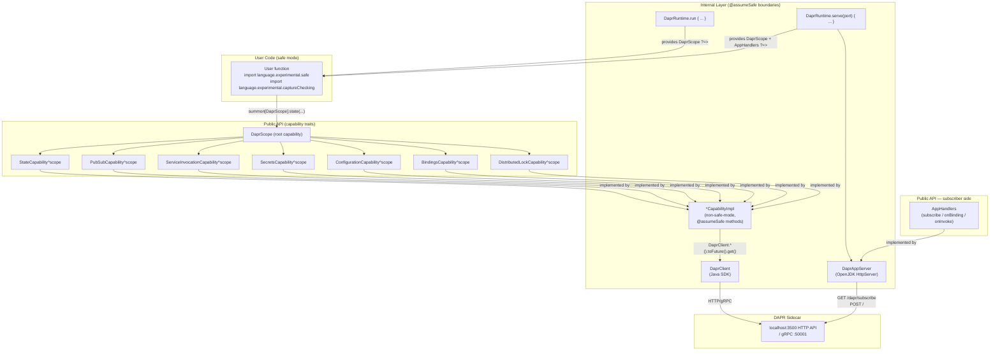
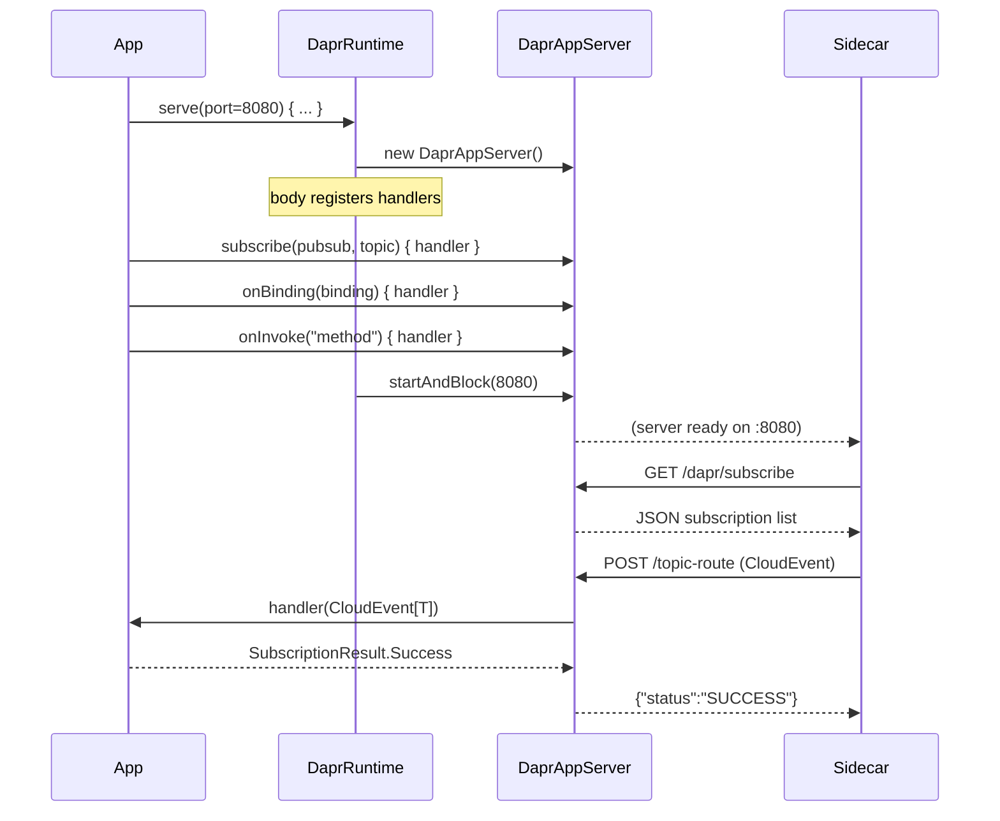
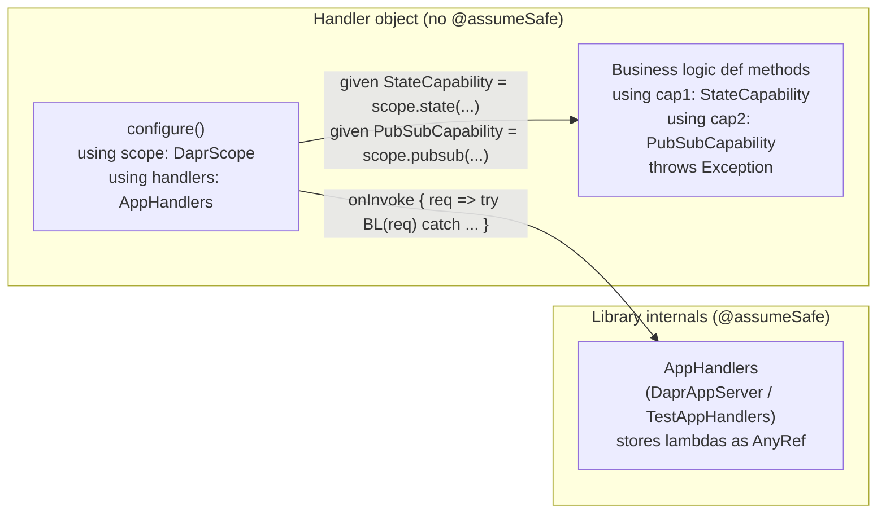
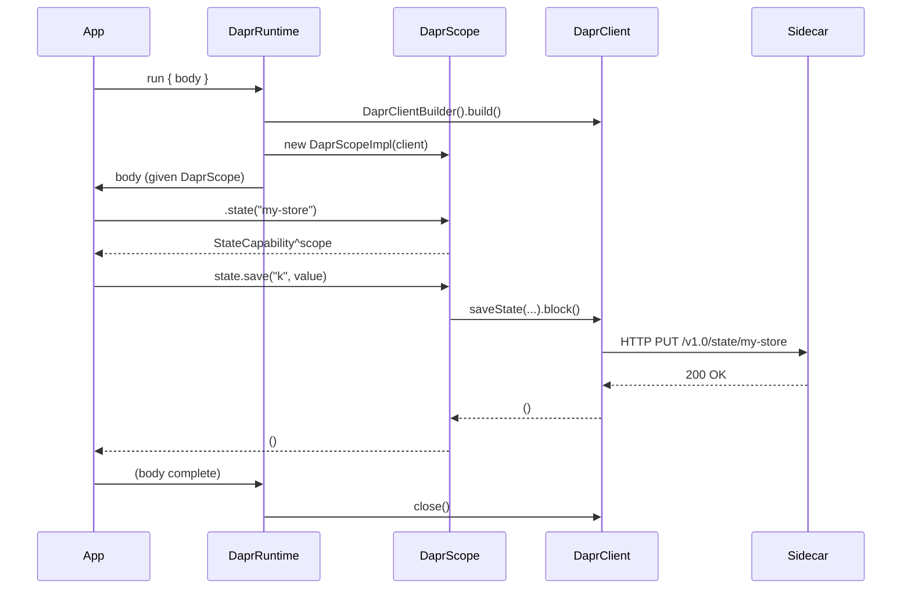

# scala-safe-dapr — Design

## Goal

A Scala 3 library that exposes every DAPR building block as a **tracked capability**. User code compiles under `import language.experimental.safe` and `import language.experimental.captureChecking`. The DAPR Java SDK is completely hidden — users see only Scala types.

**Requires**: Scala `3.9.0-RC1-bin-20260501-0c8c581-NIGHTLY` (or later nightly). The `import language.experimental.safe` and `import language.experimental.captureChecking` features are fully supported in nightly builds — no `-Ycc` flag is needed.

Each DAPR effect (state access, pub/sub, service calls, secrets, configuration, bindings) is tracked as a captured capability via `^` annotations. The Scala 3 compiler statically verifies:

- Which DAPR effects a computation may perform.
- That DAPR resources cannot escape their managed scope.
- That agent-generated code cannot introduce new unsafe capabilities.

---

## Two-Layer Architecture



### Layer 1 — Public API (safe-mode-compatible)

Capability traits, opaque domain types, and the `DaprRuntime.run` entry point. These compile cleanly under both safe mode and capture checking. No Java types are visible.

### Layer 2 — Internal implementations (`@assumeSafe`)

Non-safe-mode Scala that wraps `DaprClient` Java SDK calls. Each class/object is marked `@scala.caps.assumeSafe` (from the `scala.caps` package) so safe-mode user code may call them through the capability trait interfaces. Library authors are responsible for the safety contract; user code cannot add new `@scala.caps.assumeSafe` annotations (the annotation is itself restricted to non-safe-mode code).

Note: safe mode is enabled **per-file** via `import language.experimental.safe` (not globally via a compiler flag). This is intentional: files in `internal/` and `DaprRuntime.scala`/`JsonCodec.scala` must use `@scala.caps.assumeSafe` and therefore cannot have the safe-mode import.

---

## Capability Hierarchy

```mermaid
classDiagram
    class DaprCapability {
        <<sealed trait>>
    }
    note for DaprCapability "Any class/trait can serve as a capability via ^ capture annotations in the nightly CC model"
    class DaprScope {
        <<trait>>
        +state(storeName: StoreName) StateCapability^this
        +pubsub(pubsubName: PubSubName) PubSubCapability^this
        +invoker ServiceInvocationCapability^this
        +secrets(storeName: SecretStoreName) SecretsCapability^this
        +config(storeName: ConfigStoreName) ConfigurationCapability^this
        +binding(name: BindingName) BindingsCapability^this
        +lock(storeName: StoreName) DistributedLockCapability^this
    }
    class StateCapability {
        <<trait>>
        +get[T](key: String) Option[T]
        +getWithETag[T](key: String) StateEntry[T]
        +getBulk[T](keys: Seq[String]) Map[String,StateEntry[T]]
        +save[T](key: String, value: T) Unit
        +saveBulk[T](entries: Seq) Unit
        +saveWithETag[T](key, value, etag: ETag) Unit
        +delete(key: String) Unit
        +deleteWithETag(key: String, etag: ETag) Unit
        +transaction(ops: Seq[StateOp]) Unit
        +queryState[T](query: StateQuery) List[StateEntry[T]]
    }
    class PubSubCapability {
        <<trait>>
        +publish[T](topic: Topic, data: T) Unit
        +publishWithMetadata[T](topic, data, meta) Unit
        +bulkPublish[T](topic, entries: Seq[BulkPublishEntry[T]]) BulkPublishResult
    }
    class ServiceInvocationCapability {
        <<trait>>
        +invoke[Req,Resp](appId, method, data) Resp
        +invokeGet[Resp](appId, method) Resp
    }
    class SecretsCapability {
        <<trait>>
        +get(key: String) String
        +getBulk() Map[String,String]
    }
    class ConfigurationCapability {
        <<trait>>
        +get(keys: Seq[String]) Map[String,ConfigItem]
        +subscribe(keys)(onChange) AutoCloseable
    }
    class AppHandlers {
        <<trait>>
        +subscribe[T](pubsubName, topic)(handler) Unit
        +subscribe[T](pubsubName, topic, route)(handler) Unit
        +onBinding[T](bindingName)(handler) Unit
        +onInvoke[Req,Resp](methodName)(handler) Unit
    }
    class BindingsCapability {
        <<trait>>
        +invoke[Req,Resp](operation, data) Option[Resp]
        +invokeOneWay[Req](operation, data) Unit
    }
    class DistributedLockCapability {
        <<trait>>
        +tryLock(resourceId, lockOwner, expirySeconds) Boolean
        +unlock(resourceId, lockOwner) UnlockStatus
    }

    DaprCapability <|-- StateCapability
    DaprCapability <|-- PubSubCapability
    DaprCapability <|-- ServiceInvocationCapability
    DaprCapability <|-- SecretsCapability
    DaprCapability <|-- ConfigurationCapability
    DaprCapability <|-- BindingsCapability
    DaprCapability <|-- DistributedLockCapability
```



---

## Subscriber Server (`DaprRuntime.serve`)

Apps that need to receive Dapr events (pub/sub messages, input binding triggers, service invocations) use `DaprRuntime.serve` instead of `run`.  It starts an HTTP server on the given port and blocks until interrupted.



The server runs each request on its own virtual thread (via `Executors.newVirtualThreadPerTaskExecutor()`).  Handler lambdas may capture the `DaprScope` from the `serve` body to make outbound calls (e.g., saving received messages to state).

### CloudEvent envelope parsing

The Dapr sidecar wraps pub/sub messages in CloudEvents.  `DaprAppServer` extracts the `data` field and decodes it with the registered `JsonCodec[T]`.  If decoding fails, the result is `SubscriptionResult.Drop` (silently discards — avoids poison-pill retry loops).  If the handler itself throws, the result is `SubscriptionResult.Retry`.

### Route collision

Pub/sub routes (default `/<topic>`), input binding paths (`/<bindingName>`), and service invocation paths (`/<methodName>`) all use the same flat namespace.  Users should choose distinct names.  Registration is first-writer-wins.

> Note: `scala.caps.Capability` is **sealed** in nightly Scala 3 and cannot be extended in user code. In the new CC model, any class/trait can serve as a capability through `^` capture annotations. `DaprScope` and `DaprCapability` do not extend `scala.caps.Capability` — they are tracked via `^{scope}` return type annotations on `DaprScope`'s factory methods.

---

## Handler Implementation Pattern (Capability-as-Effect-System)

Handler objects follow a two-layer structure that maximises capability tracking while containing the CC escape hatches in a single place.

### Layer 1 — Business logic methods

Pure handler methods declared with explicit `using` capability parameters and a `throws Exception` clause.  The compiler tracks which effects each method may perform:

```scala
def placeOrder(req: OrderRequest)(using state: StateCapability, pubsub: PubSubCapability): OrderResponse throws Exception =
  val orderId = java.util.UUID.randomUUID().toString
  state.save(StateKey(orderId), req)
  pubsub.publish(OrdersTopic, OrderEvent(orderId, req.item, req.quantity))
  OrderResponse(orderId, "accepted")
```

These methods carry no `@assumeSafe`; they are pure capability-tracked code that the compiler can reason about.

### Layer 2 — `configure` method with capability injection and thin lambdas

The `configure` method injects capabilities as `given`s once per call, then registers thin wrapper lambdas via `AppHandlers`:

```scala
def configure()(using scope: DaprScope, handlers: AppHandlers): Unit =
  given StateCapability  = scope.state(StateName)
  given PubSubCapability = scope.pubsub(PubSubComp)

  handlers.onInvoke[OrderRequest](MethodName("place-order"))[OrderResponse] { req =>
    try placeOrder(req)
    catch case e: Exception => throw e   // CC CanThrow isolation
  }
```

**Why `try/catch` in each lambda**: In Scala 3.9 CC with `pureFunctions`, each lambda that calls a `throws`-annotated method creates a fresh anonymous `CanThrow` capability.  Sibling lambdas in the same method body cannot share these capabilities.  The `try/catch` absorbs the `CanThrow` at each lambda's boundary, so the next sibling lambda starts with a fresh context.  Without this, the second and later lambdas fail to compile with _"capability `any` cannot flow into capture set {any²}"_.  See AGENTS.md for the canonical explanation.

**Capability injection lifetime**: Capabilities are bound once per `configure` call and shared across all handler invocations for the lifetime of the `DaprScope`.  The CC type system ensures they cannot outlive the scope (`ScopeContainment` invariant).

### Diagram



### Testing with `TestAppHandlers`

Integration tests use `TestAppHandlers` (which is `@assumeSafe` internally) in place of a real `DaprAppServer`.  After calling `configure`, tests invoke handlers directly without an HTTP round-trip:

```scala
val testHandlers = TestAppHandlers()
DaprRuntime.runWithEndpoints(http, grpc):
  OrderServiceHandlers.configure()
  val resp = testHandlers.call[OrderRequest]("place-order", OrderRequest("widget", 2))[OrderResponse]
```

---

## Opaque Domain Types

All domain identifiers are opaque to prevent accidental misuse (e.g., passing a `PubSubName` where a `StoreName` is expected).

| Type | Wraps | Purpose |
|---|---|---|
| `StoreName` | `String` | DAPR state store component name |
| `PubSubName` | `String` | DAPR pub/sub component name |
| `Topic` | `String` | Pub/sub topic |
| `AppId` | `String` | Target application ID for service invocation |
| `SecretStoreName` | `String` | DAPR secrets store name |
| `ConfigStoreName` | `String` | DAPR configuration store name |
| `BindingName` | `String` | DAPR output binding name |
| `ETag` | `String` | Optimistic concurrency tag |
| `StateQuery` | `String` | State store query expression (JSON filter) |

Smart constructors live in companion objects. Extension methods provide operations that would otherwise require unwrapping.

---

## JSON Serialization

User types must provide a `JsonCodec[T]` given instance. The library ships default instances for primitives and common collections. Users derive instances via upickle's `ReadWriter` derivation or supply custom ones.

```scala
trait JsonCodec[T]:
  def encode(value: T): String
  def decode(json: String | Null): Either[JsonDecodeException, T]

object JsonCodec:
  given JsonCodec[String] = ...
  given JsonCodec[Int]    = ...
  def decodeOrThrow[T: JsonCodec](json: String | Null): T throws JsonDecodeException
  given [T: upickle.default.ReadWriter]: JsonCodec[T] = ...
```

---

## Resource Lifecycle (Scope Safety)

`DaprRuntime.run` acquires a `DaprClient`, creates a `DaprScope` that captures the client reference, and releases both on exit. The return type of capabilities created inside `run` captures `DaprScope`, so they cannot outlive the `run` block.



---

## State Machine: StateCapability


---

## Error Handling

All DAPR errors are surfaced as typed subtypes of `DaprException`:

| Exception | Thrown by |
|---|---|
| `DaprStateException` | `StateCapability` operations |
| `DaprPubSubException` | `PubSubCapability` operations |
| `DaprServiceInvocationException` | `ServiceInvocationCapability` operations |
| `DaprSecretsException` | `SecretsCapability` operations |
| `DaprConfigurationException` | `ConfigurationCapability` operations |
| `DaprBindingsException` | `BindingsCapability` operations |
| `DaprLockException` | `DistributedLockCapability` operations |
| `ETagMismatchException` | `saveWithETag`, `deleteWithETag` (subtype of `DaprStateException`) |
| `StateTransactionException` | failed state transactions (subtype of `DaprStateException`) |
| `DaprConnectionException` | connectivity failures reaching the DAPR sidecar |
| `JsonDecodeException` | `JsonCodec.decodeOrThrow` (subtype of `DaprException`) |
| `DaprAppServerException` | `DaprRuntime.serve` HTTP server failures |

The library does not catch exceptions internally — callers use `Try` or `Either` adapters if they want explicit error handling. Under `import language.experimental.saferExceptions`, all `throws` clauses are checked by the compiler.

---

## Project Structure (Scala CLI)

```
scala-safe-dapr/
├── project.scala                     # Scala CLI directives (deps, compiler options; nightly Scala)
├── src/
│   ├── Models.scala                  # Opaque types, ETag, StateEntry, ConfigItem, StateOp,
│   │                                 # SubscriptionResult, CloudEvent, InvocationRequest [safe mode]
│   ├── JsonCodec.scala               # JsonCodec typeclass + default instances [@assumeSafe]
│   ├── Capabilities.scala            # All capability traits (DaprCapability subtypes) [safe mode]
│   ├── AppHandlers.scala             # AppHandlers trait for inbound registration [@assumeSafe]
│   ├── DaprScope.scala               # DaprScope trait with ^{this} return types [safe mode]
│   ├── DaprRuntime.scala             # DaprRuntime.run + serve entry points [@assumeSafe]
│   └── internal/
│       ├── DaprScopeImpl.scala       # DaprScope implementation
│       ├── MonoOps.scala             # Reactor Mono → blocking bridge (.toFuture().get())
│       ├── DaprAppServer.scala       # HTTP server (OpenJDK jdk.httpserver) for subscriber side
│       ├── StateCapabilityImpl.scala
│       ├── PubSubCapabilityImpl.scala
│       ├── InvokerCapabilityImpl.scala
│       ├── SecretsCapabilityImpl.scala
│       ├── ConfigCapabilityImpl.scala
│       ├── BindingsCapabilityImpl.scala
│       └── LockCapabilityImpl.scala
└── test/
    ├── unit/
    │   ├── ModelsTest.scala
    │   ├── JsonCodecTest.scala
    │   ├── CCTest.scala              # capture checking / CanThrow invariants
    │   ├── MockDaprScope.scala       # in-memory mock for unit tests
    │   ├── StateCapabilityTest.scala # mock-based tests: state, pubsub, secrets, config, lock
    │   └── SubscriberTest.scala      # DaprAppServer dispatch logic (no Docker required)
    └── integration/
        ├── TestAppHandlers.scala          # In-memory AppHandlers for tests (@assumeSafe, AnyRef storage)
        ├── DaprTestContainer.scala        # Testcontainers bridge
        ├── StateIntegrationTest.scala
        ├── PubSubIntegrationTest.scala
        ├── InvokerIntegrationTest.scala
        ├── OrderServiceIntegrationTest.scala
        ├── InventoryServiceIntegrationTest.scala
        ├── EndToEndIntegrationTest.scala
        └── SecretsIntegrationTest.scala
        └── apps/
            ├── Shared.scala               # Shared domain models (OrderRequest, OrderEvent, etc.)
            ├── OrderServiceHandlers.scala  # Business logic: no @assumeSafe, explicit using capabilities
            ├── InventoryServiceHandlers.scala
            ├── OrderServiceApp.scala       # Main entry point (serve)
            └── InventoryServiceApp.scala
```

---

## Key Design Decisions

| Decision | Choice | Rationale |
|---|---|---|
| Capability root | `DaprScope` provides factory methods | Single entry point; child capabilities capture scope, preventing escape |
| JSON library | upickle | Pure Scala, Scala CLI friendly, automatic derivation |
| Async model | Blocking (`.toFuture().get()` on `Mono`) | Direct-style compatible; avoids bringing in effect library dependency; CAS-based VT-safe bridging |
| Error model | Exceptions (Java SDK `DaprException`) | Consistent with safe mode's exception-permitting stance; composable with `Try` |
| Java SDK visibility | Zero — all Java types in `internal/` | Users see only Scala types; easier to swap SDK in future |
| Scope safety | Capture checking: capabilities `^{scope}` | Compiler enforces no DAPR resource outlives its `DaprRuntime.run` block (via `import language.experimental.captureChecking`, no `-Ycc` needed) |

---

## Non-Goals (v1)

- Reactive/async API (Mono/Flux exposed to users) — use blocking for simplicity.
- Actor framework (DaprActor interface) — complex enough to warrant separate treatment.
- Workflow orchestration — complex; requires special determinism constraints.
