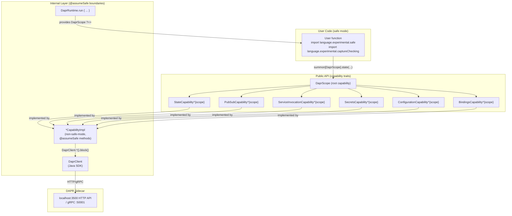
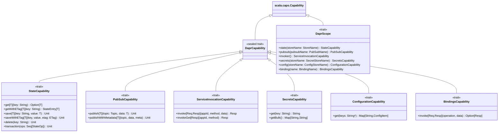
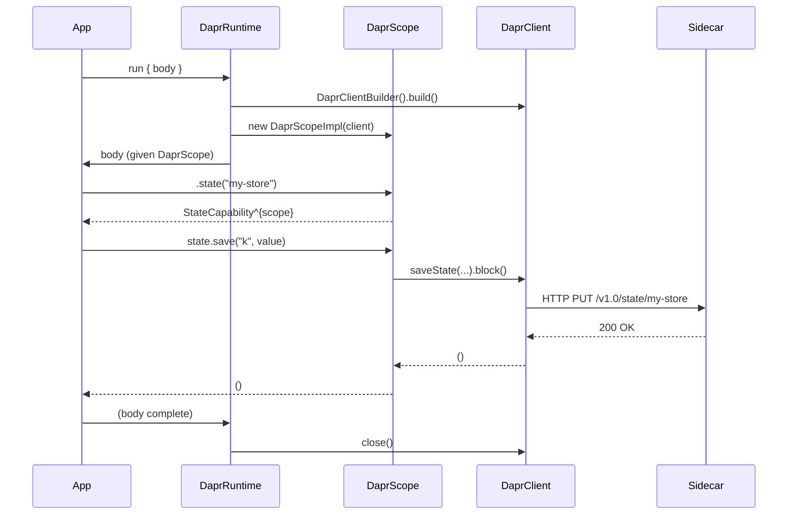

# scala-safe-dapr — Design

## Goal

A Scala 3 library that exposes every DAPR building block as a **tracked capability**. User code compiles under `import language.experimental.safe` and `import language.experimental.captureChecking`. The DAPR Java SDK is completely hidden — users see only Scala types.

Each DAPR effect (state access, pub/sub, service calls, secrets, configuration, bindings) is represented as a `scala.caps.Capability` subtype. The Scala 3 compiler statically verifies:

- Which DAPR effects a computation may perform.
- That DAPR resources cannot escape their managed scope.
- That agent-generated code cannot introduce new unsafe capabilities.

---

## Two-Layer Architecture



### Layer 1 — Public API (safe-mode-compatible)

Capability traits, opaque domain types, and the `DaprRuntime.run` entry point. These compile cleanly under both safe mode and capture checking. No Java types are visible.

### Layer 2 — Internal implementations (`@assumeSafe`)

Non-safe-mode Scala that wraps `DaprClient` Java SDK calls. Each method is marked `@assumeSafe` so safe-mode user code may call it through the capability interfaces. Library authors are responsible for the safety contract; user code cannot add new `@assumeSafe` annotations.

---

## Capability Hierarchy



---

## Opaque Domain Types

All domain identifiers are opaque to prevent accidental misuse (e.g., passing a `PubSubName` where a `StoreName` is expected).

| Type | Wraps | Purpose |
|---|---|---|
| `StoreName` | `String` | DAPR state store component name |
| `PubSubName` | `String` | DAPR pub/sub component name |
| `Topic` | `String` | Pub/sub topic |
| `AppId` | `String` | Target application ID for service invocation |
| `SecretStoreName` | `String` | DAPR secrets store name |
| `ConfigStoreName` | `String` | DAPR configuration store name |
| `BindingName` | `String` | DAPR output binding name |
| `ETag` | `String` | Optimistic concurrency tag |

Smart constructors live in companion objects. Extension methods provide operations that would otherwise require unwrapping.

---

## JSON Serialization

User types must provide a `JsonCodec[T]` given instance. The library ships default instances for primitives and common collections. Users derive instances via upickle's `ReadWriter` derivation or supply custom ones.

```scala
trait JsonCodec[T]:
  def encode(value: T): String
  def decode(json: String): Either[String, T]

object JsonCodec:
  given JsonCodec[String] = ...
  given JsonCodec[Int]    = ...
  given [T: upickle.default.ReadWriter]: JsonCodec[T] = ...
```

---

## Resource Lifecycle (Scope Safety)

`DaprRuntime.run` acquires a `DaprClient`, creates a `DaprScope` that captures the client reference, and releases both on exit. The return type of capabilities created inside `run` captures `DaprScope`, so they cannot outlive the `run` block.



---

## State Machine: StateCapability

```mermaid
stateDiagram-v2
    [*] --> Ready: DaprScope.state(storeName) called

    Ready --> Fetching: get(key)
    Fetching --> Ready: Option[T] returned
    Fetching --> Error: DaprException

    Ready --> Saving: save(key, value)
    Saving --> Ready: ()
    Saving --> Error: DaprException

    Ready --> Deleting: delete(key)
    Deleting --> Ready: ()
    Deleting --> Error: DaprException

    Ready --> InTransaction: transaction(ops)
    InTransaction --> Ready: all ops applied
    InTransaction --> Error: DaprException (all ops rolled back)

    Error --> [*]: exception propagates to caller

    note right of Ready: Capability bound to DaprScope;\ncannot escape run{} block
```

---

## Error Handling

All DAPR errors are surfaced as `DaprException` (from the Java SDK, re-exported as a Scala type alias). The library does not catch exceptions internally — callers use `Try` or `Either` adapters if they want explicit error handling. In safe mode, exceptions are explicitly permitted (see [Safe Mode](wiki/scala-capture-checking/safe-mode.md)).

---

## Project Structure (Scala CLI)

```
scala-safe-dapr/
├── project.scala                     # Scala CLI directives (deps, compiler options)
├── src/
│   ├── Models.scala                  # Opaque types, ETag, StateEntry, ConfigItem, StateOp
│   ├── JsonCodec.scala               # JsonCodec typeclass + default instances
│   ├── Capabilities.scala            # All capability traits (DaprCapability subtypes)
│   ├── DaprScope.scala               # DaprScope trait + DaprRuntime.run
│   └── internal/
│       ├── DaprScopeImpl.scala       # DaprScope implementation
│       ├── StateCapabilityImpl.scala
│       ├── PubSubCapabilityImpl.scala
│       ├── InvokerCapabilityImpl.scala
│       ├── SecretsCapabilityImpl.scala
│       ├── ConfigCapabilityImpl.scala
│       └── BindingsCapabilityImpl.scala
└── test/
    ├── unit/
    │   ├── ModelsTest.scala
    │   ├── JsonCodecTest.scala
    │   └── StateCapabilityTest.scala  # mock-based unit tests
    └── integration/
        ├── StateIntegrationTest.scala     # TestContainers
        ├── PubSubIntegrationTest.scala    # TestContainers
        ├── InvokerIntegrationTest.scala   # TestContainers
        └── SecretsIntegrationTest.scala   # TestContainers
```

---

## Key Design Decisions

| Decision | Choice | Rationale |
|---|---|---|
| Capability root | `DaprScope` provides factory methods | Single entry point; child capabilities capture scope, preventing escape |
| JSON library | upickle | Pure Scala, Scala CLI friendly, automatic derivation |
| Async model | Blocking (`.block()` on `Mono`/`Flux`) | Direct-style compatible; avoids bringing in effect library dependency |
| Error model | Exceptions (Java SDK `DaprException`) | Consistent with safe mode's exception-permitting stance; composable with `Try` |
| Java SDK visibility | Zero — all Java types in `internal/` | Users see only Scala types; easier to swap SDK in future |
| Scope safety | Capture checking: capabilities `^{scope}` | Compiler enforces no DAPR resource outlives its `DaprRuntime.run` block |

---

## Non-Goals (v1)

- Reactive/async API (Mono/Flux exposed to users) — use blocking for simplicity.
- Actor framework (DaprActor interface) — complex enough to warrant separate treatment.
- Workflow orchestration — complex; requires special determinism constraints.
- Subscription handling (inbound pub/sub) — requires HTTP server integration.
