# dapr4s — Capability Splitting (Design Exploration)

**Status:** exploration / not yet implemented.
**Scope:** how each DAPR capability trait *could* be subdivided into narrower capabilities, why, and the cost.
**Audience:** anyone evolving the public capability surface in `src/shared/Capabilities.scala`, `src/shared/Actors.scala`, `src/shared/Workflows.scala`, and the JVM-only `JobsCapability` / `ConversationCapability`.

This document follows the question "*`DaprCapability#state` hands out a `StateCapability` bound to one store — what else can be split that way?*" to its conclusion across the whole API.

---

## 1. The two axes of splitting

"Splitting like state" is not one operation — it is **two**, along orthogonal axes. Keeping them apart is what makes the rest of this document tractable.

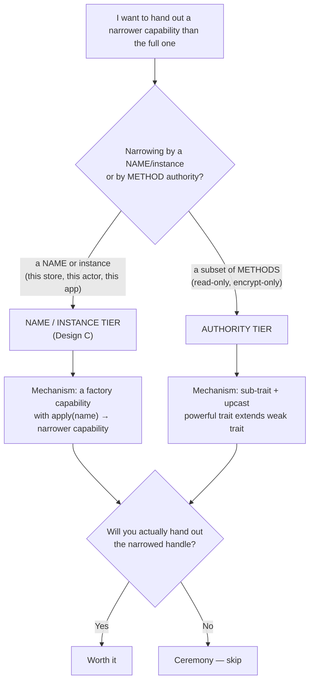

| | **Name / instance tier** | **Authority tier** |
|---|---|---|
| What is removed | a *name argument* (it gets baked into the handle) | a *set of methods* |
| Mechanism | intermediate **factory** capability (`apply(name)`) | **trait subtyping** (`Powerful extends Weak`) — attenuate by upcast |
| New runtime object? | yes (one per name) | **no** — same instance, narrower static type |
| Capture set of result | `^{parent}`, transitively rooted in `dapr` — no lifetime change | identical `^{c}` — no lifetime change |
| Example today | `state(storeName): StateCapability` | none yet |

The single most useful realisation from the research: **authority tiers are nearly free**. If `StateCapability extends ReadStateCapability`, then a `StateCapability^{c}` already *is a* `ReadStateCapability^{c}`; you attenuate by upcasting — no factory, no extra allocation, same capture set. Only the *name tiers* need the Design-C factory machinery.

---

## 2. The two mechanisms, side by side

### 2a. Authority tier = sub-trait + upcast

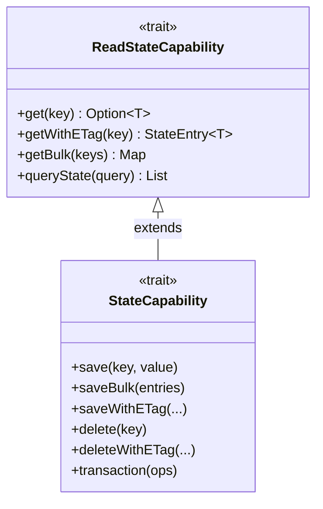

`dapr.state(name)` still returns the full `StateCapability`. A query/read handler is declared to take `ReadStateCapability^` — and the full capability passes by ordinary subsumption. The read handler *cannot* name `save`/`delete`/`transaction` because its static type has no such members.

### 2b. Name / instance tier = Design-C factory

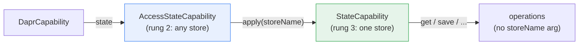

These compose: a capability can have **both** a name tier (downward) *and* authority tiers (sideways).

### 2c. How attenuation is actually used (and what it does/doesn't guarantee)

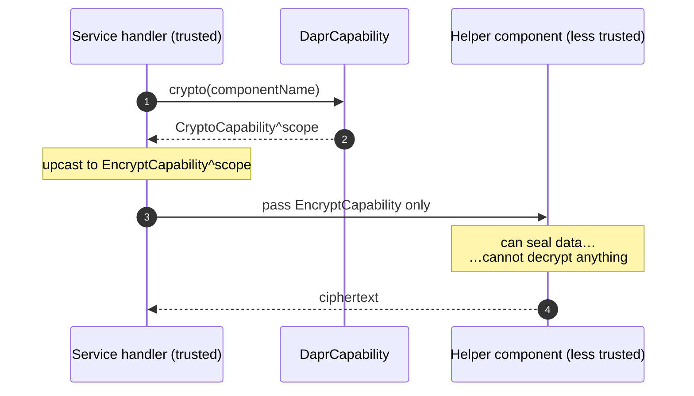

> **Enforcement boundary.** These splits are enforced by the **interface** — the narrow type physically lacks the dangerous method. Capture checking enforces only *region/lifetime* (the handle can't outlive `Dapr.run`). It does **not** enforce the authority narrowing; an `@assumeSafe` cast back to the wide type would defeat it. So this is object-capability attenuation, documented and structurally enforced in normal code, not a CC theorem.

---

## 3. The whole surface at a glance

Every capability and the seam(s) the research found in it:

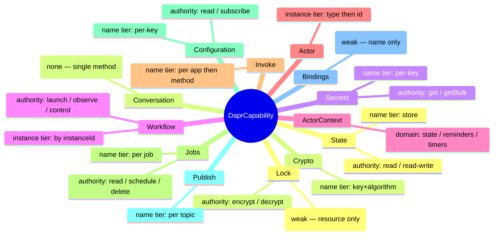

---

## 4. Ranking: payoff vs cost

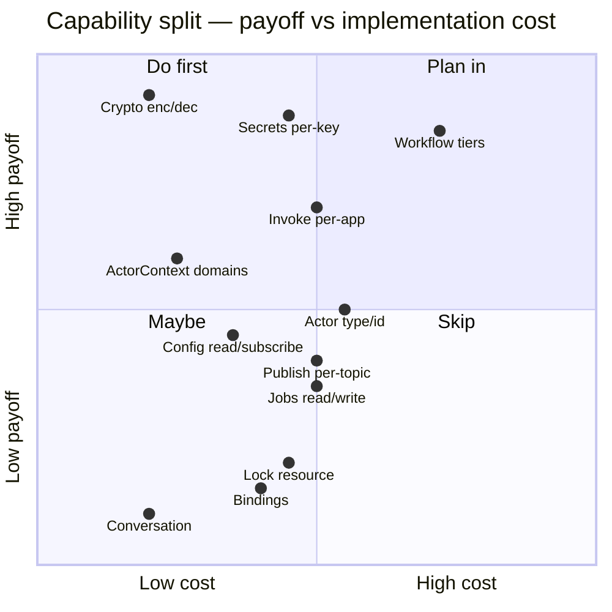

---

## 5. Per-capability designs

### 🥇 5.1 Crypto — encrypt vs decrypt (asymmetric authority)

`encrypt(keyName, plaintext, algorithm)` and `decrypt(ciphertext)` are independent authorities fused into one trait — the sealing/opening analog of sign/verify. A component that only emits sealed data should never be able to open anything.

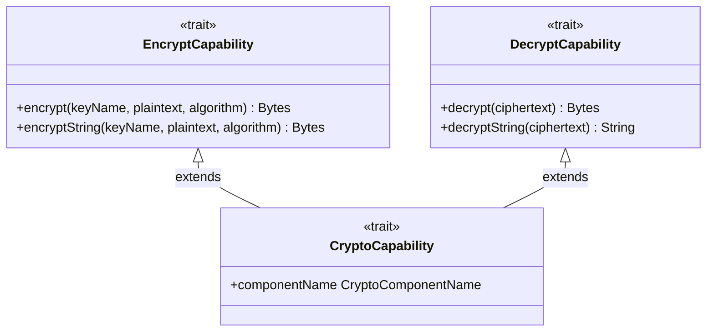

- **Authority tier** (sub-trait + upcast): `EncryptCapability` ⊕ `DecryptCapability`, with `CryptoCapability extends both`.
- **Bonus name tier:** `encrypt` carries `keyName` + `algorithm`, so a Design-C sub-tier `crypto(component).key(keyName, algorithm)` yields a "seal with exactly this key" handle.
- **Verdict:** highest payoff, lowest cost. Real security meaning, pure subtyping.

### 🥇 5.2 Secrets — get(key) vs getBulk (privilege escalation hiding as a sibling)

`getBulk` reads **every secret in the store**; `get(key)` reads one. Today the same handle grants both.

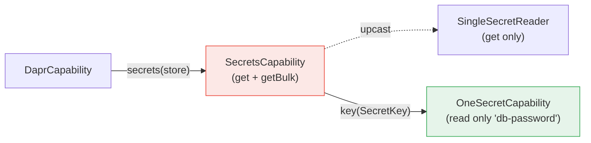

- **Authority tier:** separate `getBulk` (read-all) from per-key `get`.
- **Name tier (stronger):** `secrets(store).key(SecretKey)` → "may read only this one secret". Secrets are the most sensitive surface in the library; this is arguably the single most valuable attenuation here.
- **Verdict:** do it.

### 🥇 5.3 Workflow — launch / observe / control + instance tier (richest target)

Eleven methods cluster cleanly by authority, and ten of them take a `WorkflowInstanceId` (a collapsed instance tier the companion already exposes as `id.suspend()` extensions).

State machine of an instance, annotated by which authority tier drives each edge:

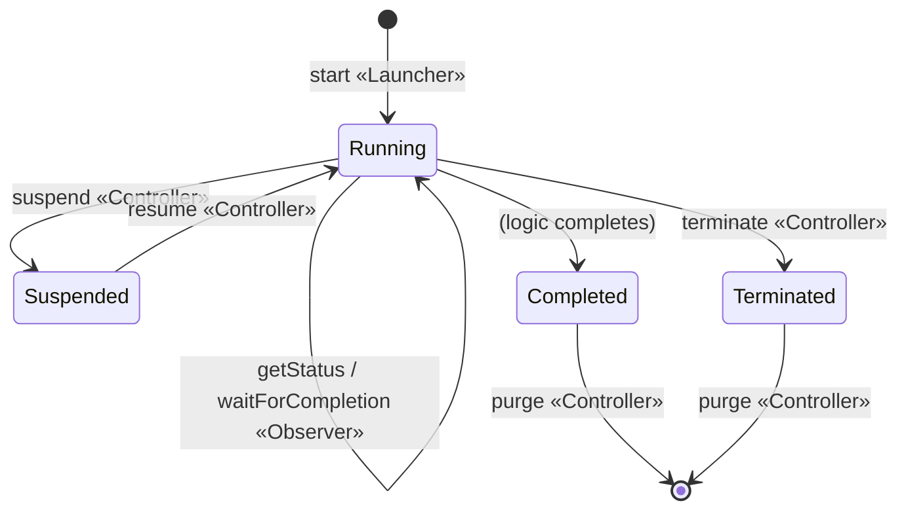

Authority tiers:

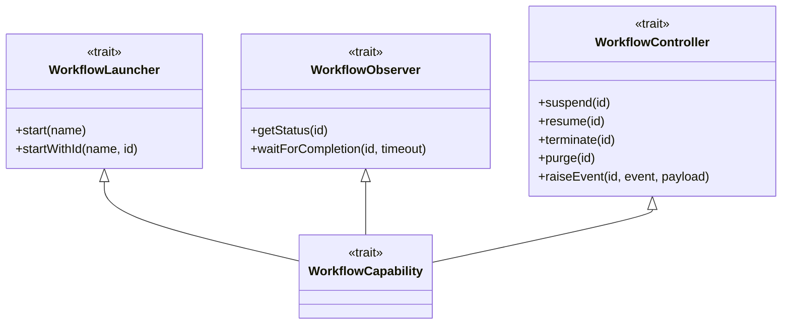

Instance tier (Design C), folding away the repeated `instanceId` argument:

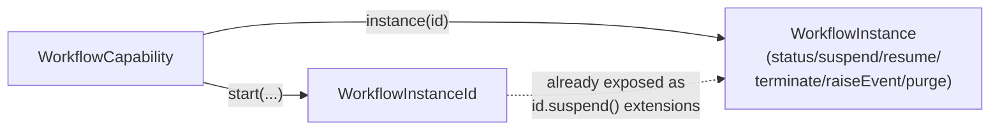

- **Verdict:** biggest API win. Isolating destructive `terminate`/`purge` from "kick off a workflow" code is worth it; the instance grouping already half-exists.

### 🥈 5.4 ActorContext — state / reminders / timers (seams already drawn)

The trait is *already* partitioned by `--- State ---`, `--- Reminders ---`, `--- Timers ---` comment banners. Three authority domains in one context.

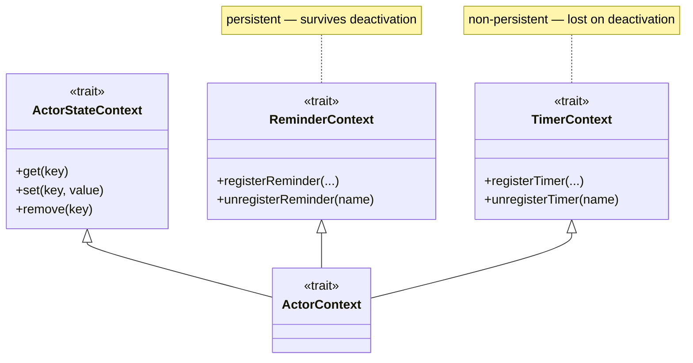

- **Verdict:** cheap (seams pre-drawn, pure subtyping), medium payoff. `ActorStateContext` is itself read/write-splittable if desired.

### 🥈 5.5 Actor — type then id (a collapsed instance tier)

`actor(actorType, actorId)` is a **two-name factory** that flattens a natural Design-C tier.

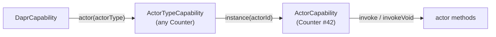

- **Verdict:** mirrors the state design exactly; useful for "this actor type only" grants or code addressing many instances of one type.

### 🥈 5.6 Invoke — per-target attenuation (the inverse of state)

`InvokeCapability` is a single shared handle (Design B — `appId`+`method` per call). Anyone holding it can RPC **any** app.

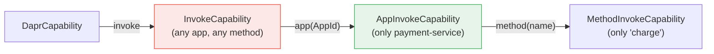

- **Verdict:** the service-to-service least-privilege story. Invoke *lacks* the tier state *has*; adding a downward `app(...)` tier is the symmetric fix.

### 🥉 5.7 Jobs — currently "Design B", plus read/write

`schedule` / `scheduleOnce` / `get` / `delete` all take a `JobName` per call. Two independent splits:

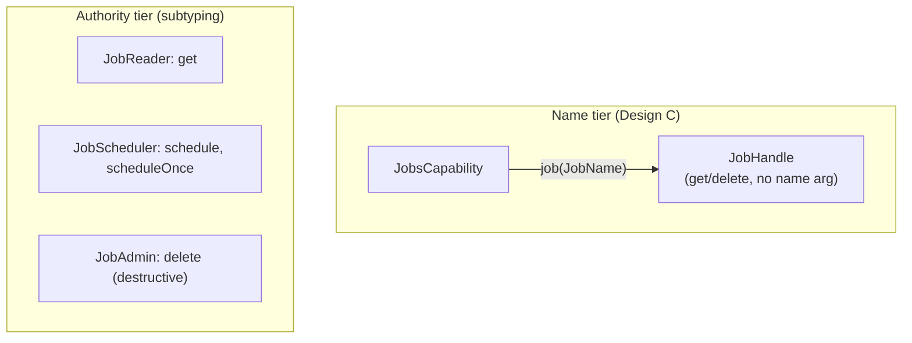

- **Verdict:** modest payoff; `delete` isolation is the main draw.

### 🥉 5.8 Configuration — read vs subscribe

`get(keys)` is a one-shot read; `subscribe(keys)(onChange)` opens a **long-lived stream**, returns `AutoCloseable^{this}`, and is the *only* callback capability in the library.

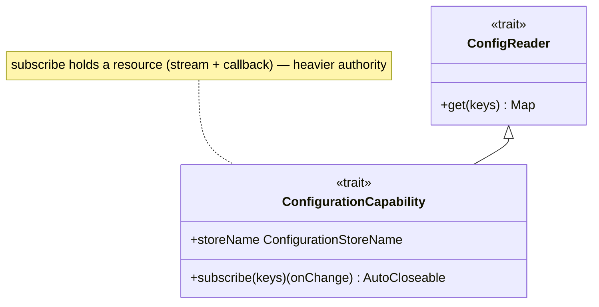

- **Verdict:** isolates the resource-holding streaming authority from plain reads. Reasonable; add per-key name tier if demand exists.

### 🥉 5.9 Publish — per-topic tier

All three methods are writes (no read/write seam), but `topic` is a routing dimension worth attenuating.

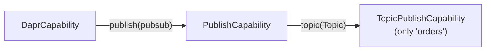

- **Verdict:** meaningful "publish only to topic X" grant; mirrors state→key.

### 5.10 Weak / skip

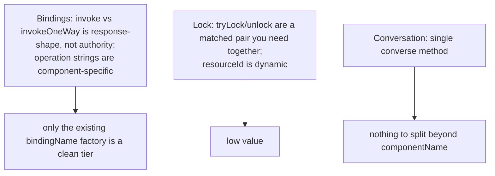

---

## 6. Cross-cutting: activities and actors get the *whole* capability

`WorkflowActivity.execute(input)(using DaprCapability)` and actor `build` lambdas receive the **entire** `DaprCapability`. None of the trait splits above help here — the lever is handing those callbacks a *narrowed* capability (only the sub-capabilities they declare). This is a separate, larger design question and is called out so it isn't mistaken for something the per-trait splits solve.

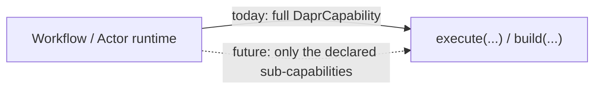

---

## 7. Recommendation & sequencing

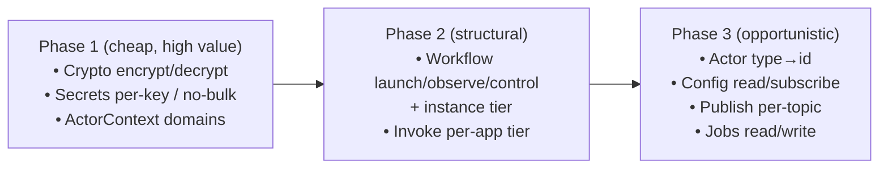

**Rules of thumb that fell out of the research:**

1. **Authority tiers first** — they are sub-trait + upcast: no new objects, no capture-set change, no factory plumbing.
2. **Name tiers only where you will hand out the narrowed handle** — otherwise the intermediate capability is pure ceremony (`dapr.state(name)` stays terser than `dapr.state.apply(name)` if nobody ever passes a bare rung-2 handle around). Where you do add one, name the selector `apply` so `dapr.state(name).get(key)` reads unchanged while `dapr.state` becomes the passable rung-2 capability.
3. **Prioritise by what's dangerous to over-grant**, not by symmetry: decrypt, read-all-secrets, terminate/purge, arbitrary-app RPC.

---

## 8. Worked example — "Design C" applied to *every* capability

This section shows the concrete shape of the new capabilities if the name/instance tier were applied uniformly. The rule is mechanical:

> Every `def x(name: N): XCapability` on `DaprCapability` becomes `def x: AccessXCapability` (no argument), and the name moves to `AccessXCapability#apply(name): XCapability`. Where a capability carries the name on its *methods* today (invoke, jobs, workflow instances), that name is lifted out the same way.

So the root shrinks to a set of **argument-less accessors**:

```mermaid
flowchart LR
    D["DaprCapability"]
    D --> AS["AccessStateCapability"]
    D --> AP["AccessPublishCapability"]
    D --> AI["AccessInvokeCapability"]
    D --> ASe["AccessSecretsCapability"]
    D --> AC["AccessConfigurationCapability"]
    D --> AB["AccessBindingsCapability"]
    D --> AL["AccessLockCapability"]
    D --> AA["AccessActorCapability"]
    D --> AW["AccessWorkflowCapability"]
    D --> ACr["AccessCryptoCapability"]
    D --> AJ["AccessJobsCapability (JVM)"]
    D --> ACo["AccessConversationCapability (JVM)"]
```

### 8.1 The uniform pattern

Every accessor is the same two-trait shape. Shown generically, then instantiated for state:

```mermaid
classDiagram
    class AccessXCapability {
        <<trait>>
        +apply(name: N) X
    }
    class XCapability {
        <<trait>>
        +name: N
        +op1(...)
        +op2(...)
    }
    AccessXCapability ..> XCapability : "apply returns (rung 3)"
    note for AccessXCapability "rung 2 — 'any X' — argument-less; held and passed around"
    note for XCapability "rung 3 — 'this X' — methods never mention N"
```

```mermaid
classDiagram
    class AccessStateCapability {
        <<trait>>
        +apply(storeName: StateStoreName) StateCapability
    }
    class StateCapability {
        <<trait>>
        +storeName: StateStoreName
        +get(key, consistency) Option~T~
        +save(key, value)
        +transaction(ops)
        +queryState(query) List
    }
    AccessStateCapability ..> StateCapability
```

**Key point:** for the eight capabilities that already take the name in the factory (state, publish, secrets, configuration, bindings, lock, crypto, conversation), **rung 3 is today's trait, unchanged** — only the rung-2 `Access*` trait is new. `dapr.state(name)` keeps reading identically because `apply` is invoked with the same argument list; the gain is that `dapr.state` is now itself a passable "any store" handle.

### 8.2 The three capabilities whose methods lose an argument

For these, the name lives on the methods today, so uniform Design C changes rung 3 too — every method drops the lifted name.

```mermaid
classDiagram
    class AccessInvokeCapability {
        <<trait>>
        +apply(appId: AppId) InvokeCapability
    }
    class InvokeCapability {
        <<trait>>
        +appId: AppId
        +invoke(method, data, httpMethod, metadata) Resp
        +invoke(method) Resp
    }
    AccessInvokeCapability ..> InvokeCapability
    note for InvokeCapability "appId dropped from every method"
```

```mermaid
classDiagram
    class AccessJobsCapability {
        <<trait>>
        +apply(name: JobName) JobCapability
    }
    class JobCapability {
        <<trait>>
        +jobName: JobName
        +schedule(data, schedule, dueTime, repeats, ttl)
        +scheduleOnce(data, dueTime, ttl)
        +get() Option~JobDetails~
        +delete()
    }
    AccessJobsCapability ..> JobCapability
    note for JobCapability "JobName dropped from every method"
```

Workflow is the interesting one: `start*` *mints* the instance id, so the accessor keeps the launch methods, and `apply(id)` hands back an instance-scoped capability holding the id-less operations.

```mermaid
classDiagram
    class AccessWorkflowCapability {
        <<trait>>
        +start(name) WorkflowInstanceId
        +startWithId(name, id) WorkflowInstanceId
        +apply(id: WorkflowInstanceId) WorkflowInstanceCapability
    }
    class WorkflowInstanceCapability {
        <<trait>>
        +instanceId: WorkflowInstanceId
        +getStatus() Option~WorkflowSnapshot~
        +suspend()
        +resume()
        +terminate()
        +raiseEvent(event, payload)
        +waitForCompletion(timeout) Option~WorkflowSnapshot~
        +purge() Boolean
    }
    AccessWorkflowCapability ..> WorkflowInstanceCapability
```

### 8.3 Actor — two names, two tiers

The actor accessor is the only one that descends **two** rungs (`ActorType` then `ActorId`), each an `apply`:

```mermaid
flowchart LR
    D["DaprCapability"] -->|".actor"| AA["AccessActorCapability"]
    AA -->|"apply(actorType)"| AT["ActorTypeCapability<br/>(val actorType)"]
    AT -->|"apply(actorId)"| AC["ActorCapability<br/>(val actorType, val actorId)<br/>invoke / invokeVoid — no type/id args"]
```

### 8.4 Full mapping

| Capability | rung 2 (new) | `apply` arg(s) | rung 3 | rung-3 methods change? |
|---|---|---|---|---|
| state | `AccessStateCapability` | `StateStoreName` | `StateCapability` | no |
| publish | `AccessPublishCapability` | `PubSubName` | `PublishCapability` | no |
| secrets | `AccessSecretsCapability` | `SecretStoreName` | `SecretsCapability` | no |
| configuration | `AccessConfigurationCapability` | `ConfigurationStoreName` | `ConfigurationCapability` | no |
| bindings | `AccessBindingsCapability` | `BindingName` | `BindingsCapability` | no |
| lock | `AccessLockCapability` | `LockStoreName` | `LockCapability` | no |
| crypto | `AccessCryptoCapability` | `CryptoComponentName` | `CryptoCapability` | no |
| conversation | `AccessConversationCapability` | `ConversationComponentName` | `ConversationCapability` | no |
| invoke | `AccessInvokeCapability` | `AppId` | `InvokeCapability` | **yes** — drop `appId` |
| jobs | `AccessJobsCapability` | `JobName` | `JobCapability` | **yes** — drop `JobName` |
| workflow | `AccessWorkflowCapability` (+`start*`) | `WorkflowInstanceId` | `WorkflowInstanceCapability` | **yes** — drop `instanceId` |
| actor | `AccessActorCapability` | `ActorType` → `ActorId` | `ActorCapability` (via `ActorTypeCapability`) | **yes** — drop type/id |

> Note: `ActorContext` and `WorkflowContext` are framework-provided (not acquired from `DaprCapability`), so the root-level Design C does not reach them. Their internal name args (`ActorStateKey`, `ReminderName`, `EventName`…) could be lifted analogously, but that's a separate, lower-value move.

---

## 9. Worked example — the "authority split" applied to *every* capability

Here the mechanism is **trait subtyping**: define narrow sub-traits, and let the full capability `extend` all of them. No factory, no new runtime object, identical `^{c}` capture set — you attenuate by *upcasting* to a sub-trait. The diagrams below show the new sub-traits each capability would gain.

### 9.1 The capabilities with a clean authority axis

```mermaid
classDiagram
    direction LR
    class ReadStateCapability {
        <<trait>>
        +get() +getWithETag() +getBulk() +queryState()
    }
    class WriteStateCapability {
        <<trait>>
        +save() +saveBulk() +saveWithETag()
        +delete() +deleteWithETag() +transaction()
    }
    class StateCapability
    ReadStateCapability <|-- StateCapability
    WriteStateCapability <|-- StateCapability
```

```mermaid
classDiagram
    direction LR
    class EncryptCapability {
        <<trait>>
        +encrypt() +encryptString()
    }
    class DecryptCapability {
        <<trait>>
        +decrypt() +decryptString()
    }
    class CryptoCapability
    EncryptCapability <|-- CryptoCapability
    DecryptCapability <|-- CryptoCapability
```

```mermaid
classDiagram
    direction LR
    class SingleSecretReader {
        <<trait>>
        +get(key) Option~SecretValue~
    }
    class BulkSecretReader {
        <<trait>>
        +getBulk() Map
    }
    class SecretsCapability
    SingleSecretReader <|-- SecretsCapability
    BulkSecretReader <|-- SecretsCapability
    note for BulkSecretReader "reads ALL secrets — higher authority"
```

```mermaid
classDiagram
    direction LR
    class ConfigReader {
        <<trait>>
        +get(keys) Map
    }
    class ConfigSubscriber {
        <<trait>>
        +subscribe(keys)(onChange) AutoCloseable
    }
    class ConfigurationCapability
    ConfigReader <|-- ConfigurationCapability
    ConfigSubscriber <|-- ConfigurationCapability
    note for ConfigSubscriber "opens a stream + callback — heavier"
```

```mermaid
classDiagram
    direction LR
    class WorkflowLauncher {
        <<trait>>
        +start() +startWithId()
    }
    class WorkflowObserver {
        <<trait>>
        +getStatus() +waitForCompletion()
    }
    class WorkflowController {
        <<trait>>
        +suspend() +resume() +terminate() +purge() +raiseEvent()
    }
    class WorkflowCapability
    WorkflowLauncher <|-- WorkflowCapability
    WorkflowObserver <|-- WorkflowCapability
    WorkflowController <|-- WorkflowCapability
    note for WorkflowController "terminate / purge are destructive"
```

```mermaid
classDiagram
    direction LR
    class JobReader {
        <<trait>>
        +get(name) Option~JobDetails~
    }
    class JobScheduler {
        <<trait>>
        +schedule(...) +scheduleOnce(...)
    }
    class JobAdmin {
        <<trait>>
        +delete(name)
    }
    class JobsCapability
    JobReader <|-- JobsCapability
    JobScheduler <|-- JobsCapability
    JobAdmin <|-- JobsCapability
```

The two context capabilities split the same way:

```mermaid
classDiagram
    direction LR
    class ActorStateReader {
        <<trait>>
        +get(key)
    }
    class ActorStateWriter {
        <<trait>>
        +set(key, value) +remove(key)
    }
    class ReminderContext {
        <<trait>>
        +registerReminder(...) +unregisterReminder(...)
    }
    class TimerContext {
        <<trait>>
        +registerTimer(...) +unregisterTimer(...)
    }
    class ActorContext
    ActorStateReader <|-- ActorContext
    ActorStateWriter <|-- ActorContext
    ReminderContext <|-- ActorContext
    TimerContext <|-- ActorContext
```

```mermaid
classDiagram
    direction LR
    class WorkflowInfo {
        <<trait>>
        +instanceId +isReplaying +getInput() +newUuid()
    }
    class WorkflowScheduler {
        <<trait>>
        +callActivity() +callActivityByName() +createTimer() +waitForExternalEvent()
    }
    class WorkflowCompletion {
        <<trait>>
        +complete(output) +continueAsNew(input)
    }
    class WorkflowContext
    WorkflowInfo <|-- WorkflowContext
    WorkflowScheduler <|-- WorkflowContext
    WorkflowCompletion <|-- WorkflowContext
    note for WorkflowCompletion "terminal — ends/restarts the run"
```

### 9.2 The capabilities where the authority split degenerates

For these the subtyping is *possible* but the sub-traits don't track a real privilege difference — the distinction is request-shape, not authority. Shown for completeness; the honest answer is "don't bother".

```mermaid
classDiagram
    direction LR
    class PublishOne {
        <<trait>>
        +publish() +publishWithMetadata()
    }
    class PublishBulk {
        <<trait>>
        +bulkPublish()
    }
    class PublishCapability
    PublishOne <|-- PublishCapability
    PublishBulk <|-- PublishCapability
    note for PublishCapability "all writes — no read side to separate"
```

```mermaid
classDiagram
    direction LR
    class BindingRequestResponse {
        <<trait>>
        +invoke() Option~Resp~
    }
    class BindingFireAndForget {
        <<trait>>
        +invokeOneWay()
    }
    class BindingsCapability
    BindingRequestResponse <|-- BindingsCapability
    BindingFireAndForget <|-- BindingsCapability
    note for BindingsCapability "split is response-shape, not authority"
```

```mermaid
classDiagram
    direction LR
    class LockAcquirer {
        <<trait>>
        +tryLock()
    }
    class LockReleaser {
        <<trait>>
        +unlock()
    }
    class LockCapability
    LockAcquirer <|-- LockCapability
    LockReleaser <|-- LockCapability
    note for LockCapability "tryLock/unlock are a matched pair — rarely split"
```

`InvokeCapability` (GET-style no-body `invoke` vs body+verb `invoke` — a read/write-ish HTTP distinction), `ActorCapability` (`invoke` query vs `invokeVoid` command — but actor-method semantics are user-defined, so the capability can't really know), and `ConversationCapability` (a single `converse` method — nothing to split) round out the degenerate cases.

### 9.3 Summary of the authority axes

```mermaid
mindmap
  root((Authority axes))
    Clean
      State :: read / write
      Crypto :: encrypt / decrypt
      Secrets :: single / bulk
      Configuration :: read / subscribe
      Workflow :: launch / observe / control
      Jobs :: read / schedule / admin
      ActorContext :: state / reminders / timers
      WorkflowContext :: info / schedule / complete
    Degenerate
      Publish :: single / bulk only
      Bindings :: response-shape only
      Lock :: acquire / release pair
      Invoke :: GET vs body
      Actor :: invoke vs invokeVoid
      Conversation :: none
```

---

## 10. Caveats

- **Interface-enforced, not CC-enforced** (see §2c). Don't rely on capture checking to stop a holder reaching a method the narrow type omits; rely on the type omitting it.
- This document was derived from the trait/companion definitions, not every `*Impl`. A split's feasibility could be constrained by an impl detail (e.g. a shared mutable handle); for the pure-subtyping authority splits that's unlikely.
- "Worth it" is judged from the API shape. It should be confirmed against real consumer call sites (the examples repo) — which tiers code would actually request — before committing to the name-tier ones.
