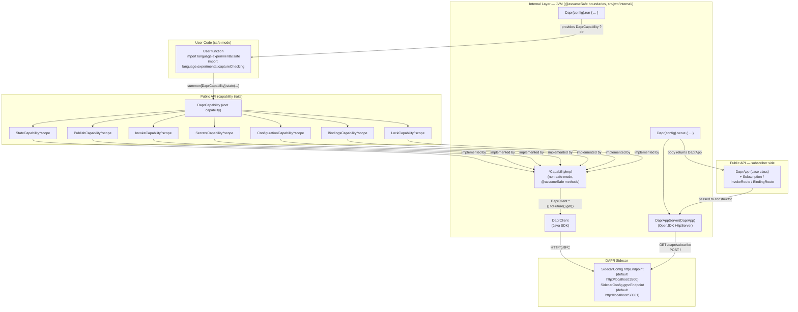
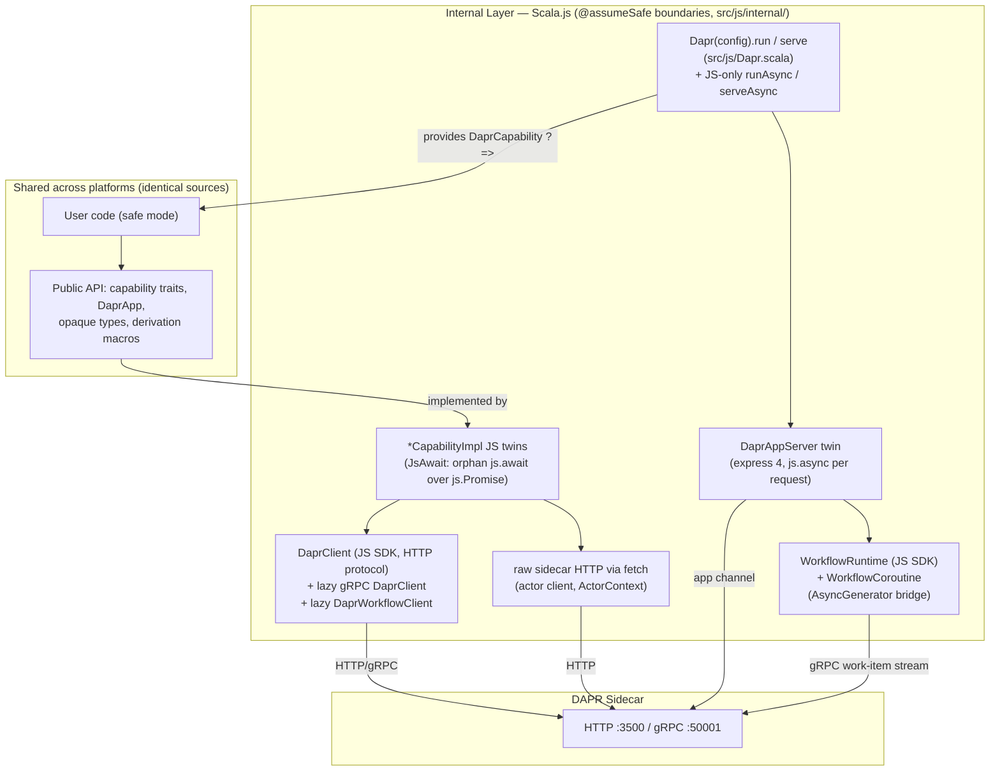
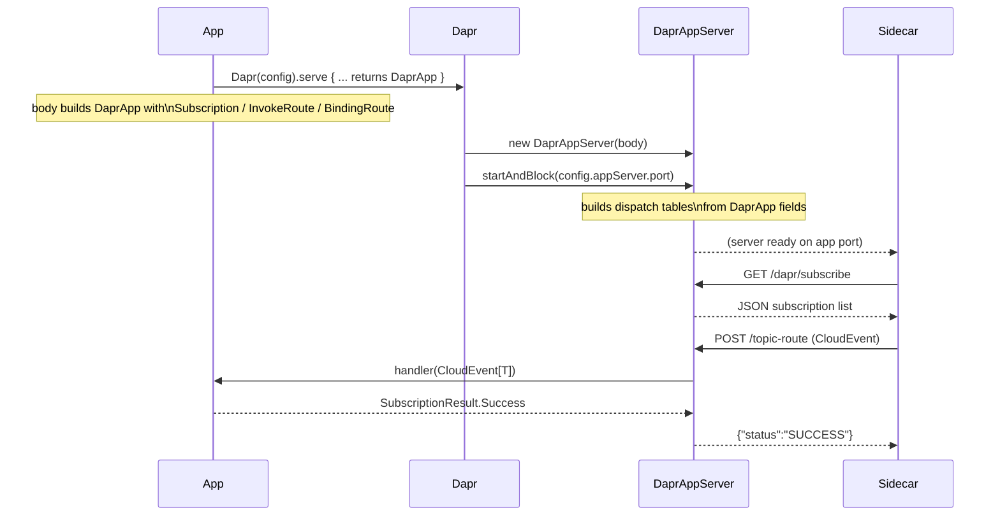
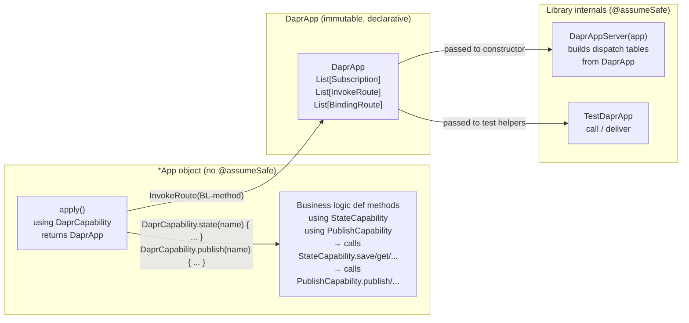
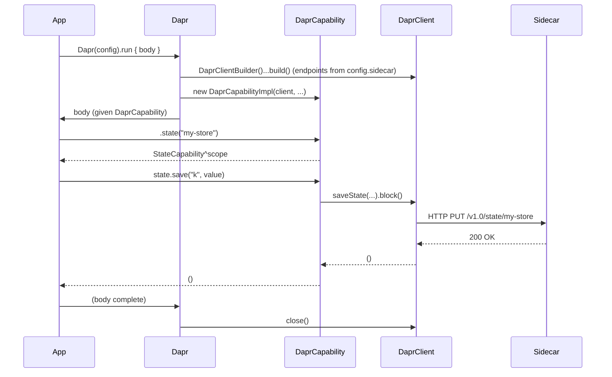
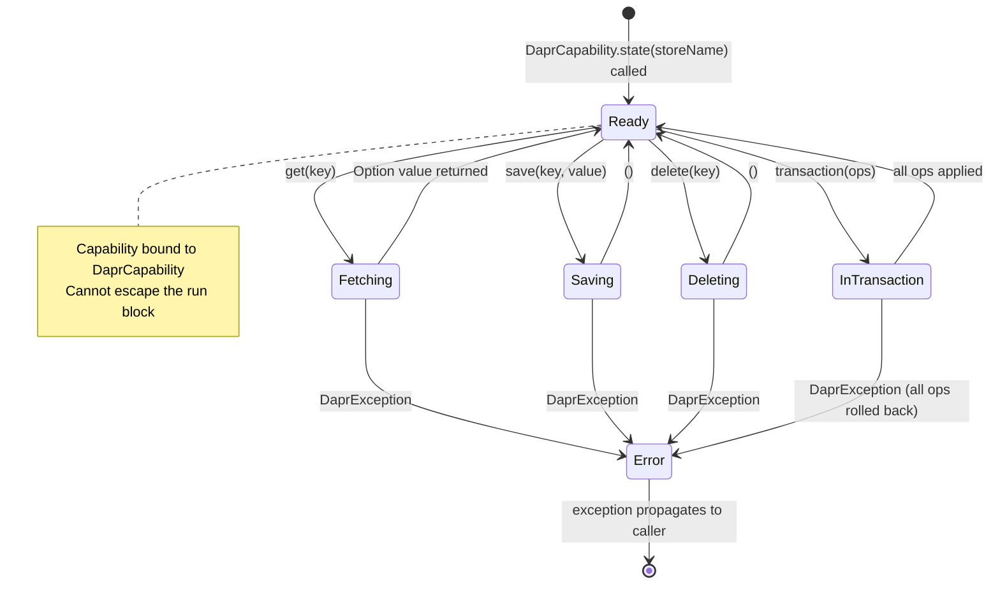

# dapr4s — Design

## Goal

A Scala 3 library that exposes every DAPR building block as a **tracked capability**. User code compiles under `import language.experimental.safe` and `import language.experimental.captureChecking`. The underlying Dapr SDK is completely hidden — users see only Scala types.

**Requires**: Scala `3.10.0-RC1-bin-20260607-dec42ae-NIGHTLY` (or later nightly). The `import language.experimental.safe` and `import language.experimental.captureChecking` features are fully supported in nightly builds — no `-Ycc` flag is needed.

**Platforms**: JVM and Scala.js, with a byte-identical public API (modulo the platform-trait surface, see below). On the JVM the internal layer wraps the Dapr **Java SDK**; on Scala.js it wraps the Dapr **JS SDK** (`@dapr/dapr`). Both SDKs are confined behind the same `@assumeSafe` wall (`src/jvm/internal/` and `src/js/internal/` respectively) — see the [Scala.js platform](#scalajs-platform) section. Sources are organised as `src/{shared,jvm,js}` and `test/{shared,jvm,js}` (see Project Structure).

Each DAPR effect (state access, pub/sub, service calls, secrets, configuration, bindings) is tracked as a captured capability via `^` annotations. The Scala 3 compiler statically verifies:

- Which DAPR effects a computation may perform.
- That DAPR resources cannot escape their managed scope.
- That agent-generated code cannot introduce new unsafe capabilities.

---

## Two-Layer Architecture



On Scala.js, everything above the internal layer is the **same source code**; only the internal layer is swapped for a JS twin (package `dapr4s.internal`, sources in `src/js/internal/`):



### Layer 1 — Public API (safe-mode-compatible)

Capability traits, opaque domain types, and the `Dapr(config).run` / `.serve` entry points (on `class Dapr(config: DaprConfig)` — `src/jvm/Dapr.scala` on the JVM, `src/js/Dapr.scala` on Scala.js, same public signatures). These compile cleanly under both safe mode and capture checking. No Java or JS SDK types are visible.

### Layer 2 — Internal implementations (`@assumeSafe`)

Non-safe-mode Scala that wraps the platform SDK calls — the Java SDK's `DaprClient` in `src/jvm/internal/`, the JS SDK's `DaprClient`/`DaprWorkflowClient`/`WorkflowRuntime` (plus express and raw `fetch`) in `src/js/internal/`. Each class/object is marked `@scala.caps.assumeSafe` (from the `scala.caps` package) so safe-mode user code may call them through the capability trait interfaces. Library authors are responsible for the safety contract; user code cannot add new `@scala.caps.assumeSafe` annotations (the annotation is itself restricted to non-safe-mode code).

Note: safe mode is enabled **per-file** via `import language.experimental.safe` (not globally via a compiler flag). This is intentional: files in `internal/` (both platforms) and `jvm/Dapr.scala`/`js/Dapr.scala`/`JsonCodec.scala` must use `@scala.caps.assumeSafe` and therefore cannot have the safe-mode import.

---

## Capability Hierarchy

```mermaid
classDiagram
    class DaprCapability {
        <<trait>>
        +state(storeName: StateStoreName) StateCapability^this
        +publish(pubsubName: PubSubName) PublishCapability^this
        +invoke InvokeCapability^this
        +secrets(storeName: SecretStoreName) SecretsCapability^this
        +configuration(storeName: ConfigurationStoreName) ConfigurationCapability^this
        +bindings(name: BindingName) BindingsCapability^this
        +lock(storeName: LockStoreName) LockCapability^this
        +actor(actorType, actorId) ActorCapability^this
        +workflow WorkflowCapability^this
        +crypto(componentName: CryptoComponentName) CryptoCapability^this
        +jobs JobsCapability^this
        +conversation(componentName: ConversationComponentName) ConversationCapability^this
    }
    note for DaprCapability "Root capability. Companion object provides transformer API:\nDaprCapability.state(name) { ... } introduces StateCapability into body scope.\njobs + conversation come from the JVM platform trait DaprCapabilityPlatform —\non Scala.js they do not exist at compile time (see Scala.js platform section)"
    class StateCapability {
        <<trait>>
        +get[T](key: StateStoreKey) Option[T]
        +getWithETag[T](key: StateStoreKey) StateEntry[T]
        +getBulk[T](keys: Seq[StateStoreKey]) Map[StateStoreKey,StateEntry[T]]
        +save[T](key: StateStoreKey, value: T) Unit
        +saveBulk[T](entries: Seq[(StateStoreKey,T)]) Unit
        +saveWithETag[T](key: StateStoreKey, value: T, etag: ETag) Option[ETagMismatchException]
        +delete(key: StateStoreKey) Unit
        +deleteWithETag(key: StateStoreKey, etag: ETag) Option[ETagMismatchException]
        +transaction(ops: Seq[StateOp]) Unit
        +queryState[T](query: StateQuery) List[StateEntry[T]]
    }
    note for StateCapability "getBulk and saveBulk use DAPR batch APIs (getBulkState / saveBulkState) — single sidecar call each"
    class PublishCapability {
        <<trait>>
        +publish[T](topic: Topic, data: T) Unit
        +publishWithMetadata[T](topic, data, meta) Unit
        +bulkPublish[T](topic, entries: Seq[BulkPublishEntry[T]]) BulkPublishResult
    }
    class InvokeCapability {
        <<trait>>
        +invoke[Req,Resp](appId: AppId, method: InvokeMethodName, data: Req) Resp
        +invokeGet[Resp](appId: AppId, method: InvokeMethodName) Resp
    }
    class SecretsCapability {
        <<trait>>
        +get(key: SecretKey) String
        +getBulk() Map[SecretKey,String]
    }
    class ConfigurationCapability {
        <<trait>>
        +get(keys: Seq[ConfigurationKey]) Map[ConfigurationKey,ConfigurationItem]
        +subscribe(keys: Seq[ConfigurationKey])(onChange) AutoCloseable
    }
    class DaprApp {
        <<case class>>
        +subscriptions: List[Subscription]
        +invokeRoutes: List[InvokeRoute]
        +bindings: List[BindingRoute]
        +workflows: List[Workflow]
        +activities: List[WorkflowActivity[?,?]]
        +actors: List[ActorDefinition]
        +jobs: List[JobRoute]
        +\+\+(other: DaprApp) DaprApp
    }
    class BindingsCapability {
        <<trait>>
        +invoke[Req,Resp](operation: BindingOperation, data: Req) Option[Resp]
        +invokeOneWay[Req](operation: BindingOperation, data: Req) Unit
    }
    class LockCapability {
        <<trait>>
        +tryLock(resourceId: LockResourceId, lockOwner: LockOwner, expirySeconds: Int) Boolean
        +unlock(resourceId: LockResourceId, lockOwner: LockOwner) UnlockStatus
    }
    class CryptoCapability {
        <<trait>>
        +encrypt(keyName, plaintext: ArraySeq[Byte], algorithm) ArraySeq[Byte]
        +decrypt(ciphertext: ArraySeq[Byte]) ArraySeq[Byte]
        +encryptString(keyName, plaintext: String, algorithm) ArraySeq[Byte]
        +decryptString(ciphertext: ArraySeq[Byte]) String
    }
    class JobsCapability {
        <<trait>>
        +schedule[T](name: JobName, data: T, schedule: JobSchedule) Unit
        +scheduleOnce[T](name: JobName, data: T, dueTime: Instant) Unit
        +get(name: JobName) Option[JobDetails]
        +delete(name: JobName) Unit
    }
    class ConversationCapability {
        <<trait>>
        +converse(messages: Seq[ConversationMessage], ...) ConversationResponse
    }

    DaprCapability --> StateCapability : .state()
    DaprCapability --> PublishCapability : .publish()
    DaprCapability --> InvokeCapability : .invoke
    DaprCapability --> SecretsCapability : .secrets()
    DaprCapability --> ConfigurationCapability : .configuration()
    DaprCapability --> BindingsCapability : .bindings()
    DaprCapability --> LockCapability : .lock()
    DaprCapability --> CryptoCapability : .crypto()
    DaprCapability --> JobsCapability : .jobs
    DaprCapability --> ConversationCapability : .conversation()
```



---

## Subscriber Server (`Dapr(config).serve`)

Apps that need to receive Dapr events (pub/sub messages, input binding triggers, service invocations) use `Dapr(config).serve` instead of `run`.  The body returns a declarative [[DaprApp]] value describing all inbound routes; the runtime passes it to `DaprAppServer` which starts an HTTP server on `config.appServer.port` (default 8080) and blocks until interrupted.



The server runs each request on its own virtual thread (via `Executors.newVirtualThreadPerTaskExecutor()`).  Handler lambdas may capture capabilities from the `serve` body to make outbound calls (e.g., saving received messages to state).  Two `DaprApp` values may be combined with `++` to compose service modules.

### CloudEvent envelope parsing

The Dapr sidecar wraps pub/sub messages in CloudEvents.  `DaprAppServer` extracts the `data` field and decodes it with the registered `JsonCodec[T]`.  If decoding fails, the result is `SubscriptionResult.Drop` (silently discards — avoids poison-pill retry loops).  If the handler itself throws, the result is `SubscriptionResult.Retry`.

A `Subscription` may declare an optional `deadLetterTopic: Option[Topic]`; when set it is emitted as `deadLetterTopic` in the `/dapr/subscribe` response so the sidecar routes undeliverable messages to that topic instead of dropping them.

### Service-invocation routes

`InvokeRoute.apply` builds a route whose handler receives only the decoded request body (`Q => R`).  `InvokeRoute.withRequest` is an HTTP-method-aware overload whose handler receives the full `InvokeRequest[Q]` envelope (method name, `httpMethod: HttpMethod`, decoded body), letting one route branch on the incoming HTTP verb.

### Route collision

Pub/sub routes (default `/<topic>`), input binding paths (`/<bindingName>`), service invocation paths (`/<methodName>`), and job-trigger paths (`/job/<jobName>`) all use the same flat namespace.  Users should choose distinct names.  Registration is first-writer-wins.

### Job triggers

A scheduled job created via `JobsCapability.schedule`/`scheduleOnce` is delivered by the sidecar as a POST to `/job/<jobName>` on the app server. A `JobRoute[T](JobName(...)) { payload => ... }` registered on the `DaprApp` decodes the payload (the sidecar sends either the raw value or a `{"data": ...}` envelope — both are accepted) and invokes the handler. Unknown job names return 404; a handler exception returns 500.

> **`ExclusiveCapability` as a cornerstone**: Every capability in this library — `DaprCapability`, all twelve sub-capability traits, `ActorContext`, and `WorkflowContext` — extends `scala.caps.ExclusiveCapability`. This is intentional and load-bearing:
> - `ExclusiveCapability` tells the Scala 3 CC framework that these objects are exclusive (not shared), enabling separation checking that prevents concurrent or escaping use.
> - `scala.caps.Capability` is **sealed** in nightly Scala 3; only `SharedCapability` and `ExclusiveCapability` can be extended. `SharedCapability` would allow sharing across concurrent fibers, which violates the exclusive-per-invocation semantics we require.
> - Because each sub-capability extends `ExclusiveCapability`, CC infers `^{fresh}` for new instances returned from methods. The trait declares `^{this}` to bind the sub-capability lifetime to the parent — overrides must explicitly annotate return types as `StateCapability^{this}` etc. to satisfy the override check. See `DaprCapabilityImpl` and `MockDaprCapability` for the pattern.
> - `@scala.caps.assumeSafe` on implementation classes suppresses CC checks inside the method body, but override-level compatibility checks still fire — hence the explicit `^{this}` annotations are required in both `DaprCapabilityImpl` and `MockDaprCapability`.

---

## Handler Implementation Pattern (Capability-as-Effect-System)

Handler objects follow a two-layer structure that maximises capability tracking while containing the CC escape hatches in a single place.

### Layer 1 — Business logic methods

Pure handler methods declared with **anonymous** `using` capability parameters.  Business logic calls **companion-object methods** on the capability types (`StateCapability.save(...)`, `PublishCapability.publish(...)`) rather than naming the capability value — the compiler resolves the implicit from the anonymous `using` context:

```scala
def placeOrder(req: OrderRequest)(using StateCapability, PublishCapability): OrderResponse =
  val orderId = java.util.UUID.randomUUID().toString
  StateCapability.save(StateStoreKey(orderId), req)
  PublishCapability.publish(OrdersTopic, OrderEvent(orderId, req.item, req.quantity))
  OrderResponse(orderId, "accepted")
```

Each capability trait has a companion object that mirrors every instance method as a static forwarder taking `using cap: CapabilityType`.  This makes the call-site type act as both a static effect declaration (which capabilities are required) and as a namespace for the API:

```scala
// src/shared/Capabilities.scala
object StateCapability:
  def save[T: JsonCodec](key: StateStoreKey, value: T)(using cap: StateCapability): Unit =
    cap.save(key, value)
  def get[T: JsonCodec](key: StateStoreKey)(using cap: StateCapability): Option[T] =
    cap.get(key)
  // ... all other methods
```

These methods carry no `@assumeSafe`; they are pure capability-tracked code that the compiler can reason about.

### Layer 2 — the `*App` object's `apply` method: declarative route description

The promoted idiom is a dedicated `*App` object whose `apply` method takes the capabilities it needs (`using DaprCapability`, codecs, …) and returns an immutable `DaprApp` — the in-library analogue of a `main`.  It uses the **`DaprCapability` transformer API** to nest sub-capabilities into scope.  Each `DaprCapability.xxx(...)` call acquires a sub-capability and makes it available as an implicit inside its body block.  Handler methods are passed as direct function references — no wrapping lambda is needed because no library method carries a `throws T` annotation:

```scala
object OrderServiceApp:
  def apply()(using DaprCapability): DaprApp =
    DaprCapability.state(StateName) {
      DaprCapability.publish(PubSubComp) {
        DaprApp(
          invokeRoutes = List(
            InvokeRoute[OrderRequest, OrderResponse](InvokeMethodName("place-order"))(placeOrder),
            InvokeRoute[String, Option[OrderRequest]](InvokeMethodName("get-order"))(getOrder)
          )
        )
      }
    }
```

Transformer signature (in `src/shared/DaprCapability.scala`):
```scala
object DaprCapability:
  def state(storeName: StateStoreName)[T](body: StateCapability ?=> T)(using cap: DaprCapability): T =
    body(using cap.state(storeName))
```

**Capability injection lifetime**: Capabilities are bound once per `apply` call and shared across all handler invokeRoutes for the lifetime of the `DaprCapability` scope.  The CC type system ensures they cannot outlive the scope (`ScopeContainment` invariant).

**`DaprApp` stores handlers as `AnyRef`**: Handler lambdas capture DAPR capabilities.  `Subscription`, `InvokeRoute`, and `BindingRoute` store them as `rawHandler: AnyRef` (CC-opaque) so the instances have an empty capture set and can live in a plain `List`.  Internal dispatch code (`DaprAppServer`, `TestDaprApp`) casts them back via path-dependent types under `@assumeSafe`.

### Diagram



### Testing with `TestDaprApp`

Integration tests use the `TestDaprApp` object (which is `@assumeSafe` internally) to invoke handlers directly against a `DaprApp` without an HTTP round-trip.  Tests point `Dapr` at the Testcontainers sidecar by constructing a `DaprConfig` whose `SidecarConfig.httpEndpoint` / `grpcEndpoint` come from the container (a test-only `Dapr.runWithEndpoints(http, grpc)` extension wraps this — it is **not** part of the published library):

```scala
Dapr(DaprConfig(SidecarConfig(httpEndpoint = c.httpEndpoint, grpcEndpoint = c.grpcEndpoint))).run:
  val scope = summon[DaprCapability]
  val app   = OrderServiceApp()(using scope)
  val resp  = TestDaprApp.call[OrderRequest](app, "place-order", OrderRequest("widget", 2))[OrderResponse]
```

Two apps can be composed with `++`:
```scala
val combined = OrderServiceApp() ++ InventoryServiceApp()
```

---

## Opaque Domain Types

All domain identifiers are opaque to prevent accidental misuse (e.g., passing a `PubSubName` where a `StateStoreName` is expected).

| Type | Wraps | Non-empty? | Purpose |
|---|---|---|---|
| `StateStoreName` | `String` | yes | DAPR state store component name |
| `LockStoreName` | `String` | yes | DAPR lock store component name |
| `PubSubName` | `String` | yes | DAPR pub/sub component name |
| `Topic` | `String` | yes | Pub/sub topic |
| `AppId` | `String` | yes | Target application ID for service invocation |
| `SecretStoreName` | `String` | yes | DAPR secrets store component name |
| `ConfigurationStoreName` | `String` | yes | DAPR configuration store component name |
| `BindingName` | `String` | yes | DAPR output binding component name |
| `InvokeMethodName` | `String` | yes | Service-invocation / inbound handler method name |
| `ActorMethodName` | `String` | yes | Actor method name |
| `Route` | `String` | yes | HTTP route for a pub/sub subscription |
| `BindingOperation` | `String` | yes | Operation name for an output binding |
| `LockResourceId` | `String` | yes | Resource identifier for a distributed lock |
| `LockOwner` | `String` | yes | Lock owner identifier |
| `ActorType` | `String` | yes | Dapr virtual actor type name |
| `ReminderName` | `String` | yes | Persistent actor reminder name |
| `TimerName` | `String` | yes | Non-persistent actor timer name |
| `WorkflowName` | `String` | yes | Dapr workflow class name |
| `EventName` | `String` | yes | External event name for `WorkflowContext.waitForExternalEvent` and `WorkflowCapability.raiseEvent` |
| `CryptoComponentName` | `String` | yes | DAPR cryptography component name |
| `CryptoKeyName` | `String` | yes | Key name within a crypto component |
| `KeyWrapAlgorithm` | `String` | yes | Key-wrap algorithm (e.g. `RSA`, `AES`); has `Rsa`/`Aes` constants |
| `JobName` | `String` | yes | DAPR job name (routed back to `/job/<name>`) |
| `ConversationComponentName` | `String` | yes | DAPR conversation (LLM) component name |
| `ETag` | `String` | no | Optimistic-concurrency tag |
| `StateStoreKey` | `String` | no | Key in a DAPR state store (StateCapability) |
| `ActorStateKey` | `String` | no | Key in a virtual actor's state |
| `StateQuery` | `String` | no | State store query expression (JSON filter) |
| `SecretKey` | `String` | no | Key in a DAPR secrets store |
| `ConfigurationKey` | `String` | no | Key in a DAPR configuration store |
| `BulkEntryId` | `String` | no | Caller-assigned ID for bulk-publish correlation |
| `WorkflowInstanceId` | `String` | no | Dapr workflow instance ID |
| `ActorId` | `String` | no | Dapr virtual actor instance ID |
| `HttpMethod` | enum | — | HTTP verb used by an incoming service invocation |

Each opaque type lives in its own file under `src/shared/optypes/` (one type per file), not in `Models.scala` companions. Smart constructors validate non-empty constraints at construction time (non-empty types). Extension methods provide `.value` unwrapping.

---

## Value Types

Structured data without identity, compared by value. Defined in `src/shared/Models.scala` — except the jobs and conversation models (`JobSchedule`, `JobDetails`, `ConversationMessage` and friends), which are JVM-only surface and live in `src/jvm/JobsModels.scala` / `src/jvm/ConversationModels.scala`. These correspond to the `value` and `entity` declarations in the spec's Value Types and Entities sections.

| Type | Scala form | Purpose |
|---|---|---|
| `StateEntry[T]` | `case class` | Result of a state fetch; holds `value: Option[T]` and `etag: Option[ETag]` |
| `ConfigurationItem` | `case class` | Single configuration item: key, value, version, metadata |
| `ConfigurationUpdate` | `case class` | Config update notification from sidecar: `storeName: ConfigurationStoreName`, `items: Map[ConfigurationKey, ConfigurationItem]` |
| `BulkPublishEntry[T]` | `case class` | Entry in a bulk publish request: `entryId: BulkEntryId`, `event: T` |
| `BulkPublishResult` | `case class` | Result of a bulk publish: `failedEntries: List[BulkEntryId]` |
| `UnlockStatus` | `enum` | Result of a distributed lock unlock: `Success`, `LockNotFound`, `InternalError` |
| `SubscriptionResult` | `enum` | What a pub/sub handler returns to sidecar: `Success`, `Retry`, `Drop` |
| `CloudEvent[T]` | `case class` | Incoming CloudEvent from sidecar: envelope fields + `data: T` |
| `InvokeRequest[T]` | `case class` | Incoming service invocation: `methodName`, `httpMethod: HttpMethod`, `data: T` |
| `HttpMethod` | `enum` | HTTP verb: `Get`, `Post`, `Put`, `Patch`, `Delete`, `Head`, `Options` |
| `StateOp` | `sealed abstract class` | Base of the state transaction ADT (see below) |
| `WorkflowSnapshot` | `case class` | Snapshot of a workflow instance's current state |
| `WorkflowStatus` | `enum` | Workflow instance lifecycle status |
| `JobSchedule` | `enum` | Job schedule: `Cron(expr)`, `Every(period)`, `Daily`/`Hourly`/`Weekly`/`Monthly`/`Yearly` |
| `JobDetails` | `case class` | Stored job definition returned by `JobsCapability.get` |
| `ConversationMessage` | `case class` | A conversation message with `role: ConversationMessageRole` + text; smart constructors `user`/`system`/`assistant`/`developer`/`tool` |
| `ConversationMessageRole` | `enum` | Conversation message role: `System`, `User`, `Assistant`, `Tool`, `Developer` |
| `ConversationTool` / `ConversationToolCall` | `case class` | Tool (function) definition and an assistant's tool-call request |
| `ConversationResponse` | `case class` | Result of `converse`: `outputs: List[ConversationResult]` (choices + usage) |

### StateOp — sealed ADT (entity + variants in spec)

The spec models `StateOp` as an `entity StateOp` (base) with two variants:
- `variant UpsertOp : StateOp` — carries `key`, optional `etag`, and `encoded_value` (pre-encoded JSON string)
- `variant DeleteOp : StateOp` — carries `key` and optional `etag`

In Scala this is represented as:

```scala
sealed abstract class StateOp          // entity StateOp
object StateOp:
  final case class UpsertOp(key: StateStoreKey, encodedValue: SerializedJson, etag: Option[ETag]) extends StateOp
  final case class DeleteOp(key: StateStoreKey, etag: Option[ETag] = None)                        extends StateOp
```

`UpsertOp.encodedValue` is a `SerializedJson` opaque type (structurally always present, non-nullable by construction). Use the companion `UpsertOp.apply[T]` smart constructor to encode a typed value immediately; this avoids type erasure issues when the operation is dispatched in `StateCapability.transaction`.

---

## JSON Serialization

User types must provide a `JsonCodec[T]` given instance. The library ships default instances for primitives and common collections. Users derive instances via upickle's `ReadWriter` derivation or supply custom ones.

```scala
trait JsonCodec[T]:
  def encode(value: T): String
  def decode(json: String | Null): Either[JsonDecodeException, T]

object JsonCodec:
  given JsonCodec[String] = ...
  given JsonCodec[Int]    = ...
  def decodeOrThrow[T: JsonCodec](json: String | Null): T   -- throws JsonDecodeException (unchecked)
  given [T: upickle.default.ReadWriter]: JsonCodec[T] = ...
```

**Raw-bytes outbound payloads**: pub/sub publish and service invocation encode the value with the `JsonCodec[T]` and hand the result to the Java SDK as **raw bytes** (`byte[]`), not as a `String`. The SDK's serializer passes `byte[]` through untouched but would re-serialize a `String`, double-encoding the JSON into a JSON-string. Exchanging bytes in both directions keeps dapr4s the sole owner of the JSON encoding. See `PublishCapabilityImpl` and `InvokeCapabilityImpl`.

---

## Resource Lifecycle (Scope Safety)

`Dapr(config).run` builds a `DaprClient` from `config.sidecar` (HTTP/gRPC endpoints, timeouts, TLS, retries), creates a `DaprCapability` that captures the client reference, and releases it on exit. The `ActorClient` and `DaprWorkflowClient` are created lazily on first use and all clients are closed in the `finally` block. The return type of capabilities created inside `run` captures `DaprCapability`, so they cannot outlive the `run` block.



---

## State Machine: StateCapability



---

## Error Handling

Only two exception types are declared in `Exceptions.scala` — those where the caller has a genuine, distinct action to take:

| Exception | How surfaced | Why it is meaningful |
|---|---|---|
| `ETagMismatchException` | **Returned** as `Option[ETagMismatchException]` by `StateCapability.saveWithETag` and `deleteWithETag` | Caller must fetch the new ETag and retry; using a return value (not a thrown exception) makes handling explicit without try/catch |
| `JsonDecodeException` | **Thrown** by `JsonCodec.decodeOrThrow` | Data in the store/response does not match the expected type; a data-contract violation the caller may want to log or handle separately |

All other failures — sidecar unreachable, component not configured, gRPC errors — propagate as unchecked `io.dapr.exceptions.DaprException` (from the Java SDK, a `RuntimeException` subclass). These are unexpected infrastructure failures that callers cannot meaningfully handle at the call site; they bubble up to a top-level error boundary. There is no per-capability exception hierarchy: such a hierarchy would be a lie of precision, implying callers need to handle `DaprStateException` differently from `DaprPubSubException` when they do not.

`SecretsCapability.get` returns `Option[String]` rather than throwing for a missing key — absence is a normal case, not a failure.

Internal catch clauses use `scala.util.control.NonFatal` to ensure fatal JVM errors propagate immediately. `InterruptedException` is never silently swallowed (see `MonoOps.awaitResult`).

---

## Project Structure (Scala CLI)

Sources are split into `src/{shared,jvm,js}` and `test/{shared,jvm,js}`. The directory layout is for humans — scala-cli has no platform directory convention, so every file under a `jvm/`/`js/` directory also carries its own `//> using target.platform "jvm"`/`"scala-js"` directive (that directive is what actually scopes the file). Everything under `shared/` cross-compiles. Packages are unchanged by the layout (e.g. `src/jvm/internal/` and `src/js/internal/` are both package `dapr4s.internal`).

```
dapr4s/
├── project.scala                     # Scala CLI directives: platforms jvm + scala-js, nightly Scala,
│                                     # compiler options, cross deps (scala-java-time; munit/upickle test deps)
├── jvm-deps.scala                    # JVM-only main deps (Dapr Java SDK), scoped to the JVM by its own
│                                     # `//> using target.platform "jvm"` directive (no --exclude needed)
├── jvm-test-deps.test.scala          # JVM-only test deps (testcontainers): test scope from the .test.scala
│                                     # suffix + platform scope from target.platform — deliberately NOT test.dep,
│                                     # which is not platform-scoped and would leak into the JS test build
├── js-deps.scala                     # Scala.js-only deps: the ScalablyTyped facade coordinates as compileOnly
│                                     # deps (org.scalablytyped::dapr__dapr/express/node from ~/.ivy2/local;
│                                     # embedded into the published jar) + their Central-hosted runtime libs
├── publish-conf.scala                # CI publishing config (git:dynver version, central, env credentials)
├── package.json                      # npm pins for the JS layer: @dapr/dapr (runtime + converter input),
│                                     # @types/express + @types/node (converter inputs), testcontainers +
│                                     # @dapr/testcontainer-node (TEST-scope: JS integration sidecar + converter
│                                     # inputs), typescript (converter tool)
├── package-lock.json                 # committed — the ScalablyTyped digests are deterministic in it
├── scripts/
│   ├── generate-st-facades.sh        # ScalablyTyped conversion → ~/.ivy2/local (pins converter tuple + digests)
│   ├── embed-st-facades.sh           # stage the facade classes for embedding into the published _sjs1_3 jar
│   ├── test-js-integration.sh        # JS integration entry point: munit on Wasm+JSPI (sidecar via testcontainers)
│   ├── wasm-test.sh                  # `scala-cli test` wrapper tolerating the known wasm cleanup bug
│   ├── js-it/                        # Node ESM resolution hooks (node-resolve-hook.mjs + node-resolve-delegate.mjs)
│   └── k8s-test.sh
├── src/
│   ├── shared/                       # cross-compiled sources (no platform directive)
│   │   ├── Models.scala              # Value types: StateEntry, ConfigurationItem, StateOp, SubscriptionResult,
│   │   │                             # CloudEvent, InvokeRequest, WorkflowSnapshot/Status
│   │   ├── JsonCodec.scala           # JsonCodec typeclass + default instances [@assumeSafe]
│   │   ├── Capabilities.scala        # Cross-platform capability traits + companions [safe mode]
│   │   ├── DaprApp.scala             # DaprApp case class + Subscription/InvokeRoute/BindingRoute/JobRoute
│   │   ├── DaprCapability.scala      # DaprCapability trait (extends DaprCapabilityPlatform) + companion
│   │   │                             # (extends DaprCapabilityCompanionPlatform) [safe mode]
│   │   ├── DaprConfig.scala          # DaprConfig / SidecarConfig / AppServerConfig / ActorRuntimeConfig
│   │   ├── Actors.scala              # ActorContext, ActorDefinition, ActorRoutes + route types
│   │   ├── Workflows.scala           # Workflow, WorkflowActivity, ActivityDef, Task, WorkflowContext
│   │   ├── Validation.scala          # DaprAppValidationError + structural validation (validateOrThrow)
│   │   ├── Charsets.scala            # Charset constants/encoding helpers usable from safe-mode code
│   │   ├── Exceptions.scala          # ETagMismatchException, JsonDecodeException
│   │   ├── optypes/                  # One opaque domain type per file (StateStoreName, Topic, AppId,
│   │   │                             # SerializedJson, ApiToken, DaprPort, DaprDuration, PemPath, JobName, ...)
│   │   └── derivation/               # Macro derivation layer: per-capability derive engines (State, Publish,
│   │                                 # Invoke, Secrets, Configuration, Bindings, Crypto, Subscriptions,
│   │                                 # InvokeRoutes/BindingRoutes/JobRoutes, WorkflowActivities/-Calls,
│   │                                 # WorkflowEvents, Actor/ActorState/ActorDefinitions, MacroSupport,
│   │                                 # Forwarders — extends ForwardersPlatform)
│   ├── jvm/                          # [every file: target.platform jvm]
│   │   ├── Dapr.scala                # JVM entry point: class Dapr(config) with .run + .serve [@assumeSafe]
│   │   ├── DaprCapabilityPlatform.scala  # JVM platform surface: jobs + conversation factory methods and
│   │   │                             # the companion transformer twins (the JS twin is empty)
│   │   ├── JobsCapability.scala      # JVM-only capability trait + companion forwarders
│   │   ├── JobsModels.scala          # JobSchedule, JobDetails
│   │   ├── ConversationCapability.scala  # JVM-only capability trait + companion forwarders
│   │   ├── ConversationModels.scala  # ConversationMessage/Role/Tool/ToolCall/Response, ...
│   │   ├── PemPathJvm.scala
│   │   ├── derivation/
│   │   │   ├── Jobs.scala            # JVM-only Jobs.derive engine
│   │   │   └── ForwardersPlatform.scala  # jobs runtime forwarders (the JS twin is empty)
│   │   └── internal/                 # JVM internal layer — Java SDK confined here
│   │       ├── DaprCapabilityImpl.scala
│   │       ├── MonoOps.scala         # Reactor Mono → blocking bridge (.toFuture().get())
│   │       ├── FluxOps.scala         # Reactor Flux subscription bridge (configuration subscribe)
│   │       ├── NullOps.scala / Json.scala
│   │       ├── DaprAppServer.scala   # HTTP server (OpenJDK jdk.httpserver); workflow/actor registration
│   │       ├── State/Publish/Invoke/Secrets/Configuration/Bindings/Lock/Actor/
│   │       │   Crypto/Jobs/Conversation/Workflow CapabilityImpl.scala
│   │       ├── HttpActorContext.scala
│   │       ├── WorkflowContextImpl.scala
│   │       └── WorkflowBridges.scala # WorkflowBridge / WorkflowActivityBridge (Java SDK adapters)
│   └── js/                           # [every file: target.platform scala-js]
│       ├── Dapr.scala                # Scala.js entry point: same public run/serve signatures
│       │                             # + JS-only runAsync/serveAsync [@assumeSafe]
│       ├── DaprCapabilityPlatform.scala  # deliberately EMPTY platform traits — no jobs/conversation on JS
│       ├── derivation/ForwardersPlatform.scala  # empty twin
│       └── internal/                 # Scala.js internal layer — @dapr/dapr confined here, via the
│           │                         # ScalablyTyped-generated dapr4styped.* facades (see Scala.js platform section)
│           ├── facade/ExpressModule.scala  # THE one hand-written facade: express CJS default-export shim
│           ├── JsAwait.scala         # THE orphan-js.await bridge (only home of allowOrphanJSAwait)
│           ├── JsInterop.scala       # JSON/string/error bridging (JS analogue of Json.scala + NullOps)
│           ├── DaprCapabilityImpl.scala  # + LazyClientRef, SidecarConfig → SDK options mapping
│           ├── State/Publish/Invoke/Secrets/Configuration/Bindings/Lock/Crypto
│           │   CapabilityImpl.scala  # twins (HTTP or gRPC client)
│           ├── ActorCapabilityImpl.scala       # actor client over raw sidecar HTTP (fetch)
│           ├── HttpActorContext.scala          # ActorContext over raw sidecar HTTP (fetch)
│           ├── WorkflowCapabilityImpl.scala    # workflow client over DaprWorkflowClient (gRPC)
│           ├── DaprAppServer.scala   # express-based app-channel server twin
│           ├── WorkflowHost.scala    # server-side workflow/activity hosting (WorkflowRuntime)
│           ├── WorkflowCoroutine.scala  # AsyncGenerator coroutine bridge (see Scala.js platform section)
│           └── WorkflowContextImpl.scala
└── test/
    ├── shared/                       # cross-compiled tests + fixtures
    │   ├── TestOptionCodec.scala
    │   ├── unit/                     # ModelsTest, JsonCodecTest, CharsetsTest, CCTest, DaprAppValidationTest,
    │   │                             # ActorDefinitionsTest, CapabilityDerivationTest, InvokeDerivationTest,
    │   │                             # ServerRouteDerivationTest, WorkflowActivityDerivationTest,
    │   │                             # WorkflowEventsTest, CapabilityHandlerTest, StateCapabilityTest (+ fixtures)
    │   └── apps/                     # cross-compiling DaprApp fixtures: Shared, OrderServiceApp,
    │                                 # InventoryServiceApp, EchoServiceClient, CounterActorApp/-Shared,
    │                                 # WorkflowApp, TestDurations, TestUpickleCodec
    ├── jvm/                          # [every file: target.platform jvm]
    │   ├── TestCodecs.scala          # shared test JsonCodec instances (Jackson)
    │   ├── TestDaprExtensions.scala  # test-only Dapr.runWithEndpoints(http, grpc) helper
    │   ├── unit/                     # JVM-server tests: SubscriberTest, BindingDispatchTest, JobDispatchTest,
    │   │                             # DaprServerTestBase, JvmCapabilityDerivationTest (+ fixtures),
    │   │                             # JvmModelsTest, JvmServerRouteDerivationTest
    │   ├── integration/              # Docker/testcontainers suites. Harnesses: DaprTestContainer, JvmItComponents
    │   │                             # (renders the shared scripts/it/components set), SharedDaprItSuite (single
    │   │                             # all-components redis sidecar — direct-call shells), RedisFixture (redis for the
    │   │                             # bespoke server-delivery suites), TestDaprApp. Thin shells over test/shared
    │   │                             # scenarios: State/Secrets/Lock/Crypto/Configuration/Invoke ItTest. Server-
    │   │                             # delivery: Publish/Actor/Workflow/Jobs/Conversation CapabilityServerTest,
    │   │                             # PubSubIntegrationTest, Order/Inventory/EndToEnd IntegrationTests
    │   └── apps/                     # OrderServiceMain / InventoryServiceMain @main entry points
    └── js/                           # [every file: target.platform scala-js]
        ├── TestCodecsJs.scala        # same given names over ujson, so shared tests cross-run
        └── integration/              # Wasm+JSPI thin shells over the SAME test/shared scenarios, against a live
                                      # sidecar: State/PubSub/Invoke/Secrets/Configuration/Lock/Actor/Workflow/Crypto
                                      # *JsIntegrationTest + DaprJsItFixtures (testcontainers bring-up) +
                                      # JsItComponents/JsItFacades + jsItUnionApp (the served app) + JsItEnv
```

### Integration-test coverage parity

Every capability the JS SDK supports is integration-tested on **both** platforms against a live `daprd`, and the two
platforms share as much as is reasonable — see [JVM-JS-PARITY.md](JVM-JS-PARITY.md) for the full design.

- **One component set, redis everywhere.** `scripts/it/components/*.yaml` + `scripts/it/secrets.json` are the single
  source of truth; the only environment-specific value is `redisHost`, substituted to `redis:6379` (the redis
  container's network alias) on both platforms. Each platform renders the manifests IN-CODE and feeds them to its
  testcontainers `DaprContainer` — `JvmItComponents` + `withComponent(Path)` on the JVM, `JsItComponents` +
  `withComponentFromPath` on JS (`SharedDaprJsItSuite`/`ServerDaprJsItSuite` stand up the redis the manifests point
  at). `scripts/it/render-components.sh` remains as a standalone renderer for manual use. Both
  platforms therefore run state/pubsub/lock/configuration on `redis`, secrets on `local.file`, crypto on
  `localstorage` — identical backends, no `state.in-memory` divergence, no `scripts/jvm-it/` twin.
- **Shared scenarios, thin shells.** Each capability's calls + assertions live once as a trait in
  `test/shared/scenarios` (`self: munit.Assertions =>`, shared API + `given DaprCapability`). The JVM and JS suites are
  thin shells that own only bring-up and the sync/`Future` boundary, then call the same scenarios — so the assertions
  are literally shared, not merely "equivalent". Direct-call capabilities (state, secrets, lock, crypto, configuration,
  invoke) reduce to `withDapr(scenario)` / `run(scenario)` one-liners.
- **Irreducibly platform-specific bring-up.** Server-delivery suites (actor, workflow, pub/sub delivery) keep
  platform-specific harnesses — a per-suite host `DaprAppServer` thread the sidecar calls back into on the JVM, one
  shared in-process `serveAsync` union server (`jsItUnionApp`) on JS (since `serve` suspends forever with no clean
  stop) — because the server runtimes differ. They still run on the shared redis components.

The only capabilities not tested on Scala.js are **jobs** and **conversation**: the JS SDK has no such APIs, so they are
*compile-time absent* on that platform (`DaprCapabilityPlatform`, see the platform-trait section) — not untested.
**Bindings** is the one shared capability with no live-sidecar suite on either platform (covered by derivation + unit
tests on both); that gap is symmetric by design.

---

## Key Design Decisions

| Decision | Choice | Rationale |
|---|---|---|
| Capability root | `DaprCapability` provides factory methods | Single entry point; child capabilities capture scope, preventing escape |
| JSON library | upickle | Pure Scala, Scala CLI friendly, automatic derivation |
| Async model | JVM: blocking (`Mono.toFuture().get()`) on virtual threads; JS: JSPI suspension via orphan `js.await` on the Wasm backend | Direct-style API on both platforms with no effect-library dependency; VT parking and JSPI stack suspension are architectural analogues (see Scala.js platform section) |
| Error model | Exceptions (Java SDK `DaprException`) | Consistent with safe mode's exception-permitting stance; composable with `Try` |
| SDK visibility | Zero — Java SDK confined to `src/jvm/internal/`, JS SDK (`@dapr/dapr`) confined to `src/js/internal/` | Users see only Scala types; easier to swap SDKs in future |
| Scope safety | Capture checking: capabilities `^{scope}` | Compiler enforces no DAPR resource outlives its `Dapr(config).run` block (via `import language.experimental.captureChecking`, no `-Ycc` needed) |
| Configuration | Typed `DaprConfig` (`SidecarConfig` / `AppServerConfig` / `ActorRuntimeConfig`) | All endpoints/timeouts/TLS explicit and typed — no env-var reads or system-property manipulation in production code; `grpcTlsInsecure` defaults to `false` |
| Capability base type | `scala.caps.ExclusiveCapability` | All capability traits extend `ExclusiveCapability` — the only sealed subtype of `Capability` that prevents sharing. Enables CC separation checking: no capability escapes its scope or is used concurrently. Sub-capabilities return as `^{this}` to bind lifetime to the parent; override methods must explicitly annotate return types to satisfy CC override checks. |

---

## Workflows and Activities

`Workflow` and `WorkflowActivity[I, O]` provide clean Scala abstractions over the Dapr workflow SDK, hiding all Java types.

### Workflow

Extend `Workflow` and implement `run()(using WorkflowContext): Unit`. `WorkflowContext` is injected as a `given` — user code never binds a `ctx` value. The `WorkflowContext` companion object provides forwarder methods (`WorkflowContext.getInput`, `callActivity`, `complete`, etc.) mirroring the `ActorContext` companion pattern:

```scala
class OrderWorkflow extends Workflow:
  def run(using WorkflowContext): Unit =
    val input = WorkflowContext.getInput[OrderRequest].getOrElse(throw RuntimeException("No input"))
    val paymentTask = WorkflowContext.callActivity[ProcessPaymentActivity](input)
    val result = paymentTask.await()
    WorkflowContext.complete(result)
```

`callActivity` is parameterised by the concrete activity **class** (`callActivity[ProcessPaymentActivity](input)`), not a `classOf[...]` argument. The `ActivityDef[A]` typeclass (auto-derived for every `WorkflowActivity[I, O]` subclass with a `ClassTag` and the relevant `JsonCodec`s in scope) links the class to its input/output types, so the input/output types are resolved by the compiler.

`Workflow` is a pure Scala abstract class — no Java type in the public API. Internally, `WorkflowBridge(workflow) extends io.dapr.workflows.Workflow` and is used only during sidecar registration via the named-instance overload `registerWorkflow(name, bridge, "", false)`. The bridge constructs `given WorkflowContext = new WorkflowContextImpl(javaCtx)` and calls `w.run`, so `WorkflowContext` never escapes the bridge's stack frame. The bridge is in `dapr4s.internal` and never visible to users.

**Registration naming**: both workflows and class-based activities register under their **simple** class name (`getSimpleName`) — for workflows this is what users pass to `WorkflowCapability.start(WorkflowName(...))`; for activities it is exposed via `ActivityDef.activityName` and resolved by `callActivity[A]`. Names are first-writer-wins (same as routes), so two classes sharing a simple name collide — override `activityName` to disambiguate. Activities reified by `dapr4s.derivation.WorkflowActivities` are anonymous, so they instead register under a stable `<implClass>#<method>` name computed by the macro. See `DaprAppServer`'s registration loop and `Workflows.scala`.

Workflow operations honour the configured gRPC endpoint: `Dapr` derives a `workflowProperties: Properties` from `config.sidecar` and threads it through to the `DaprWorkflowClient` and `WorkflowRuntimeBuilder`, whose no-arg constructors would otherwise hardcode `localhost:50001`.

`WorkflowCapability.getStatus` (and `waitForCompletion`) return `Option[WorkflowSnapshot]`, yielding `None` for an unknown or purged instance.

### WorkflowActivity[I, O]

Extend `WorkflowActivity[I, O]` (which requires `JsonCodec[I]` and `JsonCodec[O]` in scope) and implement `execute(input: I)(using DaprCapability): O`. The `DaprCapability` is supplied fresh by the workflow runtime on **every call** — it is a per-call parameter, never captured in a field. Because nothing is captured, activity implementations stay capture-checked ("safe mode") with no `@scala.caps.assumeSafe` annotation:

```scala
class ProcessPaymentActivity extends WorkflowActivity[OrderRequest, PaymentResult]:
  def execute(input: OrderRequest)(using DaprCapability): PaymentResult =
    DaprCapability.invoke:
      InvokeCapability.invoke(PaymentService, InvokeMethodName("charge"), input)[PaymentResult]
```

`WorkflowActivity[I, O]` is a pure Scala abstract class. Internally, `WorkflowActivityBridge[I, O](activity) extends io.dapr.workflows.WorkflowActivity` wraps it for registration via `registerActivity(name, bridge)`. The bridge accesses `activity.inputCodec` / `activity.outputCodec` which are `private[dapr4s]` on the abstract class.

### Task[O]

`WorkflowContext.callActivity(...)`, `WorkflowContext.createTimer(...)`, and `WorkflowContext.waitForExternalEvent(...)` all return `Task[O]`. Call `.await()` to block and get the result, or `.map(f)` to transform it without scheduling new durable work. This is replay-safe inside the workflow runtime.

---

## Actors (Server-side Hosting)

Dapr virtual actors are hosted server-side via `ActorDefinition` without extending any Java class.

### ActorContext

`ActorContext` is a capability trait provided on every actor invocation. It bundles per-instance state access with reminder/timer scheduling:

```scala
@scala.caps.assumeSafe trait ActorContext extends scala.caps.ExclusiveCapability:
  // State
  def get[T: JsonCodec](key: ActorStateKey): Option[T]
  def set[T: JsonCodec](key: ActorStateKey, value: T): Unit
  def remove(key: ActorStateKey): Unit
  // Reminders (persistent — survive actor deactivation)
  def registerReminder[T: JsonCodec](name: ReminderName, data: T, dueTime: Duration, period: Option[Duration] = None): Unit
  def unregisterReminder(name: ReminderName): Unit
  // Timers (non-persistent — lost on deactivation)
  def registerTimer[T: JsonCodec](name: TimerName, data: T, dueTime: Duration, period: Option[Duration] = None): Unit
  def unregisterTimer(name: TimerName): Unit
```

Implemented by `HttpActorContext` which calls the Dapr actor state and reminder/timer HTTP APIs. A companion `object ActorContext` provides static forwarding methods so handlers can call `ActorContext.set(...)` without naming the context parameter.

### ActorDefinition, ActorRoutes, and Route Types

```scala
ActorDefinition(ActorType("Counter")) { id =>
  // `build` is `ActorId => ActorContext ?=> ActorRoutes`, so the per-instance
  // ActorContext is supplied as a `given` — no `given ActorContext = ctx` needed.
  val actor = new CounterActor   // plain Scala class, no special supertype
  ActorRoutes(
    methods = List(
      ActorMethodRoute[IncrReq, Int](ActorMethodName("increment"))(actor.increment),
      ActorMethodRoute[Unit, Int](ActorMethodName("get"))(actor.get),
    ),
    reminders = List(
      ActorReminderRoute[String](ReminderName("reset-reminder"))(actor.onReminder),
    ),
    timers = List(
      ActorTimerRoute[IncrReq](TimerName("auto-tick"))(actor.onTimer),
    ),
  )
}
```

`build` has type `ActorId => ActorContext ?=> ActorRoutes` and is called on every incoming invocation. The fresh `ActorContext` scoped to that `(actorType, actorId)` pair is supplied as a context-function `given`, so handler methods declared `(using ActorContext)` resolve directly without any `given ActorContext = ctx` line. `build` returns an `ActorRoutes` value grouping all three route types.

- `ActorMethodRoute[Req, Resp]` — handles `POST /actors/{type}/{id}/method/{name}`
- `ActorReminderRoute[Payload]` — handles `PUT /actors/{type}/{id}/method/remind/{name}`
- `ActorTimerRoute[Payload]` — handles `PUT /actors/{type}/{id}/method/timer/{name}`

### HTTP Routes (DaprAppServer)

`DaprAppServer` handles:
- `GET /dapr/config` → returns `{"entities": [...registered actor types...], ...}` 
- `POST /actors/{type}/{id}/method/{name}` → dispatches to the matching `ActorMethodRoute`
- `PUT /actors/{type}/{id}/method/remind/{name}` → dispatches to the matching `ActorReminderRoute`; body `{"data":"base64","dueTime":"..."}` — `data` is base64(JSON)
- `PUT /actors/{type}/{id}/method/timer/{name}` → dispatches to the matching `ActorTimerRoute`; same body format
- `DELETE /actors/{type}/{id}` → actor deactivation (returns 200, no local cleanup needed)

Actor state persists via `/v1.0/actors/{type}/{id}/state`. Reminders are registered at `/v1.0/actors/{type}/{id}/reminders/{name}` and timers at `/v1.0/actors/{type}/{id}/timers/{name}`. All sidecar callbacks target `config.sidecar.httpEndpoint` (default `http://localhost:3500`), passed into `HttpActorContext` — there is no `DAPR_HTTP_PORT` environment read. The actor runtime settings reported via `GET /dapr/config` come from `config.actors` (`ActorRuntimeConfig`).

---

## Scala.js platform

dapr4s cross-compiles to Scala.js with a **byte-identical public API** — except for `jobs`/`conversation`, which exist only on the JVM (see the platform-trait technique below) — backed by the Dapr JS SDK (`@dapr/dapr`).

### Identical public API — why

The capability traits, `DaprApp`, the opaque types, and the entire derivation layer are shared sources. An async-on-JS API fork was rejected for two reasons:

1. The derivation layer generates **synchronous** calls; forking the API would fork every derive engine.
2. The project's documented constraint (see Non-Goals): no async/`Future`-based API — the library is direct-style by design.

So on JS the same synchronous signatures are preserved, and the asynchrony is absorbed below the public API by Wasm + JSPI.

### Wasm + JSPI: the virtual-thread analogue

The Dapr JS SDK is Promise-based. Every JS capability implementation funnels its asynchronous boundary through one helper, `dapr4s.internal.JsAwait.await(p: js.Promise[A]): A` — an **orphan `js.await`** (enabled by the `scala.scalajs.js.wasm.JSPI.allowOrphanJSAwait` import, which appears in that one file only). On the experimental WebAssembly backend, JavaScript Promise Integration (JSPI) **suspends the entire Wasm stack** at this point and returns control to the event loop — no thread is blocked (there are none), inbound work keeps being served, and the stack resumes when the promise settles. This is the exact architectural analogue of a virtual thread parking in `CompletableFuture.get()` on the JVM (`MonoOps.awaitResult`).

Consequences for JS consumers (documented on `src/js/Dapr.scala`):

- Link with the **experimental WebAssembly backend**: `//> using jsEmitWasm true`, `//> using jsModuleKind es`, `//> using jsEsVersionStr es2017`.
- Run on **Node 25+** (JSPI on by default), or Node 23/24 with `--experimental-wasm-jspi`.
- `npm install @dapr/dapr` so the SDK resolves from the directory Node executes in.
- Enter `js.async { ... }` **once at the program edge**: `def main = { js.async { Dapr().run { ... } }; () }`. The JS-only conveniences `Dapr#runAsync` / `Dapr#serveAsync` (returning `js.Promise`) wrap this for callers that prefer it.

**Plain-JS backend: link-time failure by design.** Orphan awaits only link when targeting WebAssembly. The published `_sjs1_3` artifact contains backend-neutral `.sjsir`, so the pure parts of dapr4s (models, codecs, derivation, validation) link fine on the plain JS backend; any code path reaching `Dapr.run`/a capability impl fails **at link time** rather than at runtime. One verified caveat: at least under scala-cli, the plain-JS linker can **wedge** (hang without an error) instead of reporting cleanly when *test* sources contain orphan awaits — which is why the JS unit-test leg excludes `test/js/integration` (see the Scala.js test architecture below).

### The per-callback `js.async` re-entry rule

JSPI suspension requires a dynamically enclosing `js.async` on the call stack **with no JavaScript frame in between** (otherwise the engine throws `WebAssembly.SuspendError`). Any Scala lambda invoked *by* a JS API — an express route handler, an SDK activity executor callback, a `Promise.then` reaction — sits below a JS frame. The rule therefore is: **every inbound dispatch re-enters `js.async` per request/invocation** before touching dapr4s code. Each request gets its own suspension scope — like one virtual thread per request on the JVM (`DaprAppServer`'s virtual-thread-per-request executor).

### Capability support matrix and per-protocol mapping

The JS SDK cannot serve all building blocks over one protocol (`configuration`/`crypto` throw `HTTPNotSupportedError` over HTTP), so `Dapr.run` owns up to three clients — an HTTP-protocol `DaprClient` (always created) plus a gRPC `DaprClient` and a `DaprWorkflowClient` created lazily on first use (`LazyClientRef`, the JS twin of the JVM's `AtomicReference` pattern) and closed in `run`'s `finally` block:

| Capability | JS backing |
|---|---|
| state, publish, invoke, bindings (outbound), secrets, lock | HTTP-protocol `DaprClient` sub-clients |
| configuration (get + subscribe), crypto | lazy **gRPC** `DaprClient` (gRPC-only in the JS SDK) |
| actor (client) + `ActorContext` | **raw sidecar HTTP via Node-global `fetch`** (see below) |
| workflow (client) | lazy `DaprWorkflowClient` (gRPC, vendored durabletask) |
| jobs, conversation | **absent at compile time** — the JS SDK has no jobs or conversation API, so these methods do not exist on the JS platform (see the platform-trait technique below); use the JVM platform |
| `serve()`: subscriptions, invoke routes, input bindings, job routes, actor hosting, workflow hosting | express-based `DaprAppServer` twin + `WorkflowHost` — full app-channel parity with the JVM |

**Why raw `fetch` for actors**: the SDK's low-level `ActorClientHTTP` is exactly what is needed but is not exported from the package root (and `@dapr/dapr` has no `exports` map, so deep-requiring it is unsupported). The exported `ActorProxyBuilder` derives the actor type string from the JS class `.name` (mangled/minified under Scala.js) and returns a JS `Proxy` that turns every property access into an invocation — hostile to a typed facade. So `ActorCapabilityImpl`/`HttpActorContext` speak the sidecar's actor HTTP API directly over `fetch` + `JsAwait`, the same SDK-bypass precedent as the JVM's `HttpActorContext`.

`SidecarConfig` mapping: `httpEndpoint` → the HTTP client, `grpcEndpoint` → the gRPC and workflow clients, `apiToken` → `daprApiToken`, `grpcMaxInboundMessageSizeBytes` → the SDK's `maxBodySizeMb`. Everything else (OkHttp pool settings, gRPC-Java keepalive, `maxRetries`, `timeout`, TLS material paths) is JVM-transport-specific and ignored on JS (TLS on/off still follows the endpoint URI scheme).

### Platform-diverging surface: the platform-trait technique

When a building block exists in only one platform SDK (`jobs` and `conversation` exist in the Java SDK but not in `@dapr/dapr`), dapr4s does **not** throw `UnsupportedOperationException` on the other platform — the methods simply do not exist there at compile time. The mechanism is an inherited **platform parent trait** pair:

```scala
// src/shared/DaprCapability.scala (cross-compiled)
trait DaprCapability extends scala.caps.ExclusiveCapability, DaprCapabilityPlatform: ...
object DaprCapability extends DaprCapabilityCompanionPlatform: ...

// src/jvm/DaprCapabilityPlatform.scala — contributes the JVM-only surface
trait DaprCapabilityPlatform:
  this: DaprCapability =>                                   // so ^{this} tracks the same capability
  def jobs: JobsCapability^{this}
  def conversation(componentName: ConversationComponentName): ConversationCapability^{this}
trait DaprCapabilityCompanionPlatform:
  def jobs[T](body: JobsCapability ?=> T)(using cap: DaprCapability): T = ...
  def conversation(componentName: ConversationComponentName)[T](...): T = ...

// src/js/DaprCapabilityPlatform.scala — both traits deliberately empty
trait DaprCapabilityPlatform
trait DaprCapabilityCompanionPlatform
```

**Why inherited traits rather than a platform-split `DaprCapability` file**: a Scala companion object must sit in the **same file** as its trait, and `DaprCapability`'s companion carries the transformer API — so the trait and companion cannot themselves be forked per platform without duplicating the whole shared surface. Parent traits let the shared file own everything cross-platform while each platform contributes (or withholds) its extra members. The same pattern repeats wherever the surface diverges: `JobsCapability`/`ConversationCapability` and their models live under `src/jvm/` outright, the JVM-only `Jobs.derive` engine lives in `src/jvm/derivation/`, and `dapr4s.derivation.Forwarders extends ForwardersPlatform` (the JVM twin carries the jobs runtime forwarders the generated code calls; the JS twin is empty — `Forwarders.jobRoute` stays shared because the inbound job-trigger side is cross-platform).

The result: using `DaprCapability.jobs` from Scala.js code is a **compile error** ("value jobs is not a member"), not a runtime surprise, and the published `_sjs1_3` artifact contains no jobs/conversation API at all.

### The express-based `DaprAppServer` twin

The JVM deliberately bypasses the Java SDK's server and hand-rolls the Dapr app-channel protocol on `com.sun.net.httpserver`. The JS twin mirrors that decision on **express 4** (a dependency of `@dapr/dapr`, so always installed): the JS SDK's `DaprServer` is unsuitable for the same reasons its Java counterpart was — its pub/sub callbacks strip the CloudEvent envelope (dapr4s hands the full envelope to subscription handlers) and its invocation listener constrains HTTP verbs (dapr4s accepts every verb and reports it in `InvokeRequest`). The twin is identical route-for-route and status-code-for-status-code: `/dapr/subscribe`, `/dapr/config`, pub/sub routes, input bindings, invocations, `/job/<name>`, and the actor protocol routes. Every handler immediately enters a fresh `js.async` (the re-entry rule above). Express-forced differences (registration via `app.all` to preserve verb-agnostic dispatch, exact instead of prefix matching of `/dapr/*` paths, `path-to-regexp` pattern characters in user route strings, Node's default backlog instead of the `httpBacklog == 0` OS-default sentinel) are documented on the class.

"Blocking forever" (`serve`'s `Nothing` contract) is an orphan await on a never-resolving promise — the JS analogue of `Thread.currentThread().join()`; the express server keeps the event loop alive. SIGINT/SIGTERM stop the listener, drain in-flight requests, close the workflow host, and exit after at most `shutdownGrace`.

### Workflow hosting: the AsyncGenerator coroutine bridge

The JS SDK's orchestration executor drives an **async generator** that yields the SDK's own `Task` objects (`await generator.next(prevResult)` per history event). Scala.js cannot write `async function*`, so `WorkflowCoroutine` hand-implements the AsyncGenerator protocol as a non-native `js.Object` class (`next`/`throw`/`return` + `Symbol.asyncIterator`):

- The dapr4s `Workflow.run` body executes inside its own `js.async` fiber. `Task.await()` = resolve the pending generator *step* promise with `{value: sdkTask, done: false}` (handing over the SDK's own Task instance — the executor `instanceof`-checks it), then orphan-await a fresh *resume* promise. The executor's next `next(v)` / `throw(e)` settles the resume promise, resuming (or failing) the fiber.
- **Strict-alternation safety argument**: the executor awaits every `next()`/`throw()` before processing the next history event, so the generator side and the fiber strictly alternate — at any instant at most one of the two is runnable. Combined with JavaScript's single-threaded execution (JSPI resumes a suspended stack as a promise reaction, never concurrently), each resolver field is written in one phase and consumed-and-cleared in the other; the plain `var`s need no synchronization, and the invariant-breach branches throw loudly if a future SDK version ever drives the generator differently. `generator.return()` is rejected loudly — the vendored executor never calls it.
- **Replay**: each work item re-executes the orchestrator from scratch; when history runs out at an incomplete task, the executor stops driving the generator and the fiber stays suspended on a resume promise nobody will resolve — the whole coroutine graph becomes garbage (abandoned JSPI stacks are collectable by design). This is the JS analogue of the JVM's `OrchestratorBlockedException` unwind.
- **Deterministic `newUuid`**: the JS SDK exposes no deterministic UUID, so `WorkflowContextImpl` mirrors the Java SDK's algorithm (RFC 4122 name-based v5/SHA-1 over `"<instanceId>-<currentUtcDateTime>-<counter>"` in the Java SDK's fixed namespace `9e952958-5e33-4daf-827f-2fa12937b875`) via `node:crypto`. Replay-stable per instance; cross-platform UUID equality is a non-goal (an instance always replays on the platform hosting it).

Registration uses `registerWorkflowWithName`/`registerActivityWithName` with the same simple-class-name rule as the JVM (never `fn.name`, which is mangled under Scala.js). Activities run inside their own per-invocation `js.async`, with the same capability-erasure contract as the JVM `WorkflowActivityBridge`.

### ScalablyTyped-generated facades

The JS interop layer's facades over `@dapr/dapr`, express and the Node stdlib are **generated, not hand-written**. `scripts/generate-st-facades.sh` runs the ScalablyTyped converter CLI (`org.scalablytyped.converter:cli_3:1.0.0-beta45` via coursier, flags `--scala 3.3.6 --scalajs 1.21.0 -s es2022 --outputPackage dapr4styped`) over the TypeScript type definitions of the npm packages pinned in `package.json` (`@dapr/dapr` 3.18.0 plus the conversion roots `@types/express` and `@types/node` — top-level *dependencies*, because the converter skips devDependencies; `typescript` itself is a converter requirement). The output is `dapr4styped.*` facade jars published to the **local** ivy repository (`~/.ivy2/local/org.scalablytyped/...`), which `js-deps.scala` pins as **compile-only** deps and scala-cli resolves with zero configuration. Generated code is **never committed** and never published remotely as standalone artifacts — at publish time its classes are embedded into the dapr4s jar (below).

**Why `--outputPackage dapr4styped` instead of ST's default `typings`**: the facade classes ship inside the published dapr4s jar, and a consumer running its own ScalablyTyped generation always gets `typings.*` (including its own `typings.std`/`typings.node`) — a default-named embedded tree would collide with it at link time. The rename keeps the embedded tree in a dapr4s-owned namespace. It must be a single identifier (the converter parses the flag as one `Name`; a dotted value would be backtick-escaped into one bizarre identifier, not a nested package).

**Digest contract**: each coordinate's version is `<npmVersion>-<digest>` (e.g. `3.18.0-d3e034`), where the digest is deterministic in exactly (package-lock.json contents, converter version, converter flags — `--outputPackage` included). `package-lock.json` is committed precisely so the digests reproduce on every machine; the script cross-checks its pinned `EXPECTED_*` digests against `js-deps.scala` and fails loudly on drift. It is idempotent — a marker-jar check makes re-runs instant.

**The one hand-written exception**: `src/js/internal/facade/ExpressModule.scala`. ST's entry point for calling the express module captures the module as a namespace import, which under Node ES modules is never callable (`express()` throws `TypeError`), and `express.text` lost its type to a converter warning — so a small `JSImport.Default` shim provides those two members, typed against the ST-generated `Express`/`Handler` types. Everything else uses `dapr4styped.*` directly.

**Consumer story**: the published `dapr4s_sjs1_3` artifact is **self-contained** — consumers resolve it from Maven Central like any ordinary dependency and never run the converter. Two mechanisms make that work, both at publish time: (1) the facade deps are `compileOnly.dep`, so the ivy-local-only `org.scalablytyped` coordinates never enter the published POM (scala-cli omits compile-only deps from the POM entirely); (2) `scripts/embed-st-facades.sh` resolves the exact transitive `org.scalablytyped` jar set of the three roots via coursier and unpacks their `.sjsir` entries — only `.sjsir`, not `.class`/`.tasty` — into a staging dir that `scala-cli publish --js . --resource-dirs .scala-build/st-embed` packs into the jar. (Consumers only ever *link* against the facades, never compile against them, so `.sjsir` suffices; additionally embedding `.tasty` made scaladoc document the entire node/express/@dapr typings, blowing the `-javadoc.jar` to ~1.1 GB and over Central's per-file upload limit — the v0.20.0 Scala.js publish failed with HTTP 400 for exactly this reason.) The two Maven-Central libraries the generated code itself links against — `com.olvind::scalablytyped-runtime` and `org.scala-js::scalajs-dom` — are declared as regular deps in `js-deps.scala` so they remain in the POM (they used to arrive transitively through the now-absent ST POMs). Only **building dapr4s itself** still requires the generation script (see the README).

### Build pattern: `target.platform`-scoped dependency files

A `//> using dep` directive in a file carrying a `//> using target.platform` directive **is scoped to that platform** — so platform-specific dependencies live in three dedicated root files, and no `--exclude` flags are needed for dependency scoping (the one remaining `--exclude test/js/integration` on plain-JS test runs is a linker workaround, see below):

| File | Platform scope | Contents |
|---|---|---|
| `jvm-deps.scala` | JVM, main | Dapr Java SDK (`io.dapr:dapr-sdk*`) |
| `jvm-test-deps.test.scala` | JVM, test | testcontainers (test scope comes from the `.test.scala` filename suffix) |
| `js-deps.scala` | Scala.js, main | the ScalablyTyped facade coordinates (compileOnly) + scalablytyped-runtime/scalajs-dom |

The one caveat (empirically verified): `//> using test.dep` is **not** platform-scoped even in a `target.platform`-tagged file — it leaks into the other platform's test build. Hence `jvm-test-deps.test.scala` uses plain `using dep` directives and gets its test scope from the `.test.scala` filename instead.

Plain `scala-cli compile|test|publish --js .` therefore never resolves the Java SDK or testcontainers, and JVM invocations never resolve the ST facades; the published `_sjs1_3` POM stays free of JVM-only artifacts. Building the JS platform requires scala-cli >= 1.13.0.

### The Scala.js test architecture

Scala.js tests run as **two legs**, mirroring the JVM split:

- **Unit leg** (plain JS backend, no Docker/npm): `scala-cli test --js . --exclude test/js/integration --test-only 'dapr4s.test.unit.*'`. The shared unit suites cross-run unchanged (with `test/js/TestCodecsJs.scala` supplying the codec givens over ujson). The `--exclude` is load-bearing and is the only exclude left in the build: the integration suites contain orphan `js.await`, and the plain-JS linker does not fail on orphan-await test sources — it **wedges** (hangs without error), so they must not even be linked on this leg.
- **Integration leg** (Wasm + JSPI, real sidecar): `scripts/test-js-integration.sh`. Nine munit suites under `test/js/integration/` — state, pub/sub, invoke, secrets, configuration, lock, actors, workflows, crypto — run on the experimental WebAssembly backend against a live `daprd` 1.17 + Redis-backed components + placement and scheduler (workflows require the scheduler in 1.17). The sidecar is started from INSIDE the test runtime by `@dapr/testcontainer-node` (the twin of the JVM `testcontainers-dapr` leg), driven by `DaprJsItFixtures.scala`; there is no external bring-up script any more (testcontainers and its Ryuk reaper own the containers). Direct-call suites run per-suite (`SharedDaprJsItSuite`, each suite's stack torn down as the next starts — `afterAll` can't await on JS); the four server-delivery suites share ONE sidecar + ONE in-process `serveAsync` union server (`ServerDaprJsItSuite` + `jsItUnionApp`), reached via `host.testcontainers.internal` with daprd app health checks pointed at `/dapr/config`, because `serve` suspends forever with no clean stop. The suites exercise the *client* capabilities through `Dapr().run`; the union server exercises subscriptions, invoke routes, actor hosting and workflow hosting end to end.

Harness specifics, each compensating for a verified toolchain gap:

- **Node >= 25 on PATH** — JSPI is on by default there; scala-cli's runner passes no V8 flags, so Node 23/24's `--experimental-wasm-jspi` cannot be injected.
- **`scripts/wasm-test.sh`** wraps `scala-cli test`: scala-cli 1.14.0 always exits 1 after a Wasm test run because its cleanup calls `Files.deleteIfExists` on the linked output, which for Wasm is a non-empty directory (`DirectoryNotEmptyException`). The wrapper tolerates exactly that failure signature (all suites "0 failed", no incomplete runs) and nothing else.
- **ESM resolution hook** (`scripts/js-it/node-resolve-hook.mjs` + `node-resolve-delegate.mjs`, injected via `NODE_OPTIONS=--import`): scala-cli links the test module into `/tmp` and runs Node there; ESM resolution of bare specifiers walks up from the *module's own path* (ignoring both CWD and `NODE_PATH`), so `import '@dapr/dapr'` cannot find the repo's `node_modules` without the hook retrying failed bare specifiers against the repo root.
- `--test-only` is **ineffective on the JS test runner** — the unit suites run alongside the integration suites on this leg (harmlessly; they are fast and environment-free).
- `java.util.UUID.randomUUID()` does **not link** on Scala.js (it reaches for `java.security.SecureRandom`, absent from the javalib) — test ids use a time+`js.Math.random()` scheme (`JsItEnv.uniqueId`).
- **Facade jars on the Wasm link classpath** (`scripts/st-link-jars.sh`): the three MAIN facades (`js-deps.scala`) are `compileOnly.dep` (so the ivy-local-only `org.scalablytyped` coordinates stay out of the published POM). `compileOnly` puts them on the classpath the *plain-JS* `test` link uses (the unit leg links fine), but **not** on the one the Wasm backend's `test --js-emit-wasm` link uses — there the link fails with "Referring to non-existent class dapr4styped…". So `test-js-integration.sh` resolves the exact transitive `org.scalablytyped` jar set (the same one `embed-st-facades.sh` embeds at publish) and passes it as `--jar` flags; the linker de-duplicates against the compileOnly deps (no duplicate-class errors) and the POM is unaffected. The two TEST-scope testcontainers facades (`js-test-deps.test.scala`, plain `dep`) need no `--jar`: their closure is already on the test link classpath, and being test scope they never reach the published POM or the embedded artifact.

### Known platform divergences

| Area | JVM | Scala.js |
|---|---|---|
| `waitForExternalEvent(name, timeout)` on timeout | throws the Java SDK's `io.dapr.durabletask.TaskCanceledException` | throws `java.util.concurrent.TimeoutException` (the JS SDK has no timeout overload; dapr4s races the event against a durable timer, mirroring the Java SDK's internal mechanism) |
| `Task.isCancelled` | reflects the SDK task state | always `false` — the vendored JS task model has no cancellation state |
| TLS material (`grpcTlsCertPath`/`KeyPath`/`CaPath`, `grpcTlsInsecure`) | honoured | ignored (JVM-only); TLS on/off follows the endpoint URI scheme |
| `SidecarConfig` transport knobs (OkHttp pool, gRPC-Java keepalive, `maxRetries`, `timeout`) | honoured | ignored — the JS SDK exposes no equivalents; `grpcMaxInboundMessageSizeBytes` maps to `maxBodySizeMb` |
| `jobs`, `conversation` | supported | **absent at compile time** — the methods exist only on the JVM platform trait (see the platform-trait technique above); using them on JS is a compile error |
| Duplicate workflow/activity registration name | silently keeps the first registration | the JS SDK registry throws at registration time (a loud failure for what is a bug either way) |
| `try`/`finally` around a never-completing `Task.await()` | finalizer runs on every replay (the `OrchestratorBlockedException` unwind passes through it) | finalizer does not run (the fiber is abandoned mid-suspension) — out of contract on both platforms anyway: workflow code must be effect-free outside activities |
| `continueAsNew` unwind signal | Java SDK `ContinueAsNewInterruption` (a `RuntimeException` — `NonFatal` would match it; contract: never catch it) | dapr4s's own `ContinueAsNewSignal extends ControlThrowable` — same contract, enforced (a broad `NonFatal` catch cannot swallow it) |
| Shutdown ordering | workflow runtime closed after the HTTP drain completes | runtime stop initiated as soon as the listener stops accepting (a JS signal listener cannot block on the drain) |

---

## Non-Goals (v1)

- Reactive/async API (Mono/Flux or `Future`s exposed to users) — direct style only. On Scala.js the same direct-style API is achieved via Wasm+JSPI suspension (see the Scala.js platform section) rather than by adding an async API; the JS-only `runAsync`/`serveAsync` conveniences merely wrap the program-edge `js.async`, they do not fork the API.
